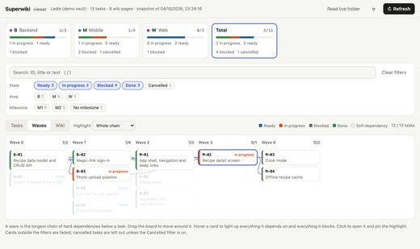
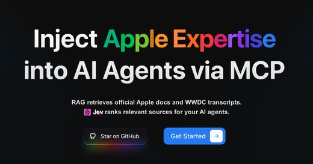
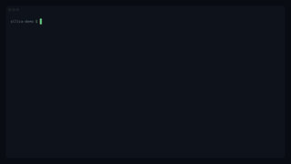

# Awesome LLM Wiki

[中文](README.zh-CN.md)

Open-source tools where **an LLM or agent builds and maintains a knowledge base**: LLM wikis of linked markdown pages, RAG knowledge-base platforms, MCP servers and skills, docs Q&A, knowledge graphs, personal knowledge. 329 repos, each one read and security-graded by [Agent Skills Hub](https://agentskillshub.top?utm_source=github&utm_medium=awesome-list).

Live page with filters: **[https://agentskillshub.top/best/knowledge-base/](https://agentskillshub.top/best/knowledge-base/?utm_source=github&utm_medium=awesome-list)** · refreshed every 8 hours

## What these knowledge bases look like

<table>
<tr>
<td align="center" valign="top" width="33%"><b>📖 LLM wikis</b> 118 repos   An agent writes and keeps a wiki of linked markdown pages. <a href="#type-llm_wiki"><b>View the list →</b></a></td>
<td align="center" valign="top" width="33%"><b>🏗 RAG platforms</b> 21 repos  RAG knowledge-base platforms with their own interface. <a href="#type-rag_platform"><b>View the list →</b></a></td>
<td align="center" valign="top" width="33%"><b>🔌 MCP & agent skills</b> 70 repos   MCP servers and skills that let an agent search a knowledge base. <a href="#type-mcp"><b>View the list →</b></a></td>
</tr>
<tr>
<td align="center" valign="top" width="33%"><b>📄 Docs Q&A</b> 37 repos  Answers from product docs, codebases, papers or PDFs. <a href="#type-docs_qa"><b>View the list →</b></a></td>
<td align="center" valign="top" width="33%"><b>🕸 Knowledge graphs</b> 75 repos  Knowledge as a graph of entities and relations. <a href="#type-graph"><b>View the list →</b></a></td>
<td align="center" valign="top" width="33%"><b>🧠 Personal knowledge</b> 8 repos  Notes, bookmarks and a second brain kept by AI. <a href="#type-personal"><b>View the list →</b></a></td>
</tr>
</table>

## Contents

- [📖 LLM wikis](#type-llm_wiki) (118)
- [🏗 RAG platforms](#type-rag_platform) (21)
- [🔌 MCP & agent skills](#type-mcp) (70)
- [📄 Docs Q&A](#type-docs_qa) (37)
- [🕸 Knowledge graphs](#type-graph) (75)
- [🧠 Personal knowledge](#type-personal) (8)

## How a repo gets on the list

1. The knowledge base is the product: a wiki an LLM maintains, a RAG knowledge base, or documents an agent answers from. A general chatbot or a bare vector database does not count.
2. It is software someone can install or run, not a list of links or a placeholder.
3. It has a README. Without one it cannot be graded.
4. At 50 stars or more it is listed on topic alone. Under 50 it must also clear a README quality bar (shows it working, one-command start, a concrete outcome, complete docs), and have 5 stars.

The questions are answered by a decision model reading each README, not by hand. A repo near a cut-off can land on either side; open an issue if one is misfiled.

## 📖 LLM wikis

[Open this type on the live page, sorted by stars →](https://agentskillshub.top/best/knowledge-base/?utm_source=github&utm_medium=awesome-list#type-llm_wiki)

<table><tr>
<td align="center" valign="top"> <a href="https://github.com/mhmtsrfglu/superwiki">mhmtsrfglu/superwiki</a></td>
</tr></table>

| Repo | Stars | What it does | Security |
|---|---:|---|---|
| [volcengine/OpenViking](https://github.com/volcengine/OpenViking) | 39.6k | Self-evolving Context Database for AI Agents. Unify Agent Memory, Knowledge RAG and Skills. | [SAFE](https://agentskillshub.top/skill/volcengine/OpenViking/?utm_source=github&utm_medium=awesome-list) |
| [nashsu/llm_wiki](https://github.com/nashsu/llm_wiki) | 20.4k | LLM Wiki is a cross-platform desktop application that turns your documents into an organized, interlinked knowledge base — automatically. Instead of… | [SAFE](https://agentskillshub.top/skill/nashsu/llm_wiki/?utm_source=github&utm_medium=awesome-list) |
| [AsyncFuncAI/deepwiki-open](https://github.com/AsyncFuncAI/deepwiki-open) | 18.2k | Open Source DeepWiki: AI-Powered Wiki Generator for GitHub/Gitlab/Bitbucket Repositories. Join the discord: https://discord.gg/gMwThUMeme | [SAFE](https://agentskillshub.top/skill/AsyncFuncAI/deepwiki-open/?utm_source=github&utm_medium=awesome-list) |
| [langchain-ai/openwiki](https://github.com/langchain-ai/openwiki) | 17.1k | OpenWiki is a CLI that writes and maintains agent documentation for your codebase. | [SAFE](https://agentskillshub.top/skill/langchain-ai/openwiki/?utm_source=github&utm_medium=awesome-list) |
| [AgriciDaniel/claude-obsidian](https://github.com/AgriciDaniel/claude-obsidian) | 15.4k | Self-organizing AI second brain for Obsidian + Claude Code. Drop any source and Claude reads, links, and files it into one connected knowledge graph… | [SAFE](https://agentskillshub.top/skill/AgriciDaniel/claude-obsidian/?utm_source=github&utm_medium=awesome-list) |
| [eugeniughelbur/obsidian-second-brain](https://github.com/eugeniughelbur/obsidian-second-brain) | 4.7k | Persistent memory for Claude Code and 6 other CLI agents, stored as plain markdown in your Obsidian vault. Stop re-explaining your projects, decision… | [SAFE](https://agentskillshub.top/skill/eugeniughelbur/obsidian-second-brain/?utm_source=github&utm_medium=awesome-list) |
| [SamurAIGPT/llm-wiki-agent](https://github.com/SamurAIGPT/llm-wiki-agent) | 3.6k | A personal knowledge base that builds and maintains itself. Drop in sources — Claude (or Codex/Gemini) reads them, extracts knowledge, and maintains… | [SAFE](https://agentskillshub.top/skill/SamurAIGPT/llm-wiki-agent/?utm_source=github&utm_medium=awesome-list) |
| [agentscope-ai/ReMe](https://github.com/agentscope-ai/ReMe) | 3.6k | ReMe: Memory Management Kit for Agents - Remember Me, Refine Me. | [SAFE](https://agentskillshub.top/skill/agentscope-ai/ReMe/?utm_source=github&utm_medium=awesome-list) |
| [Ar9av/obsidian-wiki](https://github.com/Ar9av/obsidian-wiki) | 3.5k | Framework for AI agents to build and maintain a digital brain through Obsidian wiki \| Memory System for Agents | [SAFE](https://agentskillshub.top/skill/Ar9av/obsidian-wiki/?utm_source=github&utm_medium=awesome-list) |
| [agenticnotetaking/arscontexta](https://github.com/agenticnotetaking/arscontexta) | 3.5k | Claude Code plugin that generates individualized knowledge systems from conversation. You describe how you think and work, have a conversation and ge… | [SAFE](https://agentskillshub.top/skill/agenticnotetaking/arscontexta/?utm_source=github&utm_medium=awesome-list) |
| [Astro-Han/karpathy-llm-wiki](https://github.com/Astro-Han/karpathy-llm-wiki) | 2.5k | Agent Skills-compatible LLM wiki for Claude Code, Cursor, and Codex. Build a Karpathy-style knowledge base from raw sources, citations, and linting. | [SAFE](https://agentskillshub.top/skill/Astro-Han/karpathy-llm-wiki/?utm_source=github&utm_medium=awesome-list) |
| [atomicstrata/llm-wiki-compiler](https://github.com/atomicstrata/llm-wiki-compiler) | 2.2k | The knowledge compiler. Raw sources in, interlinked wiki out. Inspired by Karpathy's LLM Wiki pattern. | [SAFE](https://agentskillshub.top/skill/atomicstrata/llm-wiki-compiler/?utm_source=github&utm_medium=awesome-list) |
| [lucasastorian/llmwiki](https://github.com/lucasastorian/llmwiki) | 1.7k | Open Source Implementation of Karpathy's LLM Wiki. Upload documents, connect your Claude account via MCP, and have it write your wiki ! | [SAFE](https://agentskillshub.top/skill/lucasastorian/llmwiki/?utm_source=github&utm_medium=awesome-list) |
| [axoviq-ai/synthadoc](https://github.com/axoviq-ai/synthadoc) | 1.6k | Synthadoc: An open-source LLM knowledge compilation engine that turns raw documents into structured, local-first wikis. A transparent, human-readable… | [SAFE](https://agentskillshub.top/skill/axoviq-ai/synthadoc/?utm_source=github&utm_medium=awesome-list) |
| [nduckmink/arkon](https://github.com/nduckmink/arkon) | 1.5k | Arkon: Enterprise AI Knowledge Hub & MCP Server. Self-hosted knowledge base for teams to manage RAG contexts, access policies, and AI skills. Connect… | [SAFE](https://agentskillshub.top/skill/nduckmink/arkon/?utm_source=github&utm_medium=awesome-list) |
| [nvk/llm-wiki](https://github.com/nvk/llm-wiki) | 1.4k | LLM-compiled knowledge bases for any AI agent. Parallel multi-agent research, thesis-driven investigation, source ingestion, wiki compilation, queryi… | [SAFE](https://agentskillshub.top/skill/nvk/llm-wiki/?utm_source=github&utm_medium=awesome-list) |
| [coleam00/claude-memory-compiler](https://github.com/coleam00/claude-memory-compiler) | 1.3k | Give Claude Code a memory that evolves with your codebase. Hooks automatically capture sessions, the Claude Agent SDK extracts key decisions and less… | [SAFE](https://agentskillshub.top/skill/coleam00/claude-memory-compiler/?utm_source=github&utm_medium=awesome-list) |
| [undefined-ui/second-brain-os](https://github.com/undefined-ui/second-brain-os) | 1.0k | An AI second brain that maintains itself. Full guide, starter vault, agent skills and scripts for a self-organizing knowledge base in Claude Code and… | [SAFE](https://agentskillshub.top/skill/undefined-ui/second-brain-os/?utm_source=github&utm_medium=awesome-list) |
| [AlmanacCode/codealmanac](https://github.com/AlmanacCode/codealmanac) | 997 | A codebase wiki for AI coding agents. Captures what the code can't say: decisions, flows, invariants, gotchas. | [SAFE](https://agentskillshub.top/skill/AlmanacCode/codealmanac/?utm_source=github&utm_medium=awesome-list) |
| [kytmanov/obsidian-llm-wiki-local](https://github.com/kytmanov/obsidian-llm-wiki-local) | 833 | Karpathy’s LLM Wiki, 100% local with Ollama. Drop Markdown notes → AI extracts concepts → your Obsidian wiki auto-links and grows. Zero sharing. Your… | [SAFE](https://agentskillshub.top/skill/kytmanov/obsidian-llm-wiki-local/?utm_source=github&utm_medium=awesome-list) |
| [NicholasSpisak/second-brain](https://github.com/NicholasSpisak/second-brain) | 737 | LLM-maintained personal knowledge base for Obsidian. Based on Andrej Karpathy's LLM Wiki pattern. | [SAFE](https://agentskillshub.top/skill/NicholasSpisak/second-brain/?utm_source=github&utm_medium=awesome-list) |
| [swarmclawai/swarmvault](https://github.com/swarmclawai/swarmvault) | 710 | The local-first LLM Wiki: open-source knowledge graph builder, RAG knowledge base, and agent memory store. Built on Andrej Karpathy's pattern. An Obs… | [SAFE](https://agentskillshub.top/skill/swarmclawai/swarmvault/?utm_source=github&utm_medium=awesome-list) |
| [lewislulu/llm-wiki-skill](https://github.com/lewislulu/llm-wiki-skill) | 655 | Karpathy-style LLM knowledge base Agent Skill for OpenClaw/Codex. Experimental — will iterate over time. | [SAFE](https://agentskillshub.top/skill/lewislulu/llm-wiki-skill/?utm_source=github&utm_medium=awesome-list) |
| [iBlinkQ/llm-wiki-obsidian-blink](https://github.com/iBlinkQ/llm-wiki-obsidian-blink) | 641 | 一个基于 Andrej Karpathy 的 LLM Wiki 模式 实现的 Obsidian 知识库，利用 LLM 维护可复利的个人知识层。 | [SAFE](https://agentskillshub.top/skill/iBlinkQ/llm-wiki-obsidian-blink/?utm_source=github&utm_medium=awesome-list) |
| [opendatalab/MinerU-Document-Explorer](https://github.com/opendatalab/MinerU-Document-Explorer) | 640 | Agent-native knowledge engine with MCP tools for document indexing, wiki organization, fast retrieval and deep reading across PDF/DOCX/PPTX/Markdown | [SAFE](https://agentskillshub.top/skill/opendatalab/MinerU-Document-Explorer/?utm_source=github&utm_medium=awesome-list) |
| [zosmaai/pi-llm-wiki](https://github.com/zosmaai/pi-llm-wiki) | 608 | Self-maintaining, Obsidian-compatible knowledge base for pi — turn raw sources into an interlinked wiki that compounds. Native Open Knowledge Format… | [SAFE](https://agentskillshub.top/skill/zosmaai/pi-llm-wiki/?utm_source=github&utm_medium=awesome-list) |
| [shannhk/llm-wikid](https://github.com/shannhk/llm-wikid) | 421 | Karpathy-style LLM knowledge base for Obsidian. Clone, run Claude Code, start building your second brain. | [SAFE](https://agentskillshub.top/skill/shannhk/llm-wikid/?utm_source=github&utm_medium=awesome-list) |
| [Pratiyush/llm-wiki](https://github.com/Pratiyush/llm-wiki) | 397 | LLM-powered knowledge base from your Claude Code, Codex CLI, Copilot, Cursor & Gemini sessions. Karpathy's LLM Wiki pattern — implemented and shipped. | [SAFE](https://agentskillshub.top/skill/Pratiyush/llm-wiki/?utm_source=github&utm_medium=awesome-list) |
| [gatelynch/llm-knowledge-base](https://github.com/gatelynch/llm-knowledge-base) | 336 | 參考自Andrej Kapathy的llm-wiki概念，把原始素材、LLM 編譯後的知識、 探索中的思考，以及最終作品明確分層管理 的個人知識庫系統。 | [SAFE](https://agentskillshub.top/skill/gatelynch/llm-knowledge-base/?utm_source=github&utm_medium=awesome-list) |
| [ussumant/llm-wiki-compiler](https://github.com/ussumant/llm-wiki-compiler) | 327 | Claude Code plugin that compiles markdown knowledge files into a topic-based wiki. Implements Karpathy's LLM Knowledge Base pattern. | [SAFE](https://agentskillshub.top/skill/ussumant/llm-wiki-compiler/?utm_source=github&utm_medium=awesome-list) |
| [Jacobinwwey/obsidian-NotEMD](https://github.com/Jacobinwwey/obsidian-NotEMD) | 311 | A Easy way to create your own Knowledge-base! Notemd enhances your Obsidian workflow by integrating with various Large Language Models (LLMs) to proc… | [SAFE](https://agentskillshub.top/skill/Jacobinwwey/obsidian-NotEMD/?utm_source=github&utm_medium=awesome-list) |
| [ymj8903668-droid/trading-review-wiki](https://github.com/ymj8903668-droid/trading-review-wiki) | 291 | A trading review knowledge base powered by LLM 专为交易者设计的 LLM 驱动知识库：快速复盘、交割单导入、FIFO 盈亏计算、个股归档与截图讨论。 | [SAFE](https://agentskillshub.top/skill/ymj8903668-droid/trading-review-wiki/?utm_source=github&utm_medium=awesome-list) |
| [tonbistudio/llm-wiki](https://github.com/tonbistudio/llm-wiki) | 265 | Open-source template for building LLM-powered knowledge bases following Karpathy's LLM Wiki pattern | [SAFE](https://agentskillshub.top/skill/tonbistudio/llm-wiki/?utm_source=github&utm_medium=awesome-list) |
| [kytmanov/synto](https://github.com/kytmanov/synto) | 261 | More than just Karpathy’s LLM Wiki, 100% local with Ollama. Drop Markdown notes → AI extracts concepts → your Obsidian wiki auto-links and grows. Zer… | [SAFE](https://agentskillshub.top/skill/kytmanov/synto/?utm_source=github&utm_medium=awesome-list) |
| [luotwo/llm-wiki](https://github.com/luotwo/llm-wiki) | 224 | LLM Wiki - 用 LLM 构建持续积累的个人知识库，含 Claude Code Skill 和实战经验 | [SAFE](https://agentskillshub.top/skill/luotwo/llm-wiki/?utm_source=github&utm_medium=awesome-list) |
| [balukosuri/llm-wiki-karpathy](https://github.com/balukosuri/llm-wiki-karpathy) | 218 |  | [SAFE](https://agentskillshub.top/skill/balukosuri/llm-wiki-karpathy/?utm_source=github&utm_medium=awesome-list) |
| [mduongvandinh/llm-wiki](https://github.com/mduongvandinh/llm-wiki) | 214 | Hệ thống knowledge base cá nhân hoàn toàn tự động, vận hành bởi LLM. Dựa trên pattern LLM Wiki của Andrej Karpathy. | [SAFE](https://agentskillshub.top/skill/mduongvandinh/llm-wiki/?utm_source=github&utm_medium=awesome-list) |
| [kfchou/wiki-skills](https://github.com/kfchou/wiki-skills) | 188 | LLM-maintained personal wiki skills for Claude Code — implements Karpathy's LLM Wiki pattern | [SAFE](https://agentskillshub.top/skill/kfchou/wiki-skills/?utm_source=github&utm_medium=awesome-list) |
| [IssacW228/student-llm-wiki](https://github.com/IssacW228/student-llm-wiki) | 177 | 📚 Student LLM Wiki — AI-compiled knowledge base for university students. Drop course slides, get a persistent interlinked wiki. Feynman review, exam… | [SAFE](https://agentskillshub.top/skill/IssacW228/student-llm-wiki/?utm_source=github&utm_medium=awesome-list) |
| [domleca/llm-wiki](https://github.com/domleca/llm-wiki) | 176 |  | [SAFE](https://agentskillshub.top/skill/domleca/llm-wiki/?utm_source=github&utm_medium=awesome-list) |
| [alfadur7/llm-wiki-newsroom](https://github.com/alfadur7/llm-wiki-newsroom) | 171 | Harness engineering applied to knowledge production: a self-evolving multi-agent newsroom that turns your documents into a cross-linked markdown wiki… | [SAFE](https://agentskillshub.top/skill/alfadur7/llm-wiki-newsroom/?utm_source=github&utm_medium=awesome-list) |
| [nanzhipro/Karpathy-llm-wiki-bootstrap-skill](https://github.com/nanzhipro/Karpathy-llm-wiki-bootstrap-skill) | 167 | Installable skill + working example for building persistent, LLM-maintained Markdown wikis, based on Karpathy’s original LLM Wiki idea. | [SAFE](https://agentskillshub.top/skill/nanzhipro/Karpathy-llm-wiki-bootstrap-skill/?utm_source=github&utm_medium=awesome-list) |
| [selmakcby/knowledge-pipeline](https://github.com/selmakcby/knowledge-pipeline) | 163 | Terminal-vibe sunum + LLM-Wiki skill'i. Ham sohbetleri, şemayla disipline edilen büyüyen bir wiki'ye dönüştürme deseni. | [SAFE](https://agentskillshub.top/skill/selmakcby/knowledge-pipeline/?utm_source=github&utm_medium=awesome-list) |
| [liangdabiao/llm-wiki](https://github.com/liangdabiao/llm-wiki) | 156 | 基于 [Karpathy llm-wiki]方法论，利用 AI 持续构建和维护你的个人知识库。支持从多种素材源（网页、推特、公众号、小红书、知乎、YouTube、PDF、本地文件）自动整理为结构化的 wiki，并通过 Quartz 发布为静态wiki知识库网站。 并通过 claude_agent_… | [SAFE](https://agentskillshub.top/skill/liangdabiao/llm-wiki/?utm_source=github&utm_medium=awesome-list) |
| [PieroSierra/SecondBrain](https://github.com/PieroSierra/SecondBrain) | 153 | A personal knowledge base that lives in this folder. Drop content in, have it organized automatically, ask questions, and get sourced answers — eithe… | [SAFE](https://agentskillshub.top/skill/PieroSierra/SecondBrain/?utm_source=github&utm_medium=awesome-list) |
| [bybit-exchange/kaas](https://github.com/bybit-exchange/kaas) | 149 | Turn scattered notes, docs and transcripts into a queryable Markdown wiki — an LLM knowledge-base compiler with MCP access, no embeddings, self-hoste… | [SAFE](https://agentskillshub.top/skill/bybit-exchange/kaas/?utm_source=github&utm_medium=awesome-list) |
| [cablate/llm-atomic-wiki](https://github.com/cablate/llm-atomic-wiki) | 149 | An extension of Karpathy's LLM Wiki pattern: atom layer, topic-branches, two-layer Lint. Distilled from running the pattern end-to-end. | [SAFE](https://agentskillshub.top/skill/cablate/llm-atomic-wiki/?utm_source=github&utm_medium=awesome-list) |
| [MehmetGoekce/llm-wiki](https://github.com/MehmetGoekce/llm-wiki) | 147 | Build Karpathy's LLM Wiki with Claude Code. L1/L2 cache architecture. Logseq + Obsidian support. | [SAFE](https://agentskillshub.top/skill/MehmetGoekce/llm-wiki/?utm_source=github&utm_medium=awesome-list) |
| [kothari-nikunj/llm-wiki](https://github.com/kothari-nikunj/llm-wiki) | 145 | Personal Wiki | [SAFE](https://agentskillshub.top/skill/kothari-nikunj/llm-wiki/?utm_source=github&utm_medium=awesome-list) |
| [Mark393295827/third-brain-v7-skills](https://github.com/Mark393295827/third-brain-v7-skills) | 141 | agent wiki +engineering skills | [SAFE](https://agentskillshub.top/skill/Mark393295827/third-brain-v7-skills/?utm_source=github&utm_medium=awesome-list) |
| [psinetron/echoes-vault-codex](https://github.com/psinetron/echoes-vault-codex) | 131 | Persistent memory plugin for Codex. Obsidian-style knowledge base that survives across sessions | [SAFE](https://agentskillshub.top/skill/psinetron/echoes-vault-codex/?utm_source=github&utm_medium=awesome-list) |
| [ctxr-dev/llm-wiki-memory](https://github.com/ctxr-dev/llm-wiki-memory) | 129 | Local, git-versioned memory for AI coding agents. No RAG, no Docker, no external service. Capture, compile, recall over a local LLM wiki with on-devi… | [SAFE](https://agentskillshub.top/skill/ctxr-dev/llm-wiki-memory/?utm_source=github&utm_medium=awesome-list) |
| [frankchu91/mindbase-llm-wiki](https://github.com/frankchu91/mindbase-llm-wiki) | 128 | Karpathy's LLM Wiki idea as a product — an AI that builds and maintains a markdown wiki from your notes and sources. MCP server + web UI, runs on fre… | [SAFE](https://agentskillshub.top/skill/frankchu91/mindbase-llm-wiki/?utm_source=github&utm_medium=awesome-list) |
| [AyanbekDos/memoriki](https://github.com/AyanbekDos/memoriki) | 122 | Memoriki - LLM Wiki + MemPalace. Personal knowledge base with real memory. | [SAFE](https://agentskillshub.top/skill/AyanbekDos/memoriki/?utm_source=github&utm_medium=awesome-list) |
| [songzhuozhu/obsidian-llm-wiki](https://github.com/songzhuozhu/obsidian-llm-wiki) | 122 | Turn your LLM into a wiki maintainer. Inspired by Karpathy's LLM Wiki. Built for Obsidian, Claude Code & Codex. \| 让 LLM 成为你的 wiki 维护者。受 Karpathy 的 L… | [SAFE](https://agentskillshub.top/skill/songzhuozhu/obsidian-llm-wiki/?utm_source=github&utm_medium=awesome-list) |
| [appleweiping/WEIPING_WIKI](https://github.com/appleweiping/WEIPING_WIKI) | 119 | knowledge base managed with an LLM workflow | [SAFE](https://agentskillshub.top/skill/appleweiping/WEIPING_WIKI/?utm_source=github&utm_medium=awesome-list) |
| [praneybehl/llm-wiki-plugin](https://github.com/praneybehl/llm-wiki-plugin) | 119 | Andrej Karpathy's LLM Wiki pattern as a skill & Claude Code plugin — turn accumulated sources into a self-maintaining, scalable markdown knowledge ba… | [SAFE](https://agentskillshub.top/skill/praneybehl/llm-wiki-plugin/?utm_source=github&utm_medium=awesome-list) |
| [SherwinQ/karpathy-wiki](https://github.com/SherwinQ/karpathy-wiki) | 114 | 基于 [Andrej Karpathy]提出的 [LLM Wiki 模式]构建的 Agent Skill，通过四阶段流水线将碎片化信息转化为结构化、可检索、持续增长的个人知识库。 | [SAFE](https://agentskillshub.top/skill/SherwinQ/karpathy-wiki/?utm_source=github&utm_medium=awesome-list) |
| [ekadetov/llm-wiki](https://github.com/ekadetov/llm-wiki) | 110 | LLM Wiki — Claude Code plugin for persistent, compounding knowledge bases in Obsidian | [SAFE](https://agentskillshub.top/skill/ekadetov/llm-wiki/?utm_source=github&utm_medium=awesome-list) |
| [abubakarsiddik31/axiom-wiki](https://github.com/abubakarsiddik31/axiom-wiki) | 108 | Inspired by Andrej Karpathy's llm-wiki — the idea that LLMs should maintain a persistent, compounding wiki rather than re-derive answers from raw sou… | [SAFE](https://agentskillshub.top/skill/abubakarsiddik31/axiom-wiki/?utm_source=github&utm_medium=awesome-list) |
| [toolboxmd/karpathy-wiki](https://github.com/toolboxmd/karpathy-wiki) | 105 | Karpathy Wiki - Claude Code skills for building persistent, compounding knowledge bases. Based on Andrej Karpathy's LLM Wiki pattern. | [SAFE](https://agentskillshub.top/skill/toolboxmd/karpathy-wiki/?utm_source=github&utm_medium=awesome-list) |
| [jackwener/llm-wiki](https://github.com/jackwener/llm-wiki) | 104 | Agent-native persistent knowledge management — compile knowledge once, query forever. | [SAFE](https://agentskillshub.top/skill/jackwener/llm-wiki/?utm_source=github&utm_medium=awesome-list) |
| [doum1004/llmwiki-cli](https://github.com/doum1004/llmwiki-cli) | 103 | CLI tool for LLM agents to build and maintain personal knowledge bases | [SAFE](https://agentskillshub.top/skill/doum1004/llmwiki-cli/?utm_source=github&utm_medium=awesome-list) |
| [songs-aaa/shared-memory-vault](https://github.com/songs-aaa/shared-memory-vault) | 103 | A memory governance engine for multi-agent cloud knowledge bases — one knowledge base shared by every agent and every device, with consistency guaran… | [SAFE](https://agentskillshub.top/skill/songs-aaa/shared-memory-vault/?utm_source=github&utm_medium=awesome-list) |
| [NulightJens/ai-second-brain-skills](https://github.com/NulightJens/ai-second-brain-skills) | 101 | Two Claude Code skills for building a Karpathy-style LLM wiki — a compounding AI second brain. Install: git clone https://github.com/NulightJens/ai-s… | [SAFE](https://agentskillshub.top/skill/NulightJens/ai-second-brain-skills/?utm_source=github&utm_medium=awesome-list) |
| [klemensgc/modular-context-obsidian-plugin](https://github.com/klemensgc/modular-context-obsidian-plugin) | 99 | Modular Context \| Karpathy LLM Knowledge Base + Gmail & G-Cal — multi-account MCP server for Claude Code, encrypted local-first | [SAFE](https://agentskillshub.top/skill/klemensgc/modular-context-obsidian-plugin/?utm_source=github&utm_medium=awesome-list) |
| [vakovalskii/ontoship](https://github.com/vakovalskii/ontoship) | 96 | md+git knowledge base: FTS5 search (bm25+trigram/fuzzy), HTML+graph, code-ontology linter, Claude Code plugin | [SAFE](https://agentskillshub.top/skill/vakovalskii/ontoship/?utm_source=github&utm_medium=awesome-list) |
| [eleven-net-cn/llm-wiki-starter](https://github.com/eleven-net-cn/llm-wiki-starter) | 95 | Create an LLM Wiki knowledge base in one command — based on Andrej Karpathy's LLM Wiki pattern. | [SAFE](https://agentskillshub.top/skill/eleven-net-cn/llm-wiki-starter/?utm_source=github&utm_medium=awesome-list) |
| [capitalparser/notebooklm-wiki-pipeline](https://github.com/capitalparser/notebooklm-wiki-pipeline) | 94 | Turn Google Drive PDFs into Obsidian wiki notes via NotebookLM MCP without loading full PDFs into Claude context | [SAFE](https://agentskillshub.top/skill/capitalparser/notebooklm-wiki-pipeline/?utm_source=github&utm_medium=awesome-list) |
| [Lambenthan/empiricalwiki](https://github.com/Lambenthan/empiricalwiki) | 93 | 经管实证研究的 AI 知识库 — 从文献阅读到 Stata 执行，一条流水线串到底。基于 Karpathy 的 LLM-Wiki 理念，按实证研究 10 类实体（变量 / 数据集 / 模型 / 机制 / 假设 / 识别策略 / 稳健性 / 异质性 / 表格 / 论文）定制 | [SAFE](https://agentskillshub.top/skill/Lambenthan/empiricalwiki/?utm_source=github&utm_medium=awesome-list) |
| [boluodaixue/paperpilot](https://github.com/boluodaixue/paperpilot) | 91 | PaperPilot 是一个基于 LangGraph 的个人深度研究系统，通过递归 Deep Research × LLM Wiki × Obsidian，把一次性研究，沉淀为可追溯、可问答、可继续生长的长期知识。 | [SAFE](https://agentskillshub.top/skill/boluodaixue/paperpilot/?utm_source=github&utm_medium=awesome-list) |
| [johnfkoo951/cmds-llm-wiki](https://github.com/johnfkoo951/cmds-llm-wiki) | 91 | LLM Wiki template — Karpathy 3-layer pattern + Gold In Gold Out purpose gate + dual Claude Code·Codex harness (11 commands, 2 hooks, 18 web clipper t… | [SAFE](https://agentskillshub.top/skill/johnfkoo951/cmds-llm-wiki/?utm_source=github&utm_medium=awesome-list) |
| [skindhu/claude-deep-wiki](https://github.com/skindhu/claude-deep-wiki) | 91 | 🚀 基于 Claude Agent SDK 的智能代码分析工具 \| AI-powered code analyzer that generates business-oriented knowledge base and PRD docs. Supports 165+ languages. | [SAFE](https://agentskillshub.top/skill/skindhu/claude-deep-wiki/?utm_source=github&utm_medium=awesome-list) |
| [zby/commonplace](https://github.com/zby/commonplace) | 91 | The theory of LLM wikis, running as one. A framework for agent-operated knowledge: typed, linked, review-gated markdown your agents execute. | [SAFE](https://agentskillshub.top/skill/zby/commonplace/?utm_source=github&utm_medium=awesome-list) |
| [fivetaku/llm-wiki](https://github.com/fivetaku/llm-wiki) | 83 | raw 소스를 Claude Code가 위키로 합성·유지하는 영구 마크다운 지식베이스 템플릿 (LLM Wiki, Karpathy 패턴) | [SAFE](https://agentskillshub.top/skill/fivetaku/llm-wiki/?utm_source=github&utm_medium=awesome-list) |
| [wfnuser/cowiki](https://github.com/wfnuser/cowiki) | 82 | LLM Wiki, but multiplayer | [SAFE](https://agentskillshub.top/skill/wfnuser/cowiki/?utm_source=github&utm_medium=awesome-list) |
| [owenliang/llm-wiki](https://github.com/owenliang/llm-wiki) | 80 | The implementation of karpathy/llm-wiki.md | [SAFE](https://agentskillshub.top/skill/owenliang/llm-wiki/?utm_source=github&utm_medium=awesome-list) |
| [rohitg00/akbp](https://github.com/rohitg00/akbp) | 80 | Agent Knowledge Base Protocol. | [SAFE](https://agentskillshub.top/skill/rohitg00/akbp/?utm_source=github&utm_medium=awesome-list) |
| [7xuanlu/wenlan](https://github.com/7xuanlu/wenlan) | 79 | A living personal wiki. Wenlan turns your documents, notes, and AI chats into pages with links to their sources, and updates them as sources change w… | [SAFE](https://agentskillshub.top/skill/7xuanlu/wenlan/?utm_source=github&utm_medium=awesome-list) |
| [moonlarry/awesome-llm-paper-wiki](https://github.com/moonlarry/awesome-llm-paper-wiki) | 78 | 由 LLM Agent 驱动的本地 Markdown 文献库管理与学术综述自动化系统 | [SAFE](https://agentskillshub.top/skill/moonlarry/awesome-llm-paper-wiki/?utm_source=github&utm_medium=awesome-list) |
| [tuirk/Kompl](https://github.com/tuirk/Kompl) | 78 | A compounding LLM-wiki, best fit as a personal second brain that organizes and updates itself as it grows, zero upkeep. | [CAUTION](https://agentskillshub.top/skill/tuirk/Kompl/?utm_source=github&utm_medium=awesome-list) |
| [lpaiu-cs/osk-system](https://github.com/lpaiu-cs/osk-system) | 76 | Source-grounded MCP memory runtime and Obsidian-compatible vault template for LLM agents. | [SAFE](https://agentskillshub.top/skill/lpaiu-cs/osk-system/?utm_source=github&utm_medium=awesome-list) |
| [ndjordjevic/pin-llm-wiki](https://github.com/ndjordjevic/pin-llm-wiki) | 76 | Skill for Claude, Cursor & Copilot that automates the Karpathy LLM Wiki workflow: ingest web, GitHub, and YouTube URLs into a well-structured, citabl… | [SAFE](https://agentskillshub.top/skill/ndjordjevic/pin-llm-wiki/?utm_source=github&utm_medium=awesome-list) |
| [zcag/tela](https://github.com/zcag/tela) | 75 | Open-source, self-hostable markdown team wiki with a built-in MCP server — so AI agents read, write, and search your docs as first-class teammates. L… | [SAFE](https://agentskillshub.top/skill/zcag/tela/?utm_source=github&utm_medium=awesome-list) |
| [asakin/llm-context-base](https://github.com/asakin/llm-context-base) | 74 | A git template for building your own LLM-powered personal wiki. Training period, metadata standard, lint system included. Clone and go. | [SAFE](https://agentskillshub.top/skill/asakin/llm-context-base/?utm_source=github&utm_medium=awesome-list) |
| [microsoft/llmwiki](https://github.com/microsoft/llmwiki) | 73 | VS Code extension for a self-maintaining personal wiki — the LLM summarizes, cross-references, and files every source for you | [SAFE](https://agentskillshub.top/skill/microsoft/llmwiki/?utm_source=github&utm_medium=awesome-list) |
| [smixs/autograph](https://github.com/smixs/autograph) | 73 | Schema-as-code memory for AI agents in Obsidian: typed cards, entity dedup, link repair, update-in-place, and Ebbinghaus decay. Plain Markdown you ow… | [SAFE](https://agentskillshub.top/skill/smixs/autograph/?utm_source=github&utm_medium=awesome-list) |
| [vouchdev/vouch](https://github.com/vouchdev/vouch) | 72 | A git-native, review-gated knowledge base for AI agents: they propose writes, you approve them. Every claim cites a source, every change is a diff in… | [SAFE](https://agentskillshub.top/skill/vouchdev/vouch/?utm_source=github&utm_medium=awesome-list) |
| [sametbrr/llm-wiki-manager](https://github.com/sametbrr/llm-wiki-manager) | 71 | Skill for a persistent LLM-managed wiki — the LLM writes and cross-references while you curate sources. | [SAFE](https://agentskillshub.top/skill/sametbrr/llm-wiki-manager/?utm_source=github&utm_medium=awesome-list) |
| [Benboerba620/karpathy-claude-wiki](https://github.com/Benboerba620/karpathy-claude-wiki) | 69 | Karpathy-style personal wiki for LLMs - markdown + frontmatter, no vector DB, no RAG. Built for Claude Code, works with any file-editing AI agent. | [SAFE](https://agentskillshub.top/skill/Benboerba620/karpathy-claude-wiki/?utm_source=github&utm_medium=awesome-list) |
| [vanillaflava/llm-wiki-skills](https://github.com/vanillaflava/llm-wiki-skills) | 69 | Turn your markdown vault into a compounding knowledge wiki (Karpathy inspired). Six agent skills - knowledge grows with every conversation. Works wit… | [SAFE](https://agentskillshub.top/skill/vanillaflava/llm-wiki-skills/?utm_source=github&utm_medium=awesome-list) |
| [oliver-kriska/scribe](https://github.com/oliver-kriska/scribe) | 66 | LLM-managed personal knowledge base. Auto-extracts from git repos, Claude Code sessions (via ccrider FTS5), and iMessage bookmarks. Cross-project, qm… | [CAUTION](https://agentskillshub.top/skill/oliver-kriska/scribe/?utm_source=github&utm_medium=awesome-list) |
| [JanYork/llm-wiki-cli](https://github.com/JanYork/llm-wiki-cli) | 65 | Agent-driven proactive memory CLI for AI agents — autonomously recall, maintain, and evolve persistent, source-grounded knowledge across sessions. | [SAFE](https://agentskillshub.top/skill/JanYork/llm-wiki-cli/?utm_source=github&utm_medium=awesome-list) |
| [LeoBR84p/wiki_llm](https://github.com/LeoBR84p/wiki_llm) | 65 |  | [SAFE](https://agentskillshub.top/skill/LeoBR84p/wiki_llm/?utm_source=github&utm_medium=awesome-list) |
| [hoadoan1997/llm-knowledge-base](https://github.com/hoadoan1997/llm-knowledge-base) | 64 | LLM-powered personal knowledge base — raw articles → compiled wiki → Q&A + outputs. Claude writes, you curate. | [SAFE](https://agentskillshub.top/skill/hoadoan1997/llm-knowledge-base/?utm_source=github&utm_medium=awesome-list) |
| [tashisleepy/knowledge-engine](https://github.com/tashisleepy/knowledge-engine) | 64 | The bridge between human-readable wikis and machine-speed memory. Built on Karpathys LLM Wiki pattern + Memvid. | [SAFE](https://agentskillshub.top/skill/tashisleepy/knowledge-engine/?utm_source=github&utm_medium=awesome-list) |
| [remember-md/remember](https://github.com/remember-md/remember) | 62 | AI-powered second brain for Claude Code that builds itself. Extract knowledge from every session—past and present—into auto-organized Markdown. Local… | [SAFE](https://agentskillshub.top/skill/remember-md/remember/?utm_source=github&utm_medium=awesome-list) |
| [ddsyasas/llm-wiki](https://github.com/ddsyasas/llm-wiki) | 61 | Open source local-first knowledge base maintained by an LLM agent. Implements Andrej Karpathy's LLM Wiki pattern. | [SAFE](https://agentskillshub.top/skill/ddsyasas/llm-wiki/?utm_source=github&utm_medium=awesome-list) |
| [hellohejinyu/llm-wiki](https://github.com/hellohejinyu/llm-wiki) | 61 | An LLM-powered personal wiki CLI. | [SAFE](https://agentskillshub.top/skill/hellohejinyu/llm-wiki/?utm_source=github&utm_medium=awesome-list) |
| [iamsashank09/llm-wiki-kit](https://github.com/iamsashank09/llm-wiki-kit) | 61 | Stop re-explaining your research to your AI agent. Persistent, LLM-maintained wikis that compound over time. Drop PDFs, URLs, YouTube - your agent re… | [SAFE](https://agentskillshub.top/skill/iamsashank09/llm-wiki-kit/?utm_source=github&utm_medium=awesome-list) |
| [MetamusicX/zissa-wiki](https://github.com/MetamusicX/zissa-wiki) | 58 | Zissa Wiki — an LLM-maintained research knowledge base in plain markdown, maintained by any AI agent (Claude, Codex, Gemini, DeepSeek, Kimi, Grok, Mi… | [SAFE](https://agentskillshub.top/skill/MetamusicX/zissa-wiki/?utm_source=github&utm_medium=awesome-list) |
| [NiharShrotri/llm-wiki](https://github.com/NiharShrotri/llm-wiki) | 55 | Local LLM-maintained personal wiki, built on Karpathy's LLM-Wiki pattern. Runs on Ollama + Qwen3 + QMD. | [SAFE](https://agentskillshub.top/skill/NiharShrotri/llm-wiki/?utm_source=github&utm_medium=awesome-list) |
| [fivif/OmniKB](https://github.com/fivif/OmniKB) | 55 | Universal AI Knowledge Base Agent | [SAFE](https://agentskillshub.top/skill/fivif/OmniKB/?utm_source=github&utm_medium=awesome-list) |
| [bashiraziz/llm-wiki-template](https://github.com/bashiraziz/llm-wiki-template) | 53 | A reusable template for building personal LLM-maintained knowledge bases. Implements Karpathy's LLM Wiki pattern. | [SAFE](https://agentskillshub.top/skill/bashiraziz/llm-wiki-template/?utm_source=github&utm_medium=awesome-list) |
| [evergreen-it-dev/folio](https://github.com/evergreen-it-dev/folio) | 51 | The AI-assisted, open-source alternative to Notion and Confluence: a team wiki that lives in Git, with real-time editing, data tables, whiteboards, o… | [SAFE](https://agentskillshub.top/skill/evergreen-it-dev/folio/?utm_source=github&utm_medium=awesome-list) |
| [Oshayr/LLM-Wiki](https://github.com/Oshayr/LLM-Wiki) | 50 | Autonomous knowledge base plugin for Claude Code - captures reserch, ideas, and decisions into an interlinked wiki with reserch-on-miss, semantic sea… | [SAFE](https://agentskillshub.top/skill/Oshayr/LLM-Wiki/?utm_source=github&utm_medium=awesome-list) |
| [sodam-ai/SoDam-WikiMate](https://github.com/sodam-ai/SoDam-WikiMate) | 50 | AI에게 '정리해줘'라고 하면 흩어진 자료를 옵시디언(원본)에 노트로 정리하고, 관련 노트끼리 연결·분류·요약하고, 선택적으로 노션에 색인하는 Claude Code 플러그인 + 이식형 MCP 코어. 보관함 자동탐지·정리·자동 링크/MOC·자동 분류·요약(원자 노트)·… | [SAFE](https://agentskillshub.top/skill/sodam-ai/SoDam-WikiMate/?utm_source=github&utm_medium=awesome-list) |
| [6eanut/llm-wiki](https://github.com/6eanut/llm-wiki) | 47 | Claude Code skill for building persistent, interlinked knowledge bases from source documents. Knowledge is compiled once and kept current — never re-… | [SAFE](https://agentskillshub.top/skill/6eanut/llm-wiki/?utm_source=github&utm_medium=awesome-list) |
| [cobusgreyling/llm-wiki](https://github.com/cobusgreyling/llm-wiki) | 44 | A compounding knowledge base maintained by LLM agents — inspired by Karpathy's LLM Wiki pattern | [SAFE](https://agentskillshub.top/skill/cobusgreyling/llm-wiki/?utm_source=github&utm_medium=awesome-list) |
| [2233admin/obsidian-llm-wiki](https://github.com/2233admin/obsidian-llm-wiki) | 36 | Your markdown vault, compiled into a 6-persona MCP team for Claude Code, Codex, OpenCode, and Gemini CLI. Headless-first. Cites, doesn't guess. | [SAFE](https://agentskillshub.top/skill/2233admin/obsidian-llm-wiki/?utm_source=github&utm_medium=awesome-list) |
| [decodingai-magazine/llm-wiki-workshop](https://github.com/decodingai-magazine/llm-wiki-workshop) | 33 | Learn to design an LLM wiki from first principles. Used as agent memory. Workshop with 3 exercises, open-source code, video, and slides. No coding sk… | [SAFE](https://agentskillshub.top/skill/decodingai-magazine/llm-wiki-workshop/?utm_source=github&utm_medium=awesome-list) |
| [Open330/kiwimu](https://github.com/Open330/kiwimu) | 30 | Turn textbooks, PDFs, and web content into your own interlinked learning wiki powered by LLM | [SAFE](https://agentskillshub.top/skill/Open330/kiwimu/?utm_source=github&utm_medium=awesome-list) |
| [professorpalmer/portable-llm-wiki](https://github.com/professorpalmer/portable-llm-wiki) | 20 | Vendor-neutral, LLM-maintained personal-context wiki. Markdown in your git, queryable by any LLM (HTTP API + MCP server). v0.7 prototype. | [SAFE](https://agentskillshub.top/skill/professorpalmer/portable-llm-wiki/?utm_source=github&utm_medium=awesome-list) |
| [atukunare/wiki-knowledge-agent](https://github.com/atukunare/wiki-knowledge-agent) | 19 | Your AI forgets. A wiki doesn't. Turn chat-pasted text/links into a verified, translated, searchable wiki knowledge base — verify links, filter ads,… | [SAFE](https://agentskillshub.top/skill/atukunare/wiki-knowledge-agent/?utm_source=github&utm_medium=awesome-list) |
| [ignromanov/llm-obsidian-wiki](https://github.com/ignromanov/llm-obsidian-wiki) | 17 | Claude Code plugin for building persistent, compounding knowledge bases in Obsidian. Inspired by Karpathy's LLM Wiki pattern. | [SAFE](https://agentskillshub.top/skill/ignromanov/llm-obsidian-wiki/?utm_source=github&utm_medium=awesome-list) |
| [onurkafk/corvid](https://github.com/onurkafk/corvid) | 14 | Permanent memory for AI coding agents. One command to save, semantic search to retrieve, works across every project. Inspired by Karpathy's LLM Wiki. | [SAFE](https://agentskillshub.top/skill/onurkafk/corvid/?utm_source=github&utm_medium=awesome-list) |
| [PALAN-K/llm-wiki-loop](https://github.com/PALAN-K/llm-wiki-loop) | 13 | The reference architecture for LLM-maintained knowledge vaults — schema, lifecycle loop, machine verification, self-installation | [SAFE](https://agentskillshub.top/skill/PALAN-K/llm-wiki-loop/?utm_source=github&utm_medium=awesome-list) |
| [mhmtsrfglu/superwiki](https://github.com/mhmtsrfglu/superwiki) | 12 | Agent skills that turn docs/ into an LLM-maintained wiki and task tracker. Obsidian-friendly. Works with Claude Code, Codex and Copilot CLI. | [SAFE](https://agentskillshub.top/skill/mhmtsrfglu/superwiki/?utm_source=github&utm_medium=awesome-list) |

## 🏗 RAG platforms

[Open this type on the live page, sorted by stars →](https://agentskillshub.top/best/knowledge-base/?utm_source=github&utm_medium=awesome-list#type-rag_platform)

| Repo | Stars | What it does | Security |
|---|---:|---|---|
| [infiniflow/ragflow](https://github.com/infiniflow/ragflow) | 92.0k | RAGFlow is a leading open-source Retrieval-Augmented Generation (RAG) engine that fuses cutting-edge RAG with Agent capabilities to create a superior… | [SAFE](https://agentskillshub.top/skill/infiniflow/ragflow/?utm_source=github&utm_medium=awesome-list) |
| [chatchat-space/Langchain-Chatchat](https://github.com/chatchat-space/Langchain-Chatchat) | 38.7k | Langchain-Chatchat（原Langchain-ChatGLM）基于 Langchain 与 ChatGLM, Qwen 与 Llama 等语言模型的 RAG 与 Agent 应用 \| Langchain-Chatchat (formerly langchain-ChatGLM),… | [SAFE](https://agentskillshub.top/skill/chatchat-space/Langchain-Chatchat/?utm_source=github&utm_medium=awesome-list) |
| [Tencent/WeKnora](https://github.com/Tencent/WeKnora) | 33.0k | Open-source LLM knowledge platform: turn raw documents into a queryable RAG, an autonomous reasoning agent, and a self-maintaining Wiki. | [SAFE](https://agentskillshub.top/skill/Tencent/WeKnora/?utm_source=github&utm_medium=awesome-list) |
| [1Panel-dev/MaxKB](https://github.com/1Panel-dev/MaxKB) | 22.9k | 🔥 MaxKB is an open-source platform for building enterprise-grade agents. 强大易用的开源企业级智能体平台。 | [SAFE](https://agentskillshub.top/skill/1Panel-dev/MaxKB/?utm_source=github&utm_medium=awesome-list) |
| [airweave-ai/airweave](https://github.com/airweave-ai/airweave) | 6.6k | Open-source context retrieval layer for AI agents | [SAFE](https://agentskillshub.top/skill/airweave-ai/airweave/?utm_source=github&utm_medium=awesome-list) |
| [Zleap-AI/SAG](https://github.com/Zleap-AI/SAG) | 2.6k | A new SOTA for RAG — an original retrieval architecture and an open-source knowledge base for humans and agents. | [SAFE](https://agentskillshub.top/skill/Zleap-AI/SAG/?utm_source=github&utm_medium=awesome-list) |
| [finic-ai/rag-stack](https://github.com/finic-ai/rag-stack) | 1.6k | 🤖 Deploy a private ChatGPT alternative hosted within your VPC. 🔮 Connect it to your organization's knowledge base and use it as a corporate oracle. S… | [SAFE](https://agentskillshub.top/skill/finic-ai/rag-stack/?utm_source=github&utm_medium=awesome-list) |
| [shuyu-labs/AntSK](https://github.com/shuyu-labs/AntSK) | 1.3k | An AI knowledge base/agent built with .Net 9, AntBlazor, Semantic Kernel, and Kernel Memory, supporting local offline AI large models. It can run off… | [SAFE](https://agentskillshub.top/skill/shuyu-labs/AntSK/?utm_source=github&utm_medium=awesome-list) |
| [dmayboroda/minima](https://github.com/dmayboroda/minima) | 1.1k | On-premises conversational RAG with configurable containers | [SAFE](https://agentskillshub.top/skill/dmayboroda/minima/?utm_source=github&utm_medium=awesome-list) |
| [mudler/LocalRecall](https://github.com/mudler/LocalRecall) | 977 | :brain: 100% Local Memory layer and Knowledge base for agents with WebUI | [SAFE](https://agentskillshub.top/skill/mudler/LocalRecall/?utm_source=github&utm_medium=awesome-list) |
| [boluo2077/deep-rag](https://github.com/boluo2077/deep-rag) | 215 | 🔍 Deep RAG: Advanced Retrieval-Augmented Generation system that goes beyond vector search. Enables AI to perform multi-hop reasoning, negation querie… | [SAFE](https://agentskillshub.top/skill/boluo2077/deep-rag/?utm_source=github&utm_medium=awesome-list) |
| [bulolo/CatWiki](https://github.com/bulolo/CatWiki) | 197 | A fully functional knowledge base platform offering robust content management, AI-powered intelligent Q&A, and a modern user experience 一个功能完善的Agenti… | [SAFE](https://agentskillshub.top/skill/bulolo/CatWiki/?utm_source=github&utm_medium=awesome-list) |
| [Ciao1019/Petrichor](https://github.com/Ciao1019/Petrichor) | 147 | A self-hosted knowledge platform for humans and AI agents — publish wikis, blogs, and portable Agent Skills. | [SAFE](https://agentskillshub.top/skill/Ciao1019/Petrichor/?utm_source=github&utm_medium=awesome-list) |
| [madarco/ragrabbit](https://github.com/madarco/ragrabbit) | 136 | Open Source, Self-Hosted, AI Search and LLM.txt for your website | [SAFE](https://agentskillshub.top/skill/madarco/ragrabbit/?utm_source=github&utm_medium=awesome-list) |
| [joungminsung/OpenDocuments](https://github.com/joungminsung/OpenDocuments) | 116 | Self-hosted RAG platform for AI document search across GitHub, Notion, Google Drive, local files, and web sources with citations. | [SAFE](https://agentskillshub.top/skill/joungminsung/OpenDocuments/?utm_source=github&utm_medium=awesome-list) |
| [Pengc-Sun/enterprise-rag-knowledge-base](https://github.com/Pengc-Sun/enterprise-rag-knowledge-base) | 115 | Enterprise-oriented RAG knowledge base system | [SAFE](https://agentskillshub.top/skill/Pengc-Sun/enterprise-rag-knowledge-base/?utm_source=github&utm_medium=awesome-list) |
| [gmickel/gno](https://github.com/gmickel/gno) | 115 | Local AI-powered document search and editing with first-in-class hybrid retrieval, LLM answers, WebUI, REST API and MCP support for AI clients. | [SAFE](https://agentskillshub.top/skill/gmickel/gno/?utm_source=github&utm_medium=awesome-list) |
| [quanta-quest/quanta-quest](https://github.com/quanta-quest/quanta-quest) | 102 | AI-powered universal search for all your personal data, tailored just for you. Goal:The world's first product with "edge-side LLMs + consumer data lo… | [SAFE](https://agentskillshub.top/skill/quanta-quest/quanta-quest/?utm_source=github&utm_medium=awesome-list) |
| [kbrisso/byte-vision](https://github.com/kbrisso/byte-vision) | 72 | Byte-Vision is a privacy-first document intelligence platform that transforms static documents into an interactive, searchable knowledge base. Built… | [CAUTION](https://agentskillshub.top/skill/kbrisso/byte-vision/?utm_source=github&utm_medium=awesome-list) |
| [upupmake/general-rag-system](https://github.com/upupmake/general-rag-system) | 64 | A RAG (Retrieval-Augmented Generation) knowledge base system with Vue.js frontend, Spring Boot backend, and FastAPI LLM service. | [SAFE](https://agentskillshub.top/skill/upupmake/general-rag-system/?utm_source=github&utm_medium=awesome-list) |
| [RD945/document-rag](https://github.com/RD945/document-rag) | 5 | DocumentRAG is a self-hosted Retrieval-Augmented Generation (RAG) chatbot system that enables intelligent document querying using local language mode… | [SAFE](https://agentskillshub.top/skill/RD945/document-rag/?utm_source=github&utm_medium=awesome-list) |

## 🔌 MCP & agent skills

[Open this type on the live page, sorted by stars →](https://agentskillshub.top/best/knowledge-base/?utm_source=github&utm_medium=awesome-list#type-mcp)

<table><tr>
<td align="center" valign="top"> <a href="https://github.com/BingoWon/apple-rag-mcp">BingoWon/apple-rag-mcp</a></td>
<td align="center" valign="top"> <a href="https://github.com/kiycoh/silica-core">kiycoh/silica-core</a></td>
<td align="center" valign="top"> <a href="https://github.com/MrDoe/OpenCodeRAG">MrDoe/OpenCodeRAG</a></td>
</tr></table>

| Repo | Stars | What it does | Security |
|---|---:|---|---|
| [zilliztech/memsearch](https://github.com/zilliztech/memsearch) | 2.7k | A persistent, unified memory layer for all your AI agents (e.g. Claude Code, Codex, DSH), backed by Markdown and Milvus. | [SAFE](https://agentskillshub.top/skill/zilliztech/memsearch/?utm_source=github&utm_medium=awesome-list) |
| [coleam00/mcp-crawl4ai-rag](https://github.com/coleam00/mcp-crawl4ai-rag) | 2.3k | Web Crawling and RAG Capabilities for AI Agents and AI Coding Assistants | [SAFE](https://agentskillshub.top/skill/coleam00/mcp-crawl4ai-rag/?utm_source=github&utm_medium=awesome-list) |
| [MicrosoftDocs/mcp](https://github.com/MicrosoftDocs/mcp) | 1.9k | Official Microsoft Learn MCP Server and CLI tool – powering LLMs and AI agents with real-time, trusted Microsoft docs & code samples. | [SAFE](https://agentskillshub.top/skill/MicrosoftDocs/mcp/?utm_source=github&utm_medium=awesome-list) |
| [chunkhound/chunkhound](https://github.com/chunkhound/chunkhound) | 1.4k | Your entire engineering context, deeply understood | [SAFE](https://agentskillshub.top/skill/chunkhound/chunkhound/?utm_source=github&utm_medium=awesome-list) |
| [study8677/repobrain](https://github.com/study8677/repobrain) | 1.3k | 🧠 RepoBrain (formerly Antigravity) — Give your repo a brain. ChatGPT for your codebase: works in Claude Code, Cursor, Codex, Windsurf & more. | [SAFE](https://agentskillshub.top/skill/study8677/repobrain/?utm_source=github&utm_medium=awesome-list) |
| [0xranx/OpenContext](https://github.com/0xranx/OpenContext) | 1.3k | A personal context store for AI agents and assistants—reuse your existing coding agent CLI (Codex/Claude/OpenCode) with built‑in Skills/tools and a d… | [SAFE](https://agentskillshub.top/skill/0xranx/OpenContext/?utm_source=github&utm_medium=awesome-list) |
| [chubbyguan/chubbyskills](https://github.com/chubbyguan/chubbyskills) | 1.2k | 把中文全渠道内容（抖音 / B站 / 小红书 / 公众号 / X / 播客）采集进个人知识库的 14 个 AI Skill：图文存图、视频转文字稿、字幕优先免 GPU、RSS/YouTube 订阅调度与每日情报简报，附带知识库 MCP server。｜ Ingest Chinese content… | [SAFE](https://agentskillshub.top/skill/chubbyguan/chubbyskills/?utm_source=github&utm_medium=awesome-list) |
| [jerry-ai-dev/MODULAR-RAG-MCP-SERVER](https://github.com/jerry-ai-dev/MODULAR-RAG-MCP-SERVER) | 1.2k | A modular RAG (Retrieval-Augmented Generation) system with MCP Server architecture. Using Skill to make AI follow each step of the spec and complete… | [SAFE](https://agentskillshub.top/skill/jerry-ai-dev/MODULAR-RAG-MCP-SERVER/?utm_source=github&utm_medium=awesome-list) |
| [BagelHole/DevOps-Security-Agent-Skills](https://github.com/BagelHole/DevOps-Security-Agent-Skills) | 1.2k | Agent-ready DevOps, security, infrastructure, and compliance knowledge base with 80+ skills across Kubernetes, Terraform, AWS/Azure/GCP, AI platform… | [SAFE](https://agentskillshub.top/skill/BagelHole/DevOps-Security-Agent-Skills/?utm_source=github&utm_medium=awesome-list) |
| [aakarim/OpenLore](https://github.com/aakarim/OpenLore) | 1.1k | A minimal, extensible, agent-native knowledge repository that keeps shared context current and inspectable | [SAFE](https://agentskillshub.top/skill/aakarim/OpenLore/?utm_source=github&utm_medium=awesome-list) |
| [0xK3vin/MegaMemory](https://github.com/0xK3vin/MegaMemory) | 719 | Persistent project knowledge graph for coding agents. MCP server with semantic search, in-process embeddings, and web explorer. | [SAFE](https://agentskillshub.top/skill/0xK3vin/MegaMemory/?utm_source=github&utm_medium=awesome-list) |
| [ConardLi/rag-skill](https://github.com/ConardLi/rag-skill) | 715 | A Skill dedicated to local knowledge base retrieval | [SAFE](https://agentskillshub.top/skill/ConardLi/rag-skill/?utm_source=github&utm_medium=awesome-list) |
| [GeminiLight/MindOS](https://github.com/GeminiLight/MindOS) | 678 | MindOS is a Human-AI Collaborative Mind System, where human thinks and agents act. Globally sync your mind for all agents: transparent, controllable,… | [SAFE](https://agentskillshub.top/skill/GeminiLight/MindOS/?utm_source=github&utm_medium=awesome-list) |
| [docsagent/docsagent](https://github.com/docsagent/docsagent) | 625 | ⚡ DocsAgent — give your AI agents instant, private access to your personal knowledge base (Zotero, Obsidian, Apple Notes supported now, local docs on… | [SAFE](https://agentskillshub.top/skill/docsagent/docsagent/?utm_source=github&utm_medium=awesome-list) |
| [Ikalus1988/MisakaNet](https://github.com/Ikalus1988/MisakaNet) | 526 | 📚 A zero-dependency, git-backed micro-lesson library for AI Agents to asynchronously share and search verified debugging experience. \| https://misak… | [SAFE](https://agentskillshub.top/skill/Ikalus1988/MisakaNet/?utm_source=github&utm_medium=awesome-list) |
| [RafalWilinski/mcp-apple-notes](https://github.com/RafalWilinski/mcp-apple-notes) | 416 | Talk with your notes in Claude. RAG over your Apple Notes using Model Context Protocol. | [SAFE](https://agentskillshub.top/skill/RafalWilinski/mcp-apple-notes/?utm_source=github&utm_medium=awesome-list) |
| [shinpr/mcp-local-rag](https://github.com/shinpr/mcp-local-rag) | 412 | Local-first RAG server for developers. Semantic + keyword search for code and technical docs. Works with MCP or CLI. Fully private, zero setup. | [SAFE](https://agentskillshub.top/skill/shinpr/mcp-local-rag/?utm_source=github&utm_medium=awesome-list) |
| [andrea9293/mcp-documentation-server](https://github.com/andrea9293/mcp-documentation-server) | 343 | MCP Documentation Server - Bridge the AI Knowledge Gap. ✨ Features: Document management • Gemini integration • AI-powered semantic search • File uplo… | [SAFE](https://agentskillshub.top/skill/andrea9293/mcp-documentation-server/?utm_source=github&utm_medium=awesome-list) |
| [ergut/mcp-logseq](https://github.com/ergut/mcp-logseq) | 341 | MCP server to interact with LogSeq via its Local HTTP API - enabling AI assistants like Claude to seamlessly read, write, and manage your LogSeq grap… | [SAFE](https://agentskillshub.top/skill/ergut/mcp-logseq/?utm_source=github&utm_medium=awesome-list) |
| [aa0101181514/tw-legal-rag](https://github.com/aa0101181514/tw-legal-rag) | 328 | 台灣法律 MCP 伺服器 + CLI（免費、免註冊、免 API key）：2,250 萬筆裁判書、行政函釋、憲法法庭裁判，附引用查核。Free Taiwan legal MCP server for Claude/ChatGPT/Codex — bring your own LLM, retrie… | [SAFE](https://agentskillshub.top/skill/aa0101181514/tw-legal-rag/?utm_source=github&utm_medium=awesome-list) |
| [nameforjt-afk/session-knowledge](https://github.com/nameforjt-afk/session-knowledge) | 304 | Turn your Claude Code session history into a searchable local knowledge base — 13 MCP tools, pure stdlib, nothing leaves your machine | [SAFE](https://agentskillshub.top/skill/nameforjt-afk/session-knowledge/?utm_source=github&utm_medium=awesome-list) |
| [Govcraft/rust-docs-mcp-server](https://github.com/Govcraft/rust-docs-mcp-server) | 299 | 🦀 Prevents outdated Rust code suggestions from AI assistants. This MCP server fetches current crate docs, uses embeddings/LLMs, and provides accurate… | [SAFE](https://agentskillshub.top/skill/Govcraft/rust-docs-mcp-server/?utm_source=github&utm_medium=awesome-list) |
| [lyonzin/knowledge-rag](https://github.com/lyonzin/knowledge-rag) | 292 | Local RAG MCP server for Claude Code — hybrid search (semantic + BM25), cross-encoder reranking, 13 MCP tools, 20 format parsers. Zero external serve… | [SAFE](https://agentskillshub.top/skill/lyonzin/knowledge-rag/?utm_source=github&utm_medium=awesome-list) |
| [asgard-ai-platform/skills](https://github.com/asgard-ai-platform/skills) | 242 | 301 open-source coding agent skills across 22 domains — methodology, judgment & gotchas packaged as Claude Agent Skills for the Asgard AI Platform. | [SAFE](https://agentskillshub.top/skill/asgard-ai-platform/skills/?utm_source=github&utm_medium=awesome-list) |
| [MLT-OSS/FirstData](https://github.com/MLT-OSS/FirstData) | 183 | The World's Most Comprehensive, Authoritative, and Structured Open Source Data Source Knowledge Base | [SAFE](https://agentskillshub.top/skill/MLT-OSS/FirstData/?utm_source=github&utm_medium=awesome-list) |
| [willynikes2/knowledge-base-server](https://github.com/willynikes2/knowledge-base-server) | 183 | Make every AI agent you use smarter. Persistent memory with SQLite FTS5, MCP server, Obsidian sync, and self-learning intelligence pipeline. | [SAFE](https://agentskillshub.top/skill/willynikes2/knowledge-base-server/?utm_source=github&utm_medium=awesome-list) |
| [ascend-ai-coding/awesome-ascend-skills](https://github.com/ascend-ai-coding/awesome-ascend-skills) | 174 | A comprehensive knowledge base for Huawei Ascend NPU development, structured as distributed Agent Skills. https://ascend-ai-coding.github.io/awesome-… | [SAFE](https://agentskillshub.top/skill/ascend-ai-coding/awesome-ascend-skills/?utm_source=github&utm_medium=awesome-list) |
| [andylow92/file-system-brain-mcp](https://github.com/andylow92/file-system-brain-mcp) | 168 | Self-improving, AI-native markdown vault you hand to an AI agent. GitHub-style file tree + Notion editing, exposed to Claude/Cursor via a built-in MC… | [SAFE](https://agentskillshub.top/skill/andylow92/file-system-brain-mcp/?utm_source=github&utm_medium=awesome-list) |
| [ali-kamali/Axon.MCP.Server](https://github.com/ali-kamali/Axon.MCP.Server) | 166 | Transform your codebase into an intelligent knowledge base for AI-powered development with Cursor IDE, Google AntiGravity, and MCP-enabled assistants | [SAFE](https://agentskillshub.top/skill/ali-kamali/Axon.MCP.Server/?utm_source=github&utm_medium=awesome-list) |
| [dnotitia/akb](https://github.com/dnotitia/akb) | 162 | AKB — Agent Knowledgebase. Organizational memory for AI agents: vault-scoped docs / tables / files unified by URI graph, served over MCP. | [SAFE](https://agentskillshub.top/skill/dnotitia/akb/?utm_source=github&utm_medium=awesome-list) |
| [0xchamin/mcptube](https://github.com/0xchamin/mcptube) | 161 | Transform YouTube videos into a compounding knowledge base with transcripts, vision analysis, and agentic search. Works as an MCP server for Claude,… | [SAFE](https://agentskillshub.top/skill/0xchamin/mcptube/?utm_source=github&utm_medium=awesome-list) |
| [zilliztech/mfs](https://github.com/zilliztech/mfs) | 154 | A context harness for AI agents: all your scattered context — code, memory, docs, databases, SaaS — in one searchable, browsable, file-like interface. | [SAFE](https://agentskillshub.top/skill/zilliztech/mfs/?utm_source=github&utm_medium=awesome-list) |
| [jztan/pdf-mcp](https://github.com/jztan/pdf-mcp) | 149 | MCP server that lets Claude Code and other AI agents read and search large PDFs, one file or a whole folder: agentic RAG with hybrid semantic + keywo… | [SAFE](https://agentskillshub.top/skill/jztan/pdf-mcp/?utm_source=github&utm_medium=awesome-list) |
| [nashsu/llm_wiki_skill](https://github.com/nashsu/llm_wiki_skill) | 149 |  | [SAFE](https://agentskillshub.top/skill/nashsu/llm_wiki_skill/?utm_source=github&utm_medium=awesome-list) |
| [sirmews/mcp-pinecone](https://github.com/sirmews/mcp-pinecone) | 149 | Model Context Protocol server to allow for reading and writing from Pinecone. Rudimentary RAG | [SAFE](https://agentskillshub.top/skill/sirmews/mcp-pinecone/?utm_source=github&utm_medium=awesome-list) |
| [radimsem/remindb](https://github.com/radimsem/remindb) | 129 | An agentic memory database that cuts session tokens by 82–99%. One portable SQLite file — your agent's memory, anywhere. | [SAFE](https://agentskillshub.top/skill/radimsem/remindb/?utm_source=github&utm_medium=awesome-list) |
| [uudam42/agent-memory-engine](https://github.com/uudam42/agent-memory-engine) | 126 | Memory Engine is a local-first MCP server that gives coding agents persistent, evidence-backed project memory. It automatically builds a project know… | [SAFE](https://agentskillshub.top/skill/uudam42/agent-memory-engine/?utm_source=github&utm_medium=awesome-list) |
| [BingoWon/apple-rag-mcp](https://github.com/BingoWon/apple-rag-mcp) | 120 | Apple developer docs and WWDC transcripts with RAG retrieval and Jev relevance ranking. | [SAFE](https://agentskillshub.top/skill/BingoWon/apple-rag-mcp/?utm_source=github&utm_medium=awesome-list) |
| [plasma-ai/wiki](https://github.com/plasma-ai/wiki) | 104 | Indexed knowledge bases with command-line tools for agents. | [SAFE](https://agentskillshub.top/skill/plasma-ai/wiki/?utm_source=github&utm_medium=awesome-list) |
| [Albertchamberlain/Awesome-OKF](https://github.com/Albertchamberlain/Awesome-OKF) | 100 | OKF (Open Knowledge Format) — curated catalog of tools, plugins, skills, proposals, and docs for agent-friendly knowledge. YAML-driven, agent-searcha… | [SAFE](https://agentskillshub.top/skill/Albertchamberlain/Awesome-OKF/?utm_source=github&utm_medium=awesome-list) |
| [IvenKooLab/loci](https://github.com/IvenKooLab/loci) | 100 | A queryable second brain over your scattered notes and docs - hybrid retrieval (vector + BM25), section-level citations, and an MCP server so AI agen… | [SAFE](https://agentskillshub.top/skill/IvenKooLab/loci/?utm_source=github&utm_medium=awesome-list) |
| [Tubo2333/obsidian-knowledge-brain](https://github.com/Tubo2333/obsidian-knowledge-brain) | 100 | AI agent skill that remembers every technical decision & bug fix across sessions — and learns from them. v4.0, MIT. \| 跨会话记忆的AI编程助手知识大脑 | [SAFE](https://agentskillshub.top/skill/Tubo2333/obsidian-knowledge-brain/?utm_source=github&utm_medium=awesome-list) |
| [byenzyme/enzyme](https://github.com/byenzyme/enzyme) | 86 | Local-first compile step for knowledge bases. Save 350x cost, 1000x speed vs. frontier models | [SAFE](https://agentskillshub.top/skill/byenzyme/enzyme/?utm_source=github&utm_medium=awesome-list) |
| [seacen/omem](https://github.com/seacen/omem) | 86 | OMem (Office Memory) — local-first memory that automatically ingests your real work (mail, calendar, notes, files) from where it already lives, into… | [SAFE](https://agentskillshub.top/skill/seacen/omem/?utm_source=github&utm_medium=awesome-list) |
| [Asklear/Klear-Team-Brain](https://github.com/Asklear/Klear-Team-Brain) | 84 | Turn your team's AI coding sessions, GitHub code, and docs into one shared, searchable memory — a self-hosted git truth store you query right from yo… | [SAFE](https://agentskillshub.top/skill/Asklear/Klear-Team-Brain/?utm_source=github&utm_medium=awesome-list) |
| [hassancs91/brainoutside](https://github.com/hassancs91/brainoutside) | 76 | Self-hosted memory server for AI agents. Your brain is a git repo, served over MCP and REST. | [SAFE](https://agentskillshub.top/skill/hassancs91/brainoutside/?utm_source=github&utm_medium=awesome-list) |
| [krokozyab/Agent-Fusion](https://github.com/krokozyab/Agent-Fusion) | 73 | Agent Fusion is a local RAG semantic search engine that gives AI agents instant access to your code, documentation (Markdown, Word, PDF). Query your… | [SAFE](https://agentskillshub.top/skill/krokozyab/Agent-Fusion/?utm_source=github&utm_medium=awesome-list) |
| [nozomio-labs/nia](https://github.com/nozomio-labs/nia) | 73 | Nia is a context-augmentation layer for agents, primarily designed for coding agents. It provides them with an up-to-date knowledge base and improves… | [SAFE](https://agentskillshub.top/skill/nozomio-labs/nia/?utm_source=github&utm_medium=awesome-list) |
| [Geeksfino/kb-mcp-server](https://github.com/Geeksfino/kb-mcp-server) | 72 | Build a knowledge base into a tar.gz and give it to this MCP server, and it is ready to serve. | [CAUTION](https://agentskillshub.top/skill/Geeksfino/kb-mcp-server/?utm_source=github&utm_medium=awesome-list) |
| [bahdotsh/indxr](https://github.com/bahdotsh/indxr) | 72 | A fast codebase indexer and knowledge wiki for AI agents. | [SAFE](https://agentskillshub.top/skill/bahdotsh/indxr/?utm_source=github&utm_medium=awesome-list) |
| [kiycoh/silica-core](https://github.com/kiycoh/silica-core) | 67 | Retrieval tools for coding agents, no model in the loop: SOTA-competitive files, search, read, code_pack and write_note over the folder your session… | [SAFE](https://agentskillshub.top/skill/kiycoh/silica-core/?utm_source=github&utm_medium=awesome-list) |
| [liangdabiao/deepseek-v4-flash-vision-video-rag](https://github.com/liangdabiao/deepseek-v4-flash-vision-video-rag) | 67 | DeepSeek V4-Flash Vision Video RAG 让 AI 真正"看懂" 一段视频，然后你对它提问：它告诉你答案、答案发生在 第几分几秒，并切出那一段的可播放片段和关键帧给你核对。 基于 DeepSeek 视觉大模型 deepseek-v4-flash-vision-exp 的… | [SAFE](https://agentskillshub.top/skill/liangdabiao/deepseek-v4-flash-vision-video-rag/?utm_source=github&utm_medium=awesome-list) |
| [ccf/agentcairn](https://github.com/ccf/agentcairn) | 65 | Long-term, cross-project memory for AI coding agents. Your own Obsidian vault as the source of truth. Daemonless and without opaque databases, your m… | [UNSAFE](https://agentskillshub.top/skill/ccf/agentcairn/?utm_source=github&utm_medium=awesome-list) |
| [tobocop2/lilbee](https://github.com/tobocop2/lilbee) | 64 | The whole local AI stack in one executable: it runs and manages local AI models across every GPU, and it's a search engine you can talk to, with cite… | [SAFE](https://agentskillshub.top/skill/tobocop2/lilbee/?utm_source=github&utm_medium=awesome-list) |
| [tomohiro-owada/devrag](https://github.com/tomohiro-owada/devrag) | 64 | Markdown vector search MCP server for Claude Code. Natural language search for markdown files using multilingual-e5-small embeddings. | [CAUTION](https://agentskillshub.top/skill/tomohiro-owada/devrag/?utm_source=github&utm_medium=awesome-list) |
| [NatsuFox/Tapestry](https://github.com/NatsuFox/Tapestry) | 63 | Tapestry - 基于 Agent Skill Bundle 的轻量级书签知识库 | [SAFE](https://agentskillshub.top/skill/NatsuFox/Tapestry/?utm_source=github&utm_medium=awesome-list) |
| [hermes-labs-ai/zer0dex](https://github.com/hermes-labs-ai/zer0dex) | 63 | A local dual-layer memory pattern for AI agents: a compact, human-readable markdown index paired with semantic retrieval from a local vector store, q… | [SAFE](https://agentskillshub.top/skill/hermes-labs-ai/zer0dex/?utm_source=github&utm_medium=awesome-list) |
| [nader0913/ocpp-rag](https://github.com/nader0913/ocpp-rag) | 61 | MCP server with RAG knowledge base for OCPP 1.6, OCPP 2.0.1, and EV charging standards | [SAFE](https://agentskillshub.top/skill/nader0913/ocpp-rag/?utm_source=github&utm_medium=awesome-list) |
| [msdanyg/smart-connections-mcp](https://github.com/msdanyg/smart-connections-mcp) | 58 | Give Claude semantic memory of your Obsidian vault — local semantic search over Smart Connections embeddings via MCP. Multi-vault, block-level, 100%… | [SAFE](https://agentskillshub.top/skill/msdanyg/smart-connections-mcp/?utm_source=github&utm_medium=awesome-list) |
| [MrDoe/OpenCodeRAG](https://github.com/MrDoe/OpenCodeRAG) | 57 | OpenCodeRAG is a RAG (Retrieval-Augmented Generation) plugin for semantic code search powered by locally-hosted embedding models. It features a seaml… | [SAFE](https://agentskillshub.top/skill/MrDoe/OpenCodeRAG/?utm_source=github&utm_medium=awesome-list) |
| [cbtw-apac/qdrant-loader](https://github.com/cbtw-apac/qdrant-loader) | 56 | Enterprise-ready vector database toolkit for building searchable knowledge bases from multiple data sources. Supports multi-project management, autom… | [SAFE](https://agentskillshub.top/skill/cbtw-apac/qdrant-loader/?utm_source=github&utm_medium=awesome-list) |
| [jeanibarz/knowledge-base-mcp-server](https://github.com/jeanibarz/knowledge-base-mcp-server) | 54 | This MCP server provides tools for listing and retrieving content from different knowledge bases. | [SAFE](https://agentskillshub.top/skill/jeanibarz/knowledge-base-mcp-server/?utm_source=github&utm_medium=awesome-list) |
| [lna-lab/distill-kura](https://github.com/lna-lab/distill-kura) | 53 | 蒸留蔵 — distilled long-term memory for agents: recall by meaning, writing gated by evidence, one kura per agent mode. Ships as a DeepSeek Harness plugi… | [SAFE](https://agentskillshub.top/skill/lna-lab/distill-kura/?utm_source=github&utm_medium=awesome-list) |
| [wgpsec/context1337](https://github.com/wgpsec/context1337) | 38 | aboutSecurity project skill finder / dict finder / exp finder, auto suggest and team knowledge base. | [SAFE](https://agentskillshub.top/skill/wgpsec/context1337/?utm_source=github&utm_medium=awesome-list) |
| [ismailperim/briefd](https://github.com/ismailperim/briefd) | 31 | Your agents, briefed. Not flooded. Self-hosted context compiler: git-backed team knowledge served to coding agents as token-budgeted bundles over MCP. | [SAFE](https://agentskillshub.top/skill/ismailperim/briefd/?utm_source=github&utm_medium=awesome-list) |
| [MontyGovernance/montycat-mcp](https://github.com/MontyGovernance/montycat-mcp) | 27 | Shared, persistent memory for AI agents. Self-hosted MCP server with semantic search, vector RAG, and live updates. Works with Claude, Cursor, Codex,… | [SAFE](https://agentskillshub.top/skill/MontyGovernance/montycat-mcp/?utm_source=github&utm_medium=awesome-list) |
| [3vilM33pl3/memory](https://github.com/3vilM33pl3/memory) | 20 | Local knowledge base for coding agents with a Rust CLI/TUI, PostgreSQL storage, and optional background capture. | [SAFE](https://agentskillshub.top/skill/3vilM33pl3/memory/?utm_source=github&utm_medium=awesome-list) |
| [arpitnath/blink-query](https://github.com/arpitnath/blink-query) | 11 | A typed wiki for LLMs — markdown on disk, resolution in the library. | [SAFE](https://agentskillshub.top/skill/arpitnath/blink-query/?utm_source=github&utm_medium=awesome-list) |
| [docouno/notarium](https://github.com/docouno/notarium) | 5 | File-first knowledge base for humans and AI agents — self-hosted Markdown notes with a web editor and a built-in MCP server. | [SAFE](https://agentskillshub.top/skill/docouno/notarium/?utm_source=github&utm_medium=awesome-list) |
| [pillumina/ascend-sleuth](https://github.com/pillumina/ascend-sleuth) | 5 | 知识驱动的昇腾训练/推理诊断 skill 套件 — Ascend training/inference diagnosis skill suite (5 skills + 3-tier knowledge base, Agent Skills standard) | [SAFE](https://agentskillshub.top/skill/pillumina/ascend-sleuth/?utm_source=github&utm_medium=awesome-list) |

## 📄 Docs Q&A

[Open this type on the live page, sorted by stars →](https://agentskillshub.top/best/knowledge-base/?utm_source=github&utm_medium=awesome-list#type-docs_qa)

| Repo | Stars | What it does | Security |
|---|---:|---|---|
| [virgiliojr94/book-to-skill](https://github.com/virgiliojr94/book-to-skill) | 34.4k | Turn any technical book PDF into a Claude Code skill — ready to study, reference, and use while you work. | [SAFE](https://agentskillshub.top/skill/virgiliojr94/book-to-skill/?utm_source=github&utm_medium=awesome-list) |
| [decodingai-magazine/second-brain-ai-assistant-course](https://github.com/decodingai-magazine/second-brain-ai-assistant-course) | 3.1k | Learn to build your Second Brain AI assistant with LLMs, agents, RAG, fine-tuning, LLMOps and AI systems techniques. | [SAFE](https://agentskillshub.top/skill/decodingai-magazine/second-brain-ai-assistant-course/?utm_source=github&utm_medium=awesome-list) |
| [mrsibe/KnowNote](https://github.com/mrsibe/KnowNote) | 1.2k | A local-first AI knowledge base & NotebookLM alternative built with Electron. More convenient, more lightweight, and understands you better! | [SAFE](https://agentskillshub.top/skill/mrsibe/KnowNote/?utm_source=github&utm_medium=awesome-list) |
| [viddexa/autollm](https://github.com/viddexa/autollm) | 1.0k | Ship RAG based LLM web apps in seconds. | [SAFE](https://agentskillshub.top/skill/viddexa/autollm/?utm_source=github&utm_medium=awesome-list) |
| [Bessouat40/RAGLight](https://github.com/Bessouat40/RAGLight) | 672 | RAGLight is a modular framework for Retrieval-Augmented Generation (RAG). It makes it easy to plug in different LLMs, embeddings, and vector stores,… | [SAFE](https://agentskillshub.top/skill/Bessouat40/RAGLight/?utm_source=github&utm_medium=awesome-list) |
| [ggozad/haiku.rag](https://github.com/ggozad/haiku.rag) | 624 | Agentic RAG for local and self-hosted document search: hybrid retrieval, reranking and multimodal RAG on embedded LanceDB, with Docling parsing and a… | [SAFE](https://agentskillshub.top/skill/ggozad/haiku.rag/?utm_source=github&utm_medium=awesome-list) |
| [rgem227/knoweldge-base](https://github.com/rgem227/knoweldge-base) | 497 | Personal or team knowledge base, supports MCP API calls. | [SAFE](https://agentskillshub.top/skill/rgem227/knoweldge-base/?utm_source=github&utm_medium=awesome-list) |
| [iamzulx/crypto-rag](https://github.com/iamzulx/crypto-rag) | 465 | Asisten crypto berbahasa Indonesia: RAG pengetahuan 267 topik + data pasar realtime (6 bursa, WebSocket, derivatif, on-chain, TVL, DeFi) + tool-calli… | [SAFE](https://agentskillshub.top/skill/iamzulx/crypto-rag/?utm_source=github&utm_medium=awesome-list) |
| [2dogsandanerd/Knowledge-Base-Self-Hosting-Kit](https://github.com/2dogsandanerd/Knowledge-Base-Self-Hosting-Kit) | 356 | A Docker-powered RAG system that understands the difference between code and prose. Ingest your codebase and documentation, then query them with full… | [SAFE](https://agentskillshub.top/skill/2dogsandanerd/Knowledge-Base-Self-Hosting-Kit/?utm_source=github&utm_medium=awesome-list) |
| [Ayanami0730/arag](https://github.com/Ayanami0730/arag) | 356 | A-RAG: Agentic Retrieval-Augmented Generation via Hierarchical Retrieval Interfaces. State-of-the-art RAG framework with keyword, semantic, and chunk… | [SAFE](https://agentskillshub.top/skill/Ayanami0730/arag/?utm_source=github&utm_medium=awesome-list) |
| [software-mansion-labs/react-native-rag](https://github.com/software-mansion-labs/react-native-rag) | 346 | Private, local RAGs. Supercharge LLMs with your own knowledge base. | [SAFE](https://agentskillshub.top/skill/software-mansion-labs/react-native-rag/?utm_source=github&utm_medium=awesome-list) |
| [lhh737/KnowledgeBase-RAG-LLM-System](https://github.com/lhh737/KnowledgeBase-RAG-LLM-System) | 276 | 基于 Streamlit、LangChain 与 Chroma 的轻量级 RAG 学习项目，支持本地知识库上传、检索增强问答与聊天式交互。 | [SAFE](https://agentskillshub.top/skill/lhh737/KnowledgeBase-RAG-LLM-System/?utm_source=github&utm_medium=awesome-list) |
| [Laurent00TT/PharosRAG](https://github.com/Laurent00TT/PharosRAG) | 243 | Pharos — local-first agentic RAG for your team's document library: multi-format ingest, hybrid retrieval, enterprise ACL, dual HTTP + MCP exits. | [SAFE](https://agentskillshub.top/skill/Laurent00TT/PharosRAG/?utm_source=github&utm_medium=awesome-list) |
| [aws-samples/serverless-rag-demo](https://github.com/aws-samples/serverless-rag-demo) | 223 | Amazon Bedrock Foundation models with Amazon Opensearch Serverless as a Vector DB | [SAFE](https://agentskillshub.top/skill/aws-samples/serverless-rag-demo/?utm_source=github&utm_medium=awesome-list) |
| [Francis1998/scholar-rag-agent](https://github.com/Francis1998/scholar-rag-agent) | 149 | Local-first literature RAG with model-free source-context reading, frozen evidence exports, and inspectable SQLite-backed research workflows. | [SAFE](https://agentskillshub.top/skill/Francis1998/scholar-rag-agent/?utm_source=github&utm_medium=awesome-list) |
| [JetXu-LLM/DocMason](https://github.com/JetXu-LLM/DocMason) | 147 | DocMason is a repo-native agent that turns your complex office files into a local LLM knowledge base and your second brain. The repo is the app. Code… | [SAFE](https://agentskillshub.top/skill/JetXu-LLM/DocMason/?utm_source=github&utm_medium=awesome-list) |
| [guhcostan/claude-mega-brain](https://github.com/guhcostan/claude-mega-brain) | 126 | OKF-powered knowledge context for Claude Code — injects your project's knowledge base at every session | [SAFE](https://agentskillshub.top/skill/guhcostan/claude-mega-brain/?utm_source=github&utm_medium=awesome-list) |
| [moyangzhan/langchain4j-aideepin-admin](https://github.com/moyangzhan/langchain4j-aideepin-admin) | 118 | JAVA版本的检索增强生成(RAG)项目，包括知识库、搜索 \| JAVA version of retrieval enhancement generation(RAG) project ,including knowledge base, search | [SAFE](https://agentskillshub.top/skill/moyangzhan/langchain4j-aideepin-admin/?utm_source=github&utm_medium=awesome-list) |
| [flamehaven01/Flamehaven-Filesearch](https://github.com/flamehaven01/Flamehaven-Filesearch) | 109 | Self-hosted RAG search engine — 34 formats, BM25+hybrid search, multi-LLM (Gemini/OpenAI/Claude/Ollama), FastAPI + Docker, production-ready in 3 min | [SAFE](https://agentskillshub.top/skill/flamehaven01/Flamehaven-Filesearch/?utm_source=github&utm_medium=awesome-list) |
| [aws-samples/aws-agentic-document-assistant](https://github.com/aws-samples/aws-agentic-document-assistant) | 97 | An agent based LLM assistant that extends RAG with batch entity extraction and SQL querying to improve performance on multi-step and analytical quest… | [SAFE](https://agentskillshub.top/skill/aws-samples/aws-agentic-document-assistant/?utm_source=github&utm_medium=awesome-list) |
| [dukesun99/Corpus2Skill](https://github.com/dukesun99/Corpus2Skill) | 93 | Official Findings of EMNLP 2026 implementation of Corpus2Skill: compile a document corpus into a navigable skill hierarchy that LLM agents explore at… | [SAFE](https://agentskillshub.top/skill/dukesun99/Corpus2Skill/?utm_source=github&utm_medium=awesome-list) |
| [georgesung/LLM-WikipediaQA](https://github.com/georgesung/LLM-WikipediaQA) | 85 | Document Q&A on Wikipedia articles using LLMs | [SAFE](https://agentskillshub.top/skill/georgesung/LLM-WikipediaQA/?utm_source=github&utm_medium=awesome-list) |
| [phoenix-zhou/logistics-industry-RAG](https://github.com/phoenix-zhou/logistics-industry-RAG) | 85 | This project is a local knowledge base "Logistics Industry" question-answering system based on the **RAG (Retrieval-Augmented Generation) technology*… | [SAFE](https://agentskillshub.top/skill/phoenix-zhou/logistics-industry-RAG/?utm_source=github&utm_medium=awesome-list) |
| [kevins981/Socratic](https://github.com/kevins981/Socratic) | 81 | Socratic is a framework for building reliable vertical AI agents by letting human experts teach agents interactively, turning tacit domain knowledge… | [CAUTION](https://agentskillshub.top/skill/kevins981/Socratic/?utm_source=github&utm_medium=awesome-list) |
| [PangHu1020/scholar-rag](https://github.com/PangHu1020/scholar-rag) | 80 | A beginner-friendly and extensible Agentic RAG project that demonstrates the full pipeline of document parsing, retrieval, reranking, workflow orches… | [SAFE](https://agentskillshub.top/skill/PangHu1020/scholar-rag/?utm_source=github&utm_medium=awesome-list) |
| [rav4nn/youtube-rag-scraper](https://github.com/rav4nn/youtube-rag-scraper) | 78 | Scrape YouTube videos, extract transcripts, and build a semantic search AI knowledge base using RAG and FAISS. | [SAFE](https://agentskillshub.top/skill/rav4nn/youtube-rag-scraper/?utm_source=github&utm_medium=awesome-list) |
| [Soren-ABT/dsh-knowledge](https://github.com/Soren-ABT/dsh-knowledge) | 71 | Knowledge base & RAG plugin for DeepSeek Harness (DSH): chunking, local embeddings, hybrid search, management panel | [SAFE](https://agentskillshub.top/skill/Soren-ABT/dsh-knowledge/?utm_source=github&utm_medium=awesome-list) |
| [liangdabiao/deepseek-v4-flash-vision-rag](https://github.com/liangdabiao/deepseek-v4-flash-vision-rag) | 70 | DeepSeek V4-Flash Vision RAG 让 AI 真正"看懂" 一份 PDF，然后你对它提问：它告诉你答案、答案在第几页， 并把那一页的原图展示出来给你核对。 基于 DeepSeek 视觉大模型 deepseek-v4-flash-vision-exp 的 PDF 深度问答与检索… | [SAFE](https://agentskillshub.top/skill/liangdabiao/deepseek-v4-flash-vision-rag/?utm_source=github&utm_medium=awesome-list) |
| [aws-samples/bedrock-kb-rag-workshop](https://github.com/aws-samples/bedrock-kb-rag-workshop) | 66 | Bedrock Knowledge Base and Agents for Retrieval Augmented Generation (RAG) | [SAFE](https://agentskillshub.top/skill/aws-samples/bedrock-kb-rag-workshop/?utm_source=github&utm_medium=awesome-list) |
| [dkedar7/embedchain-fastdash](https://github.com/dkedar7/embedchain-fastdash) | 66 | Chat with your knowledge base — a conversational RAG agent (LangGraph + OpenRouter) built on Fast Dash's native chat mode. A modern rebuild of the or… | [SAFE](https://agentskillshub.top/skill/dkedar7/embedchain-fastdash/?utm_source=github&utm_medium=awesome-list) |
| [shredEngineer/Archive-Agent](https://github.com/shredEngineer/Archive-Agent) | 63 | Find your files with natural language and ask questions. | [SAFE](https://agentskillshub.top/skill/shredEngineer/Archive-Agent/?utm_source=github&utm_medium=awesome-list) |
| [RipeMangoBox/BITE](https://github.com/RipeMangoBox/BITE) | 61 | Semi-automated research assistant and local knowledge base for paper analysis, ideation, coding, experiments, writing, and publication workflows. | [SAFE](https://agentskillshub.top/skill/RipeMangoBox/BITE/?utm_source=github&utm_medium=awesome-list) |
| [AkiRusProd/llm-agent](https://github.com/AkiRusProd/llm-agent) | 55 | LLM using long-term memory through vector database | [SAFE](https://agentskillshub.top/skill/AkiRusProd/llm-agent/?utm_source=github&utm_medium=awesome-list) |
| [nsrinidhibhat/gradio_RAG](https://github.com/nsrinidhibhat/gradio_RAG) | 55 | Code and resources showcasing the Retrieval-Augmented Generation (RAG) technique, a solution for enhancing data freshness in Large Language Models (L… | [SAFE](https://agentskillshub.top/skill/nsrinidhibhat/gradio_RAG/?utm_source=github&utm_medium=awesome-list) |
| [Azure-Samples/adaptive-rag-workbench](https://github.com/Azure-Samples/adaptive-rag-workbench) | 54 | Sample for context-aware Agentic RaG, Q&A with multi-source verification, and self-curating knowledge base. Powered by Azure AI Foundry Agent Service… | [SAFE](https://agentskillshub.top/skill/Azure-Samples/adaptive-rag-workbench/?utm_source=github&utm_medium=awesome-list) |
| [PageDen/pageden](https://github.com/PageDen/pageden) | 53 | One source of truth for people and AI a shared Markdown knowledge base your team can edit on the web, sync from Obsidian, and connect to AI agents | [SAFE](https://agentskillshub.top/skill/PageDen/pageden/?utm_source=github&utm_medium=awesome-list) |
| [DeltaXY-AI/llm-kb](https://github.com/DeltaXY-AI/llm-kb) | 27 | LLM-powered knowledge base. Drop documents, build a wiki, ask questions. Inspired by Karpathy. | [SAFE](https://agentskillshub.top/skill/DeltaXY-AI/llm-kb/?utm_source=github&utm_medium=awesome-list) |

## 🕸 Knowledge graphs

[Open this type on the live page, sorted by stars →](https://agentskillshub.top/best/knowledge-base/?utm_source=github&utm_medium=awesome-list#type-graph)

| Repo | Stars | What it does | Security |
|---|---:|---|---|
| [colbymchenry/codegraph](https://github.com/colbymchenry/codegraph) | 73.7k | Pre-indexed code knowledge graph, auto syncs on code changes, for Claude Code, Codex, Gemini, Cursor, OpenCode, AntiGravity, Kiro, CoPilot, and Herme… | [SAFE](https://agentskillshub.top/skill/colbymchenry/codegraph/?utm_source=github&utm_medium=awesome-list) |
| [HKUDS/LightRAG](https://github.com/HKUDS/LightRAG) | 40.1k | [EMNLP2025] LightRAG: Simple and Fast Retrieval-Augmented Generation | [SAFE](https://agentskillshub.top/skill/HKUDS/LightRAG/?utm_source=github&utm_medium=awesome-list) |
| [topoteretes/cognee](https://github.com/topoteretes/cognee) | 31.9k | Cognee is the open-source AI memory platform for agents. Give your AI agents persistent long-term memory with small models for free | [SAFE](https://agentskillshub.top/skill/topoteretes/cognee/?utm_source=github&utm_medium=awesome-list) |
| [OpenSPG/KAG](https://github.com/OpenSPG/KAG) | 9.1k | KAG is a logical form-guided reasoning and retrieval framework based on OpenSPG engine and LLMs. It is used to build logical reasoning and factual Q&… | [SAFE](https://agentskillshub.top/skill/OpenSPG/KAG/?utm_source=github&utm_medium=awesome-list) |
| [xerrors/Yuxi](https://github.com/xerrors/Yuxi) | 7.3k | 可私有部署的多租户知识智能体平台：统一 RAG、知识图谱、多智能体、MCP/Skills、沙盒与权限管理。Yuxi = Cloud Agents + Knowledge RAG, Self-hosted knowledge agent platform for RAG, knowledge gra… | [SAFE](https://agentskillshub.top/skill/xerrors/Yuxi/?utm_source=github&utm_medium=awesome-list) |
| [vitali87/code-graph-rag](https://github.com/vitali87/code-graph-rag) | 5.2k | The ultimate RAG for your monorepo. Query, understand, and edit multi-language codebases with the power of AI and knowledge graphs | [SAFE](https://agentskillshub.top/skill/vitali87/code-graph-rag/?utm_source=github&utm_medium=awesome-list) |
| [FlowElement-xinliuyuansu/m_flow](https://github.com/FlowElement-xinliuyuansu/m_flow) | 4.5k | A bio-inspired cognitive memory engine — a new paradigm for Graph RAG. | [SAFE](https://agentskillshub.top/skill/FlowElement-xinliuyuansu/m_flow/?utm_source=github&utm_medium=awesome-list) |
| [pipeshub-ai/pipeshub-ai](https://github.com/pipeshub-ai/pipeshub-ai) | 3.8k | The open-source context layer for AI agents. PipesHub turns your company's knowledge (Slack, Drive, Jira, GitHub, Microsoft 365 and 40+ connectors) i… | [SAFE](https://agentskillshub.top/skill/pipeshub-ai/pipeshub-ai/?utm_source=github&utm_medium=awesome-list) |
| [Ontos-AI/knowhere](https://github.com/Ontos-AI/knowhere) | 3.7k | Knowhere extracts, parses, and outputs structured chunks ready for AI Agents and RAG. | [SAFE](https://agentskillshub.top/skill/Ontos-AI/knowhere/?utm_source=github&utm_medium=awesome-list) |
| [pingcap/autoflow](https://github.com/pingcap/autoflow) | 3.0k | pingcap/autoflow is a Graph RAG based and conversational knowledge base tool built with TiDB Serverless Vector Storage. Demo: https://tidb.ai | [SAFE](https://agentskillshub.top/skill/pingcap/autoflow/?utm_source=github&utm_medium=awesome-list) |
| [sdyckjq-lab/llm-wiki-skill](https://github.com/sdyckjq-lab/llm-wiki-skill) | 2.5k | 基于 Karpathy llm-wiki 方法论的个人知识库构建 Skill，支持多平台！ | [SAFE](https://agentskillshub.top/skill/sdyckjq-lab/llm-wiki-skill/?utm_source=github&utm_medium=awesome-list) |
| [mex-memory/mex](https://github.com/mex-memory/mex) | 1.8k | Team memory for engineers and their AI agents. Lives in your repo. Shared through Git. | [SAFE](https://agentskillshub.top/skill/mex-memory/mex/?utm_source=github&utm_medium=awesome-list) |
| [yuezhiai/jonex](https://github.com/yuezhiai/jonex) | 1.3k | All-in-One Multimodal Parsing Engine + Ontology-Powered, LLM Wiki-Driven AI-Ready Knowledge Engine | [SAFE](https://agentskillshub.top/skill/yuezhiai/jonex/?utm_source=github&utm_medium=awesome-list) |
| [apecloud/ApeRAG](https://github.com/apecloud/ApeRAG) | 1.3k | ApeRAG: Production-ready GraphRAG with multi-modal indexing, AI agents, MCP support, and scalable K8s deployment | [SAFE](https://agentskillshub.top/skill/apecloud/ApeRAG/?utm_source=github&utm_medium=awesome-list) |
| [BaranziniLab/KG_RAG](https://github.com/BaranziniLab/KG_RAG) | 946 | Empower Large Language Models (LLM) using Knowledge Graph based Retrieval-Augmented Generation (KG-RAG) for knowledge intensive tasks | [SAFE](https://agentskillshub.top/skill/BaranziniLab/KG_RAG/?utm_source=github&utm_medium=awesome-list) |
| [Jakedismo/codegraph-rust](https://github.com/Jakedismo/codegraph-rust) | 893 | 100% Rust implementation of code graphRAG with blazing fast AST+FastML parsing, surrealDB backend and advanced agentic code analysis tools through MC… | [SAFE](https://agentskillshub.top/skill/Jakedismo/codegraph-rust/?utm_source=github&utm_medium=awesome-list) |
| [Deodat-Lawson/LaunchStack](https://github.com/Deodat-Lawson/LaunchStack) | 890 | AI-powered StartUp Accelerator Engine built with Next.js, LangChain, PostgreSQL + pgvector. Upload, organize, and chat with documents. Includes predi… | [SAFE](https://agentskillshub.top/skill/Deodat-Lawson/LaunchStack/?utm_source=github&utm_medium=awesome-list) |
| [verygoodplugins/automem](https://github.com/verygoodplugins/automem) | 821 | Long-term memory for AI assistants. Graph + vector store that recalls decisions, relationships, and context across sessions. | [SAFE](https://agentskillshub.top/skill/verygoodplugins/automem/?utm_source=github&utm_medium=awesome-list) |
| [agentic-box/memora](https://github.com/agentic-box/memora) | 733 | Give your AI agents persistent, collective memory — with deduplicating absorb, supersession lineage, semantic search, and a graph UI. Speaks MCP. | [SAFE](https://agentskillshub.top/skill/agentic-box/memora/?utm_source=github&utm_medium=awesome-list) |
| [GD4AI/obsidian-llm-wiki](https://github.com/GD4AI/obsidian-llm-wiki) | 697 | Karpathy's LLM Wiki implementation plugin for Obsidian - turns notes and PDFs into a linked, LLM-powered knowledge base with entity pages, concept pa… | [SAFE](https://agentskillshub.top/skill/GD4AI/obsidian-llm-wiki/?utm_source=github&utm_medium=awesome-list) |
| [xoai/sage-wiki](https://github.com/xoai/sage-wiki) | 623 | sage-wiki is a graph memory and knowledge base that AI agents and humans build and query together. Drop in documents; an LLM compiler turns them into… | [SAFE](https://agentskillshub.top/skill/xoai/sage-wiki/?utm_source=github&utm_medium=awesome-list) |
| [benmaster82/Kwipu](https://github.com/benmaster82/Kwipu) | 607 | Ask questions across your Markdown notes using a fully local Graph RAG engine. Built for Obsidian vaults, works with any folder of Markdown files. Ex… | [SAFE](https://agentskillshub.top/skill/benmaster82/Kwipu/?utm_source=github&utm_medium=awesome-list) |
| [Beever-AI/beever-atlas](https://github.com/Beever-AI/beever-atlas) | 449 | Your First LLM-Wiki Conversation Knowledge Base | [SAFE](https://agentskillshub.top/skill/Beever-AI/beever-atlas/?utm_source=github&utm_medium=awesome-list) |
| [awslabs/graphrag-toolkit](https://github.com/awslabs/graphrag-toolkit) | 446 | Python toolkit for building graph-enhanced GenAI applications | [SAFE](https://agentskillshub.top/skill/awslabs/graphrag-toolkit/?utm_source=github&utm_medium=awesome-list) |
| [zhuzhaoyun/Molio](https://github.com/zhuzhaoyun/Molio) | 433 | A local-first personal knowledge layer for AI agents. Build evolving knowledge spaces with LLM Wiki, knowledge graphs, and agent workflows. | [SAFE](https://agentskillshub.top/skill/zhuzhaoyun/Molio/?utm_source=github&utm_medium=awesome-list) |
| [aayoawoyemi/Ori-Mnemos](https://github.com/aayoawoyemi/Ori-Mnemos) | 331 | Local-first persistent agentic memory powered by Recursive Memory Harness (RMH). Open source must win. | [SAFE](https://agentskillshub.top/skill/aayoawoyemi/Ori-Mnemos/?utm_source=github&utm_medium=awesome-list) |
| [Qingyon-AI/Revornix](https://github.com/Qingyon-AI/Revornix) | 292 | Revornix is an open-source, local-first AI information/markdown workspace. It helps you collect fragmented inputs, turn them into structured knowledg… | [SAFE](https://agentskillshub.top/skill/Qingyon-AI/Revornix/?utm_source=github&utm_medium=awesome-list) |
| [HarimxChoi/google-surf-mcp](https://github.com/HarimxChoi/google-surf-mcp) | 291 | Turn Google Search, Papers, and Codebases into an Automatic Local Knowledge Graph for AI Agents. | [SAFE](https://agentskillshub.top/skill/HarimxChoi/google-surf-mcp/?utm_source=github&utm_medium=awesome-list) |
| [Lyra-stellAI/BYO-LLM-WIKI](https://github.com/Lyra-stellAI/BYO-LLM-WIKI) | 280 | Build your own LLM-native WIKI (knowledge library). Search, extract, summarize, Q&A with contextual RAG, layered knowledge graph, and reinforced memo… | [SAFE](https://agentskillshub.top/skill/Lyra-stellAI/BYO-LLM-WIKI/?utm_source=github&utm_medium=awesome-list) |
| [KnowledgeXLab/LeanRAG](https://github.com/KnowledgeXLab/LeanRAG) | 260 | (AAAI 2026) Knowledge-Graph-Based Generation with Semantic Aggregation and Hierarchical Retrieval | [SAFE](https://agentskillshub.top/skill/KnowledgeXLab/LeanRAG/?utm_source=github&utm_medium=awesome-list) |
| [FreePeak/LeanKG](https://github.com/FreePeak/LeanKG) | 220 | LeanKG: Stop Burning Tokens. Start Coding Lean. | [SAFE](https://agentskillshub.top/skill/FreePeak/LeanKG/?utm_source=github&utm_medium=awesome-list) |
| [aouicher/graphmind](https://github.com/aouicher/graphmind) | 213 | Local-first code intelligence for AI assistants. Turns your codebase into a knowledge graph your AI can query, navigate, and remember. 25 MCP tools. | [SAFE](https://agentskillshub.top/skill/aouicher/graphmind/?utm_source=github&utm_medium=awesome-list) |
| [EduardTalianu/erag](https://github.com/EduardTalianu/erag) | 212 | an AI interaction tool with RAG hybrid search, conversation context, web content processing and structured data analysis with LLM / GPT | [SAFE](https://agentskillshub.top/skill/EduardTalianu/erag/?utm_source=github&utm_medium=awesome-list) |
| [judegomila/OnCo](https://github.com/judegomila/OnCo) | 205 | OnCo: total information dominance on cancer. A public, cited knowledge graph of oncology with a website, JSON API, MCP server and CLI: one page per c… | [SAFE](https://agentskillshub.top/skill/judegomila/OnCo/?utm_source=github&utm_medium=awesome-list) |
| [stevereiner/flexible-graphrag](https://github.com/stevereiner/flexible-graphrag) | 191 | Python, LlamaIndex, LangChain, 15 Property Graph, 4 RDF , 10 Vector, OpenSearch, Elasticsearch DBs. 14 data sources, 10 auto sync: Alfresco, Nuxeo, e… | [SAFE](https://agentskillshub.top/skill/stevereiner/flexible-graphrag/?utm_source=github&utm_medium=awesome-list) |
| [Graph-COM/SubgraphRAG](https://github.com/Graph-COM/SubgraphRAG) | 186 | [ICLR 2025] Simple is Effective: The Roles of Graphs and Large Language Models in Knowledge-Graph-Based Retrieval-Augmented Generation | [SAFE](https://agentskillshub.top/skill/Graph-COM/SubgraphRAG/?utm_source=github&utm_medium=awesome-list) |
| [Nazm-AI/open-hikmah](https://github.com/Nazm-AI/open-hikmah) | 180 | An AI-powered Quran knowledge graph — place verses on a canvas and discover thematic, linguistic, and theological connections. | [SAFE](https://agentskillshub.top/skill/Nazm-AI/open-hikmah/?utm_source=github&utm_medium=awesome-list) |
| [serradura/okf](https://github.com/serradura/okf) | 178 | OKF (Open Knowledge Format): Durable, structured memory for AI agents. Author, validate, consume, and maintain portable knowledge bundles through an… | [SAFE](https://agentskillshub.top/skill/serradura/okf/?utm_source=github&utm_medium=awesome-list) |
| [Haaaiawd/Nexus-skills](https://github.com/Haaaiawd/Nexus-skills) | 166 | AI-native codebase intelligence skills — generate persistent .nexus-map/ knowledge bases and instantly query file structure, dependency graphs, and c… | [SAFE](https://agentskillshub.top/skill/Haaaiawd/Nexus-skills/?utm_source=github&utm_medium=awesome-list) |
| [entanglr/zettelkasten-mcp](https://github.com/entanglr/zettelkasten-mcp) | 166 | A Model Context Protocol (MCP) server that implements the Zettelkasten knowledge management methodology, allowing you to create, link, explore and sy… | [SAFE](https://agentskillshub.top/skill/entanglr/zettelkasten-mcp/?utm_source=github&utm_medium=awesome-list) |
| [ArihantDeva/heimdall](https://github.com/ArihantDeva/heimdall) | 137 | A lightweight CPU only memory approach with ranked retrieval. Simple, yet effective. | [SAFE](https://agentskillshub.top/skill/ArihantDeva/heimdall/?utm_source=github&utm_medium=awesome-list) |
| [bitsofchris/openaugi](https://github.com/bitsofchris/openaugi) | 134 | Human memory, for agents. Scalable, private, personal knowledge base for any LLM provider. | [SAFE](https://agentskillshub.top/skill/bitsofchris/openaugi/?utm_source=github&utm_medium=awesome-list) |
| [aaronsb/knowledge-graph-system](https://github.com/aaronsb/knowledge-graph-system) | 128 | Kappa Graph — κ(G). A semantic knowledge graph where knowledge has weight. Extracts concepts, measures grounding strength, preserves disagreement, tr… | [SAFE](https://agentskillshub.top/skill/aaronsb/knowledge-graph-system/?utm_source=github&utm_medium=awesome-list) |
| [NimaChu/my-wiki](https://github.com/NimaChu/my-wiki) | 124 | Local-first AI knowledge app and Agent Skill with evidence-backed Wiki, an interactive knowledge universe, Viki Q&A, and shareable knowledge galaxies. | [SAFE](https://agentskillshub.top/skill/NimaChu/my-wiki/?utm_source=github&utm_medium=awesome-list) |
| [SpillwaveSolutions/agent-brain](https://github.com/SpillwaveSolutions/agent-brain) | 119 | Local-first RAG memory for AI agents: hybrid + GraphRAG search, MCP server with OAuth 2.1, plugin for Claude Code / OpenCode / Codex. | [SAFE](https://agentskillshub.top/skill/SpillwaveSolutions/agent-brain/?utm_source=github&utm_medium=awesome-list) |
| [HiAi-gg/docsmint](https://github.com/HiAi-gg/docsmint) | 118 | Open-source knowledge base for people and AI agents. Rich-text editing, hybrid search, GraphRAG, and MCP. Self-host with Docker or use DocsMint Cloud. | [SAFE](https://agentskillshub.top/skill/HiAi-gg/docsmint/?utm_source=github&utm_medium=awesome-list) |
| [dimknaf/braindb](https://github.com/dimknaf/braindb) | 111 | An "LLM wiki" upgraded to a real database — typed entities, graph relations, HTTP API, and a built-in natural-language agent. | [SAFE](https://agentskillshub.top/skill/dimknaf/braindb/?utm_source=github&utm_medium=awesome-list) |
| [mtrnix/metronix-memory](https://github.com/mtrnix/metronix-memory) | 107 | Self-hosted AI agent memory — MCP memory server with durable recall for agents | [SAFE](https://agentskillshub.top/skill/mtrnix/metronix-memory/?utm_source=github&utm_medium=awesome-list) |
| [iurykrieger/claude-bedrock](https://github.com/iurykrieger/claude-bedrock) | 105 | Second Brain automation for Obsidian vaults — entity management, ingestion, compression, and sync via Claude Code skills | [SAFE](https://agentskillshub.top/skill/iurykrieger/claude-bedrock/?utm_source=github&utm_medium=awesome-list) |
| [MarcoPorcellato/matryca-plumber](https://github.com/MarcoPorcellato/matryca-plumber) | 99 | Local-first AI daemon for Logseq OG: background semantic indexing, link hygiene, and agent-ready CLI/MCP — edits Markdown on disk (no cloud, no Logse… | [SAFE](https://agentskillshub.top/skill/MarcoPorcellato/matryca-plumber/?utm_source=github&utm_medium=awesome-list) |
| [talirezun/the-curator](https://github.com/talirezun/the-curator) | 99 | Your brain, then your team's brain, then your agents' brain. Drop in documents and it compounds them into an interlinked markdown wiki you own — read… | [SAFE](https://agentskillshub.top/skill/talirezun/the-curator/?utm_source=github&utm_medium=awesome-list) |
| [FareedKhan-dev/temporal-ai-agent-pipeline](https://github.com/FareedKhan-dev/temporal-ai-agent-pipeline) | 97 | Optimizing Dynamic Knowledge Base Using AI Agent | [CAUTION](https://agentskillshub.top/skill/FareedKhan-dev/temporal-ai-agent-pipeline/?utm_source=github&utm_medium=awesome-list) |
| [trapoom555/claude-paperloom](https://github.com/trapoom555/claude-paperloom) | 96 | Claude Code Plugin for Self-maintaining research knowledge graph for Claude Code + Obsidian | [SAFE](https://agentskillshub.top/skill/trapoom555/claude-paperloom/?utm_source=github&utm_medium=awesome-list) |
| [wanxueyao/MMGraphRAG](https://github.com/wanxueyao/MMGraphRAG) | 94 | MMGraphRAG is a multi-modal knowledge graph-based framework designed to enhance complex reasoning tasks, such as multi-modal document question-answer… | [SAFE](https://agentskillshub.top/skill/wanxueyao/MMGraphRAG/?utm_source=github&utm_medium=awesome-list) |
| [HKUST-KnowComp/DeepRefine-Skill](https://github.com/HKUST-KnowComp/DeepRefine-Skill) | 93 | An agent skill to evolve the quality of LLM-Wiki (Graphify) at test time. | [SAFE](https://agentskillshub.top/skill/HKUST-KnowComp/DeepRefine-Skill/?utm_source=github&utm_medium=awesome-list) |
| [The-AI-Alliance/semiont](https://github.com/The-AI-Alliance/semiont) | 93 | Semiont supports human+ai collaborative knowledge work. Use it as: a Wiki, Knowledge Base, Context Graph, Semantic Layer, or Agentic Memory. | [SAFE](https://agentskillshub.top/skill/The-AI-Alliance/semiont/?utm_source=github&utm_medium=awesome-list) |
| [kangise/ecommerce-ai-skills](https://github.com/kangise/ecommerce-ai-skills) | 83 | Cross-border e-commerce AI knowledge base, read by people and installed by agents: 69 trilingual guides, 878 prompts, a 100-entity / 322-constraint o… | [SAFE](https://agentskillshub.top/skill/kangise/ecommerce-ai-skills/?utm_source=github&utm_medium=awesome-list) |
| [gavishap/omnia-vault](https://github.com/gavishap/omnia-vault) | 80 | Omnia Vault - the all-in-one project brain: an Obsidian LLM wiki, Graphify code graphs, a living plan that triages new videos against itself, and a C… | [SAFE](https://agentskillshub.top/skill/gavishap/omnia-vault/?utm_source=github&utm_medium=awesome-list) |
| [cybaea/obsidian-vault-intelligence](https://github.com/cybaea/obsidian-vault-intelligence) | 78 | Obsidian vault intelligence | [SAFE](https://agentskillshub.top/skill/cybaea/obsidian-vault-intelligence/?utm_source=github&utm_medium=awesome-list) |
| [SenolIsci/mykg](https://github.com/SenolIsci/mykg) | 74 | MyKG Knowledge Graph Engine: Turn raw files into knowledge graphs with induced ontology | [SAFE](https://agentskillshub.top/skill/SenolIsci/mykg/?utm_source=github&utm_medium=awesome-list) |
| [mitre-atlas/atlas-knowledge-base-agent](https://github.com/mitre-atlas/atlas-knowledge-base-agent) | 70 | The ATLAS Agent helps answer questions about the MITRE ATLAS Framework by leveraging the ATLAS Knowledge Graph. | [SAFE](https://agentskillshub.top/skill/mitre-atlas/atlas-knowledge-base-agent/?utm_source=github&utm_medium=awesome-list) |
| [Loukie7/Datacapsule](https://github.com/Loukie7/Datacapsule) | 69 | High precision industrial grade RAG solution based on knowledge graph multi-channel recall | [SAFE](https://agentskillshub.top/skill/Loukie7/Datacapsule/?utm_source=github&utm_medium=awesome-list) |
| [MihaiBuilds/memory-vault](https://github.com/MihaiBuilds/memory-vault) | 65 | A local-first AI memory system with hybrid search, MCP integration, and a knowledge graph. | [SAFE](https://agentskillshub.top/skill/MihaiBuilds/memory-vault/?utm_source=github&utm_medium=awesome-list) |
| [ThreatRecall/zettelforge](https://github.com/ThreatRecall/zettelforge) | 65 | Agentic memory for CTI in Python — STIX knowledge graphs, threat-actor alias resolution, offline-first RAG, MCP server for Claude Code and LangChain… | [SAFE](https://agentskillshub.top/skill/ThreatRecall/zettelforge/?utm_source=github&utm_medium=awesome-list) |
| [2015xli/clangd-graph-rag](https://github.com/2015xli/clangd-graph-rag) | 63 | Source code graph RAG (GraphRAG) for C/C++ development based on clang/clangd | [SAFE](https://agentskillshub.top/skill/2015xli/clangd-graph-rag/?utm_source=github&utm_medium=awesome-list) |
| [ZengLiangYi/ChatCrystal](https://github.com/ZengLiangYi/ChatCrystal) | 61 | Local-first AI PKM for coding conversations: import Claude Code/Cursor/Codex, distill notes, semantic search, tag graph, MCP memory. | [SAFE](https://agentskillshub.top/skill/ZengLiangYi/ChatCrystal/?utm_source=github&utm_medium=awesome-list) |
| [olafgeibig/knowledge-mcp](https://github.com/olafgeibig/knowledge-mcp) | 59 | A MCP server that is a locally running knowledge base with a hybrid vector and graph RAG engine using LightRAG | [SAFE](https://agentskillshub.top/skill/olafgeibig/knowledge-mcp/?utm_source=github&utm_medium=awesome-list) |
| [AndrewNgo-ini/memoose](https://github.com/AndrewNgo-ini/memoose) | 58 | A dual-path memory system for proactive agents. Facts and procedures in a local knowledge graph, exposed as a CLI, MCP tools and skills. No API key. | [SAFE](https://agentskillshub.top/skill/AndrewNgo-ini/memoose/?utm_source=github&utm_medium=awesome-list) |
| [laramohan/wikillm](https://github.com/laramohan/wikillm) | 56 | LLMs as Collaboratively Edited Knowledge Bases | [CAUTION](https://agentskillshub.top/skill/laramohan/wikillm/?utm_source=github&utm_medium=awesome-list) |
| [streamient/streamient](https://github.com/streamient/streamient) | 55 | Open source memory infrastructure for AI and humans. Turn scattered knowledge into AI-ready context across Claude, Cursor, ChatGPT, and any MCP clien… | [SAFE](https://agentskillshub.top/skill/streamient/streamient/?utm_source=github&utm_medium=awesome-list) |
| [bodepudimuneendra-netizen/laya-jev-GraphRAG](https://github.com/bodepudimuneendra-netizen/laya-jev-GraphRAG) | 51 | A database-agnostic Agentic GraphRAG framework using swappable System One models (local Laya / cloud Jev). A plug-and-play intelligence layer featuri… | [SAFE](https://agentskillshub.top/skill/bodepudimuneendra-netizen/laya-jev-GraphRAG/?utm_source=github&utm_medium=awesome-list) |
| [iikarus/Dragon-Brain](https://github.com/iikarus/Dragon-Brain) | 51 | Dragon Brain — persistent long-term memory for AI agents via MCP (Model Context Protocol). Knowledge graph (FalkorDB) + vector search (Qdrant) + CUDA… | [SAFE](https://agentskillshub.top/skill/iikarus/Dragon-Brain/?utm_source=github&utm_medium=awesome-list) |
| [lesteroliver911/contextual-chunking-graphpowered-rag](https://github.com/lesteroliver911/contextual-chunking-graphpowered-rag) | 50 | An advanced retrieval system that combines semantic vector search with token-based search, using contextual chunking and knowledge graphs to improve… | [SAFE](https://agentskillshub.top/skill/lesteroliver911/contextual-chunking-graphpowered-rag/?utm_source=github&utm_medium=awesome-list) |
| [boykush/scraps](https://github.com/boykush/scraps) | 45 | The Wiki-link doc compiler for the LLM era. | [SAFE](https://agentskillshub.top/skill/boykush/scraps/?utm_source=github&utm_medium=awesome-list) |
| [mshtawythug/second-brain](https://github.com/mshtawythug/second-brain) | 15 | Local-first personal knowledge base CLI — hybrid FTS + pgvector search, a GraphRAG entity graph, and LLM enrichment over your notes, transcripts, Sla… | [SAFE](https://agentskillshub.top/skill/mshtawythug/second-brain/?utm_source=github&utm_medium=awesome-list) |

## 🧠 Personal knowledge

[Open this type on the live page, sorted by stars →](https://agentskillshub.top/best/knowledge-base/?utm_source=github&utm_medium=awesome-list#type-personal)

| Repo | Stars | What it does | Security |
|---|---:|---|---|
| [tianma-if/edgeever](https://github.com/tianma-if/edgeever) | 2.2k | Open-source, AI-native knowledge base & Evernote alternative with native MCP. Zero-cost on Cloudflare or Docker. | [SAFE](https://agentskillshub.top/skill/tianma-if/edgeever/?utm_source=github&utm_medium=awesome-list) |
| [rahilp/second-brain-cloudflare](https://github.com/rahilp/second-brain-cloudflare) | 799 | One memory layer, every AI tool. Store anything once — recall it in Claude, ChatGPT, Cursor, or any MCP client. Self-hosted on Cloudflare's free tier. | [SAFE](https://agentskillshub.top/skill/rahilp/second-brain-cloudflare/?utm_source=github&utm_medium=awesome-list) |
| [smixs/agent-second-brain](https://github.com/smixs/agent-second-brain) | 394 | An always-on second brain you talk to. Voice notes in Telegram → typed, linked knowledge in your Obsidian vault. Runs 24/7 on the Claude subscription… | [SAFE](https://agentskillshub.top/skill/smixs/agent-second-brain/?utm_source=github&utm_medium=awesome-list) |
| [shenmintao/marginalia](https://github.com/shenmintao/marginalia) | 252 | A library-science-inspired personal knowledge management system with LLM agents | [SAFE](https://agentskillshub.top/skill/shenmintao/marginalia/?utm_source=github&utm_medium=awesome-list) |
| [xingranya/GitHub-Stars-AI-Tools](https://github.com/xingranya/GitHub-Stars-AI-Tools) | 109 | 本地优先的 GitHub Stars AI 桌面应用，可 AI 检索/解析已 Star 项目。Local-first AI desktop app for GitHub Stars. | [SAFE](https://agentskillshub.top/skill/xingranya/GitHub-Stars-AI-Tools/?utm_source=github&utm_medium=awesome-list) |
| [tpierrain/kenjaku](https://github.com/tpierrain/kenjaku) | 91 | Kenjaku is a Karpathy-style LLM wiki, reinforced where it counts with battle-tested software (including a local RAG). | [SAFE](https://agentskillshub.top/skill/tpierrain/kenjaku/?utm_source=github&utm_medium=awesome-list) |
| [The-Flash-7/open-note](https://github.com/The-Flash-7/open-note) | 60 | 一款跨平台智能笔记 Agent 应用，支持多格式笔记、本地知识库、AI 智能助手、向量语义检索 。 | [SAFE](https://agentskillshub.top/skill/The-Flash-7/open-note/?utm_source=github&utm_medium=awesome-list) |
| [andreasjansson/veta](https://github.com/andreasjansson/veta) | 8 | Memory and knowledge base for agents, on the command line or as a Cloudflare worker | [SAFE](https://agentskillshub.top/skill/andreasjansson/veta/?utm_source=github&utm_medium=awesome-list) |

**Security** is the grade of the repo's README and install steps on Agent Skills Hub. *pending* means the catalog has not graded it yet.

Preview images are reduced copies of pictures from each project's own README, included only for projects under a permissive license. Sources and licenses: [assets/previews/NOTICE.md](assets/previews/NOTICE.md). Open an issue to have one removed.

## Related collections

- [zhuyansen/awesome-claude-video-skills](https://github.com/zhuyansen/awesome-claude-video-skills), [zhuyansen/awesome-codex-ppt-skills](https://github.com/zhuyansen/awesome-codex-ppt-skills) — lists built the same way.

## Add a repo

Open an issue with the GitHub URL. It goes through the same review as every entry; the rules above decide, stars do not.

---

Machine-readable copy: [`data/skills.json`](data/skills.json). Generated 2026-10-10.
