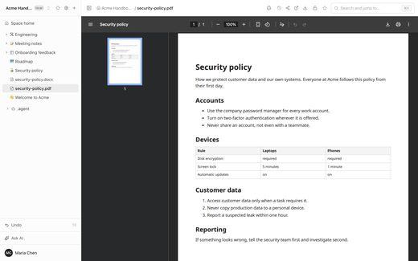
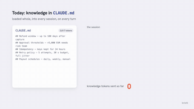
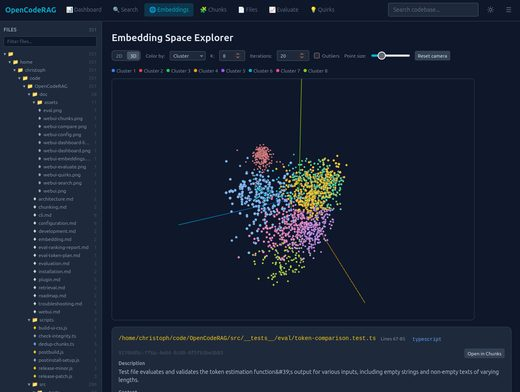

# Awesome LLM Wiki

[English](README.md)

**由 LLM 或 agent 搭建和维护知识库**的开源工具:Markdown 互链的 LLM Wiki、RAG 知识库平台、MCP 与 skill、文档问答、知识图谱、个人知识库。共 326 个仓库,每个都由 [Agent Skills Hub](https://agentskillshub.top?utm_source=github&utm_medium=awesome-list) 读过 README 并做了安全评级。

带类型筛选的在线页面:**[https://agentskillshub.top/best/knowledge-base/](https://agentskillshub.top/best/knowledge-base/?utm_source=github&utm_medium=awesome-list)** · 每 8 小时刷新

## 这些知识库长什么样

<table>
<tr>
<td align="center" valign="top" width="33%"><b>📖 LLM Wiki</b> 117 个仓库   由 agent 撰写并维护的 Markdown 互链 wiki。 <a href="#type-llm_wiki"><b>查看列表 →</b></a></td>
<td align="center" valign="top" width="33%"><b>🏗 RAG 知识库平台</b> 21 个仓库  自带界面的 RAG 知识库平台。 <a href="#type-rag_platform"><b>查看列表 →</b></a></td>
<td align="center" valign="top" width="33%"><b>🔌 MCP 与 Agent Skill</b> 69 个仓库   让 agent 检索知识库的 MCP 服务和 skill。 <a href="#type-mcp"><b>查看列表 →</b></a></td>
</tr>
<tr>
<td align="center" valign="top" width="33%"><b>📄 文档问答</b> 37 个仓库  基于产品文档、代码库、论文或 PDF 回答问题。 <a href="#type-docs_qa"><b>查看列表 →</b></a></td>
<td align="center" valign="top" width="33%"><b>🕸 知识图谱</b> 74 个仓库  以实体和关系组织知识的图谱。 <a href="#type-graph"><b>查看列表 →</b></a></td>
<td align="center" valign="top" width="33%"><b>🧠 个人知识库</b> 8 个仓库  由 AI 维护的笔记、收藏和第二大脑。 <a href="#type-personal"><b>查看列表 →</b></a></td>
</tr>
</table>

## 目录

- [📖 LLM Wiki](#type-llm_wiki) (117)
- [🏗 RAG 知识库平台](#type-rag_platform) (21)
- [🔌 MCP 与 Agent Skill](#type-mcp) (69)
- [📄 文档问答](#type-docs_qa) (37)
- [🕸 知识图谱](#type-graph) (74)
- [🧠 个人知识库](#type-personal) (8)

## 什么样的仓库能上榜

1. 知识库本身就是产品:LLM 维护的 wiki、RAG 知识库,或 agent 据以回答的文档。通用聊天机器人、单纯的向量数据库不算。
2. 它是能安装或运行的软件,不是链接合集或空仓库。
3. 它有 README。没有 README 就没法评级。
4. 50 星及以上只看是否切题;50 星以下还要过 README 质量线(展示效果、一条命令上手、说清产出、文档完整),并且至少 5 星。

这些问题由决策模型逐个读 README 回答,不是人工挑选。卡在线上的仓库可能判到任一边,归错了请提 issue。

## 📖 LLM Wiki

[在在线页面打开这一类,按星数排序 →](https://agentskillshub.top/best/knowledge-base/?utm_source=github&utm_medium=awesome-list#type-llm_wiki)

| 仓库 | 星数 | 做什么 | 安全评级 |
|---|---:|---|---|
| [volcengine/OpenViking](https://github.com/volcengine/OpenViking) | 39.2k | AI Agent 的自演化上下文数据库，统一 Agent 记忆、知识 RAG 和 skill。 | [SAFE](https://agentskillshub.top/skill/volcengine/OpenViking/?utm_source=github&utm_medium=awesome-list) |
| [nashsu/llm_wiki](https://github.com/nashsu/llm_wiki) | 20.2k | LLM Wiki 是跨平台桌面应用，可自动将文档整理为互联知识库。不同于传统 RAG，LLM 会根据来源持续构建和维护持久化 wiki。 | [*待评级*](https://agentskillshub.top/skill/nashsu/llm_wiki/?utm_source=github&utm_medium=awesome-list) |
| [AsyncFuncAI/deepwiki-open](https://github.com/AsyncFuncAI/deepwiki-open) | 18.1k | DeepWiki：为 GitHub/GitLab/Bitbucket 仓库生成 AI Wiki 的开源工具 | [SAFE](https://agentskillshub.top/skill/AsyncFuncAI/deepwiki-open/?utm_source=github&utm_medium=awesome-list) |
| [langchain-ai/openwiki](https://github.com/langchain-ai/openwiki) | 17.0k | OpenWiki 是为代码库编写和维护 agent 文档的 CLI。 | [SAFE](https://agentskillshub.top/skill/langchain-ai/openwiki/?utm_source=github&utm_medium=awesome-list) |
| [AgriciDaniel/claude-obsidian](https://github.com/AgriciDaniel/claude-obsidian) | 15.4k | Obsidian + Claude Code 的 AI 第二大脑：将资料整理成纯 Markdown 知识图谱，支持 AI 笔记与 PKM，基于 Karpath… | [SAFE](https://agentskillshub.top/skill/AgriciDaniel/claude-obsidian/?utm_source=github&utm_medium=awesome-list) |
| [eugeniughelbur/obsidian-second-brain](https://github.com/eugeniughelbur/obsidian-second-brain) | 4.7k | Claude Code等7个CLI agent的持久记忆，以Markdown存储于Obsidian库。含45个命令：语义搜索、笔记改写、免密网络研究和定时维护… | [SAFE](https://agentskillshub.top/skill/eugeniughelbur/obsidian-second-brain/?utm_source=github&utm_medium=awesome-list) |
| [SamurAIGPT/llm-wiki-agent](https://github.com/SamurAIGPT/llm-wiki-agent) | 3.6k | 自维护个人知识库：导入资料，Claude（或 Codex/Gemini）提取知识并维护互联 wiki。支持 Claude Code、Codex、OpenCod… | [SAFE](https://agentskillshub.top/skill/SamurAIGPT/llm-wiki-agent/?utm_source=github&utm_medium=awesome-list) |
| [agentscope-ai/ReMe](https://github.com/agentscope-ai/ReMe) | 3.6k | ReMe：面向 agent 的记忆管理工具包 | [SAFE](https://agentskillshub.top/skill/agentscope-ai/ReMe/?utm_source=github&utm_medium=awesome-list) |
| [Ar9av/obsidian-wiki](https://github.com/Ar9av/obsidian-wiki) | 3.5k | 通过 Obsidian wiki 构建和维护数字大脑的 AI agent 框架，agent 记忆系统 | [SAFE](https://agentskillshub.top/skill/Ar9av/obsidian-wiki/?utm_source=github&utm_medium=awesome-list) |
| [agenticnotetaking/arscontexta](https://github.com/agenticnotetaking/arscontexta) | 3.5k | 基于对话生成个性化知识系统的 Claude Code 插件，输出你拥有的 Markdown 文件第二大脑。 | [SAFE](https://agentskillshub.top/skill/agenticnotetaking/arscontexta/?utm_source=github&utm_medium=awesome-list) |
| [Astro-Han/karpathy-llm-wiki](https://github.com/Astro-Han/karpathy-llm-wiki) | 2.4k | 兼容 Agent Skills 的 LLM wiki，适用于 Claude Code、Cursor 和 Codex。用原始资料、引用和 linting 构建… | [SAFE](https://agentskillshub.top/skill/Astro-Han/karpathy-llm-wiki/?utm_source=github&utm_medium=awesome-list) |
| [atomicstrata/llm-wiki-compiler](https://github.com/atomicstrata/llm-wiki-compiler) | 2.2k | 知识编译器。输入原始资料，输出相互链接的 Wiki。受 Karpathy 的 LLM Wiki 模式启发。 | [SAFE](https://agentskillshub.top/skill/atomicstrata/llm-wiki-compiler/?utm_source=github&utm_medium=awesome-list) |
| [lucasastorian/llmwiki](https://github.com/lucasastorian/llmwiki) | 1.7k | Karpathy 的 LLM Wiki 开源实现。上传文档，通过 MCP 连接 Claude 账户，让它编写 wiki！ | [SAFE](https://agentskillshub.top/skill/lucasastorian/llmwiki/?utm_source=github&utm_medium=awesome-list) |
| [axoviq-ai/synthadoc](https://github.com/axoviq-ai/synthadoc) | 1.6k | Synthadoc：开源LLM知识编译引擎，将原始文档转为结构化、本地优先的Wiki。透明、易读，可自行管理和改进，无需工具。 | [SAFE](https://agentskillshub.top/skill/axoviq-ai/synthadoc/?utm_source=github&utm_medium=awesome-list) |
| [nduckmink/arkon](https://github.com/nduckmink/arkon) | 1.5k | Arkon：企业 AI 知识库与 MCP Server；自托管管理 RAG 上下文、访问策略和 AI skill，通过 MCP 连接 Claude 等 LLM… | [SAFE](https://agentskillshub.top/skill/nduckmink/arkon/?utm_source=github&utm_medium=awesome-list) |
| [nvk/llm-wiki](https://github.com/nvk/llm-wiki) | 1.4k | 为任意 AI agent 编译知识库。支持并行多 agent 研究、论点驱动调查、来源导入、Wiki 编纂、查询和产物生成。 | [SAFE](https://agentskillshub.top/skill/nvk/llm-wiki/?utm_source=github&utm_medium=awesome-list) |
| [coleam00/claude-memory-compiler](https://github.com/coleam00/claude-memory-compiler) | 1.3k | 为 Claude Code 提供随代码库演进的记忆：Hooks 自动记录会话，Claude Agent SDK 提取决策和经验，LLM 编译器整理结构化、交叉… | [*待评级*](https://agentskillshub.top/skill/coleam00/claude-memory-compiler/?utm_source=github&utm_medium=awesome-list) |
| [AlmanacCode/codealmanac](https://github.com/AlmanacCode/codealmanac) | 997 | 供 AI coding agents 使用的代码库 wiki，记录代码未表达的决策、流程、不变量和易错点。 | [SAFE](https://agentskillshub.top/skill/AlmanacCode/codealmanac/?utm_source=github&utm_medium=awesome-list) |
| [undefined-ui/second-brain-os](https://github.com/undefined-ui/second-brain-os) | 919 | 能自我维护的 AI 第二大脑，包含指南、起始知识库、agent skills 和脚本，用于在 Claude Code 和 Obsidian 中构建自组织知识库。 | [SAFE](https://agentskillshub.top/skill/undefined-ui/second-brain-os/?utm_source=github&utm_medium=awesome-list) |
| [kytmanov/obsidian-llm-wiki-local](https://github.com/kytmanov/obsidian-llm-wiki-local) | 829 | Karpathy 的 LLM Wiki，基于 Ollama 本地运行。导入 Markdown 笔记，AI 提取概念，自动链接并扩展 Obsidian wiki… | [*待评级*](https://agentskillshub.top/skill/kytmanov/obsidian-llm-wiki-local/?utm_source=github&utm_medium=awesome-list) |
| [NicholasSpisak/second-brain](https://github.com/NicholasSpisak/second-brain) | 735 | 由 LLM 维护的 Obsidian 个人知识库，基于 Andrej Karpathy 的 LLM Wiki 模式。 | [*待评级*](https://agentskillshub.top/skill/NicholasSpisak/second-brain/?utm_source=github&utm_medium=awesome-list) |
| [swarmclawai/swarmvault](https://github.com/swarmclawai/swarmvault) | 708 | 本地优先的LLM Wiki：开源知识图谱、RAG知识库和agent记忆；可替代Obsidian，支持Claude Code、Codex、OpenClaw。 | [SAFE](https://agentskillshub.top/skill/swarmclawai/swarmvault/?utm_source=github&utm_medium=awesome-list) |
| [lewislulu/llm-wiki-skill](https://github.com/lewislulu/llm-wiki-skill) | 655 | Karpathy 风格的 LLM 知识库 Agent Skill，适用于 OpenClaw/Codex。实验性项目，将持续迭代。 | [SAFE](https://agentskillshub.top/skill/lewislulu/llm-wiki-skill/?utm_source=github&utm_medium=awesome-list) |
| [iBlinkQ/llm-wiki-obsidian-blink](https://github.com/iBlinkQ/llm-wiki-obsidian-blink) | 639 | 一个基于 Andrej Karpathy 的 LLM Wiki 模式 实现的 Obsidian 知识库，利用 LLM 维护可复利的个人知识层。 | [*待评级*](https://agentskillshub.top/skill/iBlinkQ/llm-wiki-obsidian-blink/?utm_source=github&utm_medium=awesome-list) |
| [opendatalab/MinerU-Document-Explorer](https://github.com/opendatalab/MinerU-Document-Explorer) | 636 | Agent 原生知识引擎：用 MCP 工具索引文档、整理 Wiki、快速检索和深度阅读，支持 PDF/DOCX/PPTX/Markdown | [SAFE](https://agentskillshub.top/skill/opendatalab/MinerU-Document-Explorer/?utm_source=github&utm_medium=awesome-list) |
| [zosmaai/pi-llm-wiki](https://github.com/zosmaai/pi-llm-wiki) | 604 | 可自维护、兼容 Obsidian 的 pi 知识库，将原始资料整理为互联的 wiki。原生支持 Open Knowledge Format (OKF) v0.… | [SAFE](https://agentskillshub.top/skill/zosmaai/pi-llm-wiki/?utm_source=github&utm_medium=awesome-list) |
| [shannhk/llm-wikid](https://github.com/shannhk/llm-wikid) | 420 | 面向 Obsidian 的 Karpathy 风格 LLM 知识库。克隆后运行 Claude Code，构建你的第二大脑。 | [*待评级*](https://agentskillshub.top/skill/shannhk/llm-wikid/?utm_source=github&utm_medium=awesome-list) |
| [Pratiyush/llm-wiki](https://github.com/Pratiyush/llm-wiki) | 394 | 基于 LLM 的知识库，来自 Claude Code、Codex CLI、Copilot、Cursor 和 Gemini 会话。实现并发布 Karpathy… | [SAFE](https://agentskillshub.top/skill/Pratiyush/llm-wiki/?utm_source=github&utm_medium=awesome-list) |
| [gatelynch/llm-knowledge-base](https://github.com/gatelynch/llm-knowledge-base) | 334 | 参考 Andrej Kapathy 的 llm-wiki 概念，分层管理素材、知识、思考与作品的个人知识库。 | [*待评级*](https://agentskillshub.top/skill/gatelynch/llm-knowledge-base/?utm_source=github&utm_medium=awesome-list) |
| [ussumant/llm-wiki-compiler](https://github.com/ussumant/llm-wiki-compiler) | 326 | 将 Markdown 知识文件编译为主题式 wiki 的 Claude Code 插件，采用 Karpathy 的 LLM Knowledge Base 模式。 | [SAFE](https://agentskillshub.top/skill/ussumant/llm-wiki-compiler/?utm_source=github&utm_medium=awesome-list) |
| [Jacobinwwey/obsidian-NotEMD](https://github.com/Jacobinwwey/obsidian-NotEMD) | 311 | Notemd 集成多种大型语言模型处理 Obsidian 笔记，自动生成 wiki-links、概念笔记并开展网络研究等。 | [*待评级*](https://agentskillshub.top/skill/Jacobinwwey/obsidian-NotEMD/?utm_source=github&utm_medium=awesome-list) |
| [ymj8903668-droid/trading-review-wiki](https://github.com/ymj8903668-droid/trading-review-wiki) | 290 | LLM驱动的交易复盘知识库：支持快速复盘、交割单导入、FIFO盈亏计算、个股归档和截图讨论。 | [*待评级*](https://agentskillshub.top/skill/ymj8903668-droid/trading-review-wiki/?utm_source=github&utm_medium=awesome-list) |
| [tonbistudio/llm-wiki](https://github.com/tonbistudio/llm-wiki) | 264 | 按 Karpathy 的 LLM Wiki 模式构建 LLM 知识库的开源模板 | [*待评级*](https://agentskillshub.top/skill/tonbistudio/llm-wiki/?utm_source=github&utm_medium=awesome-list) |
| [kytmanov/synto](https://github.com/kytmanov/synto) | 260 | Karpathy 的 LLM Wiki，使用 Ollama 本地运行。导入 Markdown 笔记，AI 提取概念，Obsidian wiki 自动链接并扩展… | [*待评级*](https://agentskillshub.top/skill/kytmanov/synto/?utm_source=github&utm_medium=awesome-list) |
| [luotwo/llm-wiki](https://github.com/luotwo/llm-wiki) | 223 | LLM Wiki - 用 LLM 构建持续积累的个人知识库，含 Claude Code Skill 和实战经验 | [SAFE](https://agentskillshub.top/skill/luotwo/llm-wiki/?utm_source=github&utm_medium=awesome-list) |
| [balukosuri/llm-wiki-karpathy](https://github.com/balukosuri/llm-wiki-karpathy) | 215 |  | [*待评级*](https://agentskillshub.top/skill/balukosuri/llm-wiki-karpathy/?utm_source=github&utm_medium=awesome-list) |
| [mduongvandinh/llm-wiki](https://github.com/mduongvandinh/llm-wiki) | 213 | 由 LLM 驱动的全自动个人知识库，基于 Andrej Karpathy 的 LLM Wiki 模式。 | [SAFE](https://agentskillshub.top/skill/mduongvandinh/llm-wiki/?utm_source=github&utm_medium=awesome-list) |
| [kfchou/wiki-skills](https://github.com/kfchou/wiki-skills) | 187 | Claude Code 的 LLM 维护个人 Wiki skills，实现 Karpathy 的 LLM Wiki 模式 | [SAFE](https://agentskillshub.top/skill/kfchou/wiki-skills/?utm_source=github&utm_medium=awesome-list) |
| [IssacW228/student-llm-wiki](https://github.com/IssacW228/student-llm-wiki) | 176 | 学生LLMWiki：把课程幻灯片整理成互联知识库，支持费曼复习、备考、信心衰减和跨课关联，适配Claude Code与Obsidian。 | [SAFE](https://agentskillshub.top/skill/IssacW228/student-llm-wiki/?utm_source=github&utm_medium=awesome-list) |
| [domleca/llm-wiki](https://github.com/domleca/llm-wiki) | 176 | LM Wiki 读取 Obsidian 笔记，提取人物、想法和联系，支持私密自然语言查询。 | [*待评级*](https://agentskillshub.top/skill/domleca/llm-wiki/?utm_source=github&utm_medium=awesome-list) |
| [alfadur7/llm-wiki-newsroom](https://github.com/alfadur7/llm-wiki-newsroom) | 170 | Harness engineering：agent 编辑部将文档转成交链 Markdown wiki；reground 防页面过时，写作≠审阅，本地优先，结构… | [SAFE](https://agentskillshub.top/skill/alfadur7/llm-wiki-newsroom/?utm_source=github&utm_medium=awesome-list) |
| [nanzhipro/Karpathy-llm-wiki-bootstrap-skill](https://github.com/nanzhipro/Karpathy-llm-wiki-bootstrap-skill) | 166 | 可安装的 skill 和示例，用于构建由 LLM 持续维护的 Markdown wiki，基于 Karpathy 的 LLM Wiki 构想。 | [*待评级*](https://agentskillshub.top/skill/nanzhipro/Karpathy-llm-wiki-bootstrap-skill/?utm_source=github&utm_medium=awesome-list) |
| [selmakcby/knowledge-pipeline](https://github.com/selmakcby/knowledge-pipeline) | 161 | Terminal-vibe 演示 + LLM-Wiki skill。将原始对话转化为由模式规范的持续增长 wiki。 | [*待评级*](https://agentskillshub.top/skill/selmakcby/knowledge-pipeline/?utm_source=github&utm_medium=awesome-list) |
| [liangdabiao/llm-wiki](https://github.com/liangdabiao/llm-wiki) | 156 | 基于 Karpathy llm-wiki，使用 AI 整理多种来源为 wiki，通过 Quartz 发布，并用 claude_agent_sdk 调用 cla… | [*待评级*](https://agentskillshub.top/skill/liangdabiao/llm-wiki/?utm_source=github&utm_medium=awesome-list) |
| [PieroSierra/SecondBrain](https://github.com/PieroSierra/SecondBrain) | 152 | 此文件夹中的个人知识库。放入内容后自动整理，可提问并获得有来源的答案，支持 Claude Code 斜杠命令或本地网页面板。 | [*待评级*](https://agentskillshub.top/skill/PieroSierra/SecondBrain/?utm_source=github&utm_medium=awesome-list) |
| [bybit-exchange/kaas](https://github.com/bybit-exchange/kaas) | 149 | 将零散笔记、文档和文字稿整理为可查询的 Markdown wiki，支持 MCP 访问，无需 embeddings，可自托管。 | [SAFE](https://agentskillshub.top/skill/bybit-exchange/kaas/?utm_source=github&utm_medium=awesome-list) |
| [cablate/llm-atomic-wiki](https://github.com/cablate/llm-atomic-wiki) | 149 | Karpathy 的 LLM Wiki 模式扩展：原子层、主题分支、双层 Lint。基于端到端实践提炼。 | [*待评级*](https://agentskillshub.top/skill/cablate/llm-atomic-wiki/?utm_source=github&utm_medium=awesome-list) |
| [MehmetGoekce/llm-wiki](https://github.com/MehmetGoekce/llm-wiki) | 147 | 使用 Claude Code 构建 Karpathy 的 LLM Wiki，采用 L1/L2 缓存架构，支持 Logseq + Obsidian。 | [SAFE](https://agentskillshub.top/skill/MehmetGoekce/llm-wiki/?utm_source=github&utm_medium=awesome-list) |
| [kothari-nikunj/llm-wiki](https://github.com/kothari-nikunj/llm-wiki) | 145 | 个人维基 | [*待评级*](https://agentskillshub.top/skill/kothari-nikunj/llm-wiki/?utm_source=github&utm_medium=awesome-list) |
| [Mark393295827/third-brain-v7-skills](https://github.com/Mark393295827/third-brain-v7-skills) | 141 | agent wiki + 工程 skills | [SAFE](https://agentskillshub.top/skill/Mark393295827/third-brain-v7-skills/?utm_source=github&utm_medium=awesome-list) |
| [psinetron/echoes-vault-codex](https://github.com/psinetron/echoes-vault-codex) | 131 | Codex 持久记忆插件，跨会话保留的 Obsidian 风格知识库 | [SAFE](https://agentskillshub.top/skill/psinetron/echoes-vault-codex/?utm_source=github&utm_medium=awesome-list) |
| [ctxr-dev/llm-wiki-memory](https://github.com/ctxr-dev/llm-wiki-memory) | 130 | 本地、Git 版本化的 AI 编程 agent 记忆。无需 RAG、Docker 或外部服务。借助本地 LLM wiki、设备端 embeddings 和 M… | [SAFE](https://agentskillshub.top/skill/ctxr-dev/llm-wiki-memory/?utm_source=github&utm_medium=awesome-list) |
| [frankchu91/mindbase-llm-wiki](https://github.com/frankchu91/mindbase-llm-wiki) | 128 | Karpathy 的 LLM Wiki 产品：AI 根据笔记和资料构建并维护 Markdown wiki。MCP server + web UI，支持 Oll… | [SAFE](https://agentskillshub.top/skill/frankchu91/mindbase-llm-wiki/?utm_source=github&utm_medium=awesome-list) |
| [AyanbekDos/memoriki](https://github.com/AyanbekDos/memoriki) | 122 | Memoriki - LLM Wiki + MemPalace。具备真实记忆的个人知识库 | [*待评级*](https://agentskillshub.top/skill/AyanbekDos/memoriki/?utm_source=github&utm_medium=awesome-list) |
| [songzhuozhu/obsidian-llm-wiki](https://github.com/songzhuozhu/obsidian-llm-wiki) | 122 | 让 LLM 成为 wiki 维护者，受 Karpathy 的 LLM Wiki 启发，适用于 Obsidian、Claude Code 和 Codex。 | [*待评级*](https://agentskillshub.top/skill/songzhuozhu/obsidian-llm-wiki/?utm_source=github&utm_medium=awesome-list) |
| [appleweiping/WEIPING_WIKI](https://github.com/appleweiping/WEIPING_WIKI) | 119 | knowledge base managed with an LLM workflow | [*待评级*](https://agentskillshub.top/skill/appleweiping/WEIPING_WIKI/?utm_source=github&utm_medium=awesome-list) |
| [praneybehl/llm-wiki-plugin](https://github.com/praneybehl/llm-wiki-plugin) | 116 | Andrej Karpathy 的 LLM Wiki 模式，作为 skill 和 Claude Code 插件：将资料转为可自维护、可扩展的 Markdown… | [SAFE](https://agentskillshub.top/skill/praneybehl/llm-wiki-plugin/?utm_source=github&utm_medium=awesome-list) |
| [SherwinQ/karpathy-wiki](https://github.com/SherwinQ/karpathy-wiki) | 113 | 基于 Andrej Karpathy 提出的 LLM Wiki 模式构建的 Agent skill，通过四阶段流水线将碎片信息转化为结构化、可检索、持续增长的… | [SAFE](https://agentskillshub.top/skill/SherwinQ/karpathy-wiki/?utm_source=github&utm_medium=awesome-list) |
| [ekadetov/llm-wiki](https://github.com/ekadetov/llm-wiki) | 109 | LLM Wiki——用于在 Obsidian 中构建持久、不断积累知识库的 Claude Code 插件 | [*待评级*](https://agentskillshub.top/skill/ekadetov/llm-wiki/?utm_source=github&utm_medium=awesome-list) |
| [abubakarsiddik31/axiom-wiki](https://github.com/abubakarsiddik31/axiom-wiki) | 108 | 受 Andrej Karpathy 的 llm-wiki 启发：让 LLM 持续积累 wiki，而非每次从原始来源重新推导答案 | [*待评级*](https://agentskillshub.top/skill/abubakarsiddik31/axiom-wiki/?utm_source=github&utm_medium=awesome-list) |
| [jackwener/llm-wiki](https://github.com/jackwener/llm-wiki) | 104 | 面向 agent 的持久知识管理：一次编译知识，持续查询。 | [*待评级*](https://agentskillshub.top/skill/jackwener/llm-wiki/?utm_source=github&utm_medium=awesome-list) |
| [toolboxmd/karpathy-wiki](https://github.com/toolboxmd/karpathy-wiki) | 104 | Karpathy Wiki - 用于构建持久积累知识库的 Claude Code skills，基于 Andrej Karpathy 的 LLM Wiki 模… | [SAFE](https://agentskillshub.top/skill/toolboxmd/karpathy-wiki/?utm_source=github&utm_medium=awesome-list) |
| [doum1004/llmwiki-cli](https://github.com/doum1004/llmwiki-cli) | 103 | 用于构建和维护个人知识库的 LLM agent CLI 工具 | [SAFE](https://agentskillshub.top/skill/doum1004/llmwiki-cli/?utm_source=github&utm_medium=awesome-list) |
| [songs-aaa/shared-memory-vault](https://github.com/songs-aaa/shared-memory-vault) | 102 | 多智能体云知识库的记忆治理引擎，所有 agent 和设备共享并保持一致。纯 Markdown，九项治理自动化，零依赖。 | [*待评级*](https://agentskillshub.top/skill/songs-aaa/shared-memory-vault/?utm_source=github&utm_medium=awesome-list) |
| [NulightJens/ai-second-brain-skills](https://github.com/NulightJens/ai-second-brain-skills) | 100 | 用于构建 Karpathy 风格 LLM wiki 的两个 Claude Code skill。 | [SAFE](https://agentskillshub.top/skill/NulightJens/ai-second-brain-skills/?utm_source=github&utm_medium=awesome-list) |
| [klemensgc/modular-context-obsidian-plugin](https://github.com/klemensgc/modular-context-obsidian-plugin) | 99 | 模块化上下文：Karpathy LLM 知识库与 Gmail、G-Cal，多账户 Claude Code MCP 服务器，本地优先并加密 | [SAFE](https://agentskillshub.top/skill/klemensgc/modular-context-obsidian-plugin/?utm_source=github&utm_medium=awesome-list) |
| [eleven-net-cn/llm-wiki-starter](https://github.com/eleven-net-cn/llm-wiki-starter) | 95 | 一条命令创建 LLM Wiki 知识库，基于 Andrej Karpathy 的 LLM Wiki 模式 | [*待评级*](https://agentskillshub.top/skill/eleven-net-cn/llm-wiki-starter/?utm_source=github&utm_medium=awesome-list) |
| [capitalparser/notebooklm-wiki-pipeline](https://github.com/capitalparser/notebooklm-wiki-pipeline) | 94 | 通过 NotebookLM MCP 将 Google Drive PDF 转为 Obsidian wiki 笔记，无需加载完整 PDF 到 Claude 上下… | [SAFE](https://agentskillshub.top/skill/capitalparser/notebooklm-wiki-pipeline/?utm_source=github&utm_medium=awesome-list) |
| [Lambenthan/empiricalwiki](https://github.com/Lambenthan/empiricalwiki) | 91 | 经管实证研究 AI 知识库，覆盖文献阅读至 Stata 执行，按10类实体组织：变量、数据集、模型、机制、假设、识别策略、稳健性、异质性、表格、论文。 | [SAFE](https://agentskillshub.top/skill/Lambenthan/empiricalwiki/?utm_source=github&utm_medium=awesome-list) |
| [boluodaixue/paperpilot](https://github.com/boluodaixue/paperpilot) | 91 | 基于 LangGraph 的个人深度研究系统，将研究沉淀为可追溯、可问答、可持续扩展的长期知识。 | [*待评级*](https://agentskillshub.top/skill/boluodaixue/paperpilot/?utm_source=github&utm_medium=awesome-list) |
| [skindhu/claude-deep-wiki](https://github.com/skindhu/claude-deep-wiki) | 91 | 基于 Claude Agent SDK 的代码分析工具，生成业务知识库和 PRD 文档，支持 165+ 种语言。 | [*待评级*](https://agentskillshub.top/skill/skindhu/claude-deep-wiki/?utm_source=github&utm_medium=awesome-list) |
| [johnfkoo951/cmds-llm-wiki](https://github.com/johnfkoo951/cmds-llm-wiki) | 90 | LLM Wiki 模板：Karpathy 三层模式＋Gold In Gold Out 目的门＋Claude Code·Codex 双 harness（11 个… | [SAFE](https://agentskillshub.top/skill/johnfkoo951/cmds-llm-wiki/?utm_source=github&utm_medium=awesome-list) |
| [zby/commonplace](https://github.com/zby/commonplace) | 90 | LLM wiki 协同运行理论：供 agent 操作知识的框架，包含带类型、可链接、经审核的 Markdown，由 agent 执行。 | [SAFE](https://agentskillshub.top/skill/zby/commonplace/?utm_source=github&utm_medium=awesome-list) |
| [fivetaku/llm-wiki](https://github.com/fivetaku/llm-wiki) | 83 | 由 Claude Code 将原始资料合成为 Wiki 并持续维护的 Markdown 知识库模板（LLM Wiki、Karpathy 模式） | [*待评级*](https://agentskillshub.top/skill/fivetaku/llm-wiki/?utm_source=github&utm_medium=awesome-list) |
| [vouchdev/vouch](https://github.com/vouchdev/vouch) | 82 | 面向 AI agents 的 Git 原生审核知识库：它们提议写入，你审批。每条声明引用来源，每次变更均为仓库中的 diff。MCP + CLI。 | [SAFE](https://agentskillshub.top/skill/vouchdev/vouch/?utm_source=github&utm_medium=awesome-list) |
| [wfnuser/cowiki](https://github.com/wfnuser/cowiki) | 82 | LLM Wiki，多人协作版 | [*待评级*](https://agentskillshub.top/skill/wfnuser/cowiki/?utm_source=github&utm_medium=awesome-list) |
| [rohitg00/akbp](https://github.com/rohitg00/akbp) | 80 | Agent 知识库协议 | [*待评级*](https://agentskillshub.top/skill/rohitg00/akbp/?utm_source=github&utm_medium=awesome-list) |
| [vakovalskii/ontoship](https://github.com/vakovalskii/ontoship) | 80 | md+git 知识库：FTS5 搜索（bm25+trigram/模糊）、HTML+图谱、代码本体检查器、Claude Code 插件 | [*待评级*](https://agentskillshub.top/skill/vakovalskii/ontoship/?utm_source=github&utm_medium=awesome-list) |
| [7xuanlu/wenlan](https://github.com/7xuanlu/wenlan) | 79 | Wenlan 是面向 AI 原生时代的知识库，AI agent 记录所学并生成持续更新、标注来源的 wiki 页面。 | [SAFE](https://agentskillshub.top/skill/7xuanlu/wenlan/?utm_source=github&utm_medium=awesome-list) |
| [moonlarry/awesome-llm-paper-wiki](https://github.com/moonlarry/awesome-llm-paper-wiki) | 78 | 由 LLM Agent 驱动的本地 Markdown 文献库管理与学术综述自动化系统 | [*待评级*](https://agentskillshub.top/skill/moonlarry/awesome-llm-paper-wiki/?utm_source=github&utm_medium=awesome-list) |
| [owenliang/llm-wiki](https://github.com/owenliang/llm-wiki) | 78 | karpathy/llm-wiki.md 的实现 | [*待评级*](https://agentskillshub.top/skill/owenliang/llm-wiki/?utm_source=github&utm_medium=awesome-list) |
| [tuirk/Kompl](https://github.com/tuirk/Kompl) | 77 | 可持续积累的 LLM wiki，适合作为个人第二大脑，随内容增长自动整理和更新，无需维护 | [CAUTION](https://agentskillshub.top/skill/tuirk/Kompl/?utm_source=github&utm_medium=awesome-list) |
| [ndjordjevic/pin-llm-wiki](https://github.com/ndjordjevic/pin-llm-wiki) | 76 | 用于 Claude、Cursor 和 Copilot 的 skill，自动执行 Karpathy LLM Wiki 流程：将网页、GitHub 和 YouTu… | [SAFE](https://agentskillshub.top/skill/ndjordjevic/pin-llm-wiki/?utm_source=github&utm_medium=awesome-list) |
| [asakin/llm-context-base](https://github.com/asakin/llm-context-base) | 75 | A git template for building your own LLM-powered personal wiki. Training period, metadata standard, lint system included. Clone and go. | [*待评级*](https://agentskillshub.top/skill/asakin/llm-context-base/?utm_source=github&utm_medium=awesome-list) |
| [smixs/autograph](https://github.com/smixs/autograph) | 73 | Obsidian 中 AI agent 的 schema-as-code 记忆：类型化卡片、实体去重、链接修复、原位更新、艾宾浩斯衰减。你拥有的纯 Markd… | [SAFE](https://agentskillshub.top/skill/smixs/autograph/?utm_source=github&utm_medium=awesome-list) |
| [zcag/tela](https://github.com/zcag/tela) | 73 | 开源自托管 Markdown 团队 Wiki，内置 MCP server，支持 AI agents 读写和搜索文档、实时协作、语义及全文搜索。 | [SAFE](https://agentskillshub.top/skill/zcag/tela/?utm_source=github&utm_medium=awesome-list) |
| [lpaiu-cs/osk-system](https://github.com/lpaiu-cs/osk-system) | 72 | 基于来源的 MCP 记忆运行时和兼容 Obsidian 的 LLM agent 知识库模板。 | [SAFE](https://agentskillshub.top/skill/lpaiu-cs/osk-system/?utm_source=github&utm_medium=awesome-list) |
| [sametbrr/llm-wiki-manager](https://github.com/sametbrr/llm-wiki-manager) | 71 | 用于持久化 LLM 管理的 wiki 的 skill：LLM 编写并交叉引用，你维护来源。 | [SAFE](https://agentskillshub.top/skill/sametbrr/llm-wiki-manager/?utm_source=github&utm_medium=awesome-list) |
| [Benboerba620/karpathy-claude-wiki](https://github.com/Benboerba620/karpathy-claude-wiki) | 69 | 面向 LLM 的 Karpathy 风格个人 wiki：Markdown + frontmatter，无向量数据库、无 RAG。为 Claude Code 打… | [SAFE](https://agentskillshub.top/skill/Benboerba620/karpathy-claude-wiki/?utm_source=github&utm_medium=awesome-list) |
| [vanillaflava/llm-wiki-skills](https://github.com/vanillaflava/llm-wiki-skills) | 69 | 将 Markdown 知识库整理为 Wiki，含 6 个 agent skill；支持 Obsidian、Logseq、本地文件夹和 LLM 会话记忆，跨平台。 | [SAFE](https://agentskillshub.top/skill/vanillaflava/llm-wiki-skills/?utm_source=github&utm_medium=awesome-list) |
| [microsoft/llmwiki](https://github.com/microsoft/llmwiki) | 68 | 用于自维护个人维基的 VS Code 扩展，LLM 为你总结、交叉引用并整理所有来源 | [*待评级*](https://agentskillshub.top/skill/microsoft/llmwiki/?utm_source=github&utm_medium=awesome-list) |
| [oliver-kriska/scribe](https://github.com/oliver-kriska/scribe) | 66 | 由LLM管理的个人知识库，自动从git仓库、Claude Code会话和iMessage书签提取内容，跨项目使用，qmd索引，按cron运行 | [CAUTION](https://agentskillshub.top/skill/oliver-kriska/scribe/?utm_source=github&utm_medium=awesome-list) |
| [LeoBR84p/wiki_llm](https://github.com/LeoBR84p/wiki_llm) | 65 | wiki-llm：将文档集合转为智能 Wiki，自动生成、组织和维护，无需编程。 | [*待评级*](https://agentskillshub.top/skill/LeoBR84p/wiki_llm/?utm_source=github&utm_medium=awesome-list) |
| [hoadoan1997/llm-knowledge-base](https://github.com/hoadoan1997/llm-knowledge-base) | 65 | LLM驱动的个人知识库：原始文章→wiki→问答与输出。Claude撰写，你负责整理。 | [*待评级*](https://agentskillshub.top/skill/hoadoan1997/llm-knowledge-base/?utm_source=github&utm_medium=awesome-list) |
| [JanYork/llm-wiki-cli](https://github.com/JanYork/llm-wiki-cli) | 64 | 由 agent 驱动的主动记忆 CLI：跨会话自主回忆、维护并演化有来源依据的持久知识 | [SAFE](https://agentskillshub.top/skill/JanYork/llm-wiki-cli/?utm_source=github&utm_medium=awesome-list) |
| [tashisleepy/knowledge-engine](https://github.com/tashisleepy/knowledge-engine) | 64 | 连接人类可读的 Wiki 与机器速度的记忆，基于 Karpathys LLM Wiki 模式和 Memvid 构建。 | [*待评级*](https://agentskillshub.top/skill/tashisleepy/knowledge-engine/?utm_source=github&utm_medium=awesome-list) |
| [remember-md/remember](https://github.com/remember-md/remember) | 62 | Claude Code 的 AI 第二大脑，可自我构建。将会话知识提取为自动整理的 Markdown。优先本地存储，可查询并学习你的习惯。 | [SAFE](https://agentskillshub.top/skill/remember-md/remember/?utm_source=github&utm_medium=awesome-list) |
| [hellohejinyu/llm-wiki](https://github.com/hellohejinyu/llm-wiki) | 61 | 基于大语言模型的个人 Wiki 命令行工具。 | [*待评级*](https://agentskillshub.top/skill/hellohejinyu/llm-wiki/?utm_source=github&utm_medium=awesome-list) |
| [iamsashank09/llm-wiki-kit](https://github.com/iamsashank09/llm-wiki-kit) | 61 | 别再向 AI agent 反复解释研究内容。LLM 持续维护并积累的 wiki。导入 PDF、URL、YouTube，agent 永久记住。基于 Karpat… | [SAFE](https://agentskillshub.top/skill/iamsashank09/llm-wiki-kit/?utm_source=github&utm_medium=awesome-list) |
| [MetamusicX/zissa-wiki](https://github.com/MetamusicX/zissa-wiki) | 58 | Zissa Wiki——纯 Markdown 研究知识库，可由任意 AI agent 维护；采用 Karpathy 的 LLM Wiki 模式，核对每条引文来… | [SAFE](https://agentskillshub.top/skill/MetamusicX/zissa-wiki/?utm_source=github&utm_medium=awesome-list) |
| [ddsyasas/llm-wiki](https://github.com/ddsyasas/llm-wiki) | 58 | 由 LLM agent 维护的开源本地优先知识库，实现 Andrej Karpathy 的 LLM Wiki 模式。 | [*待评级*](https://agentskillshub.top/skill/ddsyasas/llm-wiki/?utm_source=github&utm_medium=awesome-list) |
| [NiharShrotri/llm-wiki](https://github.com/NiharShrotri/llm-wiki) | 55 | 基于 Karpathy 的 LLM-Wiki 模式构建的本地 LLM 维护个人 wiki，运行于 Ollama + Qwen3 + QMD。 | [*待评级*](https://agentskillshub.top/skill/NiharShrotri/llm-wiki/?utm_source=github&utm_medium=awesome-list) |
| [fivif/OmniKB](https://github.com/fivif/OmniKB) | 55 | 通用 AI 知识库 agent | [*待评级*](https://agentskillshub.top/skill/fivif/OmniKB/?utm_source=github&utm_medium=awesome-list) |
| [bashiraziz/llm-wiki-template](https://github.com/bashiraziz/llm-wiki-template) | 52 | 构建个人 LLM 维护知识库的可复用模板，采用 Karpathy 的 LLM Wiki 模式。 | [SAFE](https://agentskillshub.top/skill/bashiraziz/llm-wiki-template/?utm_source=github&utm_medium=awesome-list) |
| [sodam-ai/SoDam-WikiMate](https://github.com/sodam-ai/SoDam-WikiMate) | 51 | Claude Code 插件+MCP core：整理 Obsidian 原文库，建笔记、关联分类总结，可索引 Notion；健康检查、无删除修复、审批与注入防… | [SAFE](https://agentskillshub.top/skill/sodam-ai/SoDam-WikiMate/?utm_source=github&utm_medium=awesome-list) |
| [Oshayr/LLM-Wiki](https://github.com/Oshayr/LLM-Wiki) | 50 | Claude Code 的自主知识库插件：记录研究、想法和决策，构建互联维基，支持缺失时研究、语义搜索和 Wikipedia 风格网页界面。 | [SAFE](https://agentskillshub.top/skill/Oshayr/LLM-Wiki/?utm_source=github&utm_medium=awesome-list) |
| [6eanut/llm-wiki](https://github.com/6eanut/llm-wiki) | 46 | 用 Claude Code skill 从源文档构建持久、互联的知识库，知识编译一次并持续更新，无需每次查询重新推导，基于 Karpathy 的 LLM Wi… | [SAFE](https://agentskillshub.top/skill/6eanut/llm-wiki/?utm_source=github&utm_medium=awesome-list) |
| [cobusgreyling/llm-wiki](https://github.com/cobusgreyling/llm-wiki) | 45 | 由 LLM 智能体维护的持续积累知识库，灵感来自 Karpathy 的 LLM Wiki 模式 | [SAFE](https://agentskillshub.top/skill/cobusgreyling/llm-wiki/?utm_source=github&utm_medium=awesome-list) |
| [2233admin/obsidian-llm-wiki](https://github.com/2233admin/obsidian-llm-wiki) | 36 | 你的 Markdown 知识库，编译为供 Claude Code、Codex、OpenCode 和 Gemini CLI 使用的 6 人 MCP 团队。优先无… | [SAFE](https://agentskillshub.top/skill/2233admin/obsidian-llm-wiki/?utm_source=github&utm_medium=awesome-list) |
| [decodingai-magazine/llm-wiki-workshop](https://github.com/decodingai-magazine/llm-wiki-workshop) | 33 | 从第一性原理学习设计 LLM wiki，用作 agent 记忆。包含 3 个练习、开源代码、视频和幻灯片。无需编程技能。 | [*待评级*](https://agentskillshub.top/skill/decodingai-magazine/llm-wiki-workshop/?utm_source=github&utm_medium=awesome-list) |
| [Open330/kiwimu](https://github.com/Open330/kiwimu) | 30 | 用 LLM 将教材、PDF 和网页内容转为互联的个人学习 Wiki | [*待评级*](https://agentskillshub.top/skill/Open330/kiwimu/?utm_source=github&utm_medium=awesome-list) |
| [evergreen-it-dev/folio](https://github.com/evergreen-it-dev/folio) | 20 | The AI-assisted, open-source alternative to Notion and Confluence: a team wiki that lives in Git, with real-time editing, data tables, whiteboards, o… | [SAFE](https://agentskillshub.top/skill/evergreen-it-dev/folio/?utm_source=github&utm_medium=awesome-list) |
| [atukunare/wiki-knowledge-agent](https://github.com/atukunare/wiki-knowledge-agent) | 19 | Claude Code、Codex、Cursor、Hermes 的零依赖 agent skill：聊天内容转可搜索 wiki，验链、滤广告、翻译总结、时效提醒。 | [SAFE](https://agentskillshub.top/skill/atukunare/wiki-knowledge-agent/?utm_source=github&utm_medium=awesome-list) |
| [professorpalmer/portable-llm-wiki](https://github.com/professorpalmer/portable-llm-wiki) | 18 | 厂商中立的LLM维护型个人上下文wiki。Markdown存于git，可通过HTTP API和MCP server供LLM查询。v0.7原型。 | [*待评级*](https://agentskillshub.top/skill/professorpalmer/portable-llm-wiki/?utm_source=github&utm_medium=awesome-list) |
| [ignromanov/llm-obsidian-wiki](https://github.com/ignromanov/llm-obsidian-wiki) | 17 | 用于在 Obsidian 中构建持久积累知识库的 Claude Code 插件。受 Karpathy 的 LLM Wiki 模式启发。 | [*待评级*](https://agentskillshub.top/skill/ignromanov/llm-obsidian-wiki/?utm_source=github&utm_medium=awesome-list) |
| [onurkafk/corvid](https://github.com/onurkafk/corvid) | 14 | AI 编码 agent 的持久记忆：一条命令保存，语义搜索检索，跨项目使用。灵感来自 Karpathy 的 LLM Wiki。 | [*待评级*](https://agentskillshub.top/skill/onurkafk/corvid/?utm_source=github&utm_medium=awesome-list) |
| [PALAN-K/llm-wiki-loop](https://github.com/PALAN-K/llm-wiki-loop) | 13 | LLM维护的知识库参考架构：模式、生命周期闭环、机器验证、自安装 | [*待评级*](https://agentskillshub.top/skill/PALAN-K/llm-wiki-loop/?utm_source=github&utm_medium=awesome-list) |

## 🏗 RAG 知识库平台

[在在线页面打开这一类,按星数排序 →](https://agentskillshub.top/best/knowledge-base/?utm_source=github&utm_medium=awesome-list#type-rag_platform)

| 仓库 | 星数 | 做什么 | 安全评级 |
|---|---:|---|---|
| [infiniflow/ragflow](https://github.com/infiniflow/ragflow) | 91.7k | RAGFlow 是开源的检索增强生成（RAG）引擎，结合 RAG 与 Agent 能力，为 LLMs 提供上下文层 | [SAFE](https://agentskillshub.top/skill/infiniflow/ragflow/?utm_source=github&utm_medium=awesome-list) |
| [chatchat-space/Langchain-Chatchat](https://github.com/chatchat-space/Langchain-Chatchat) | 38.7k | Langchain-Chatchat（原Langchain-ChatGLM）：基于 Langchain、ChatGLM、Qwen、Llama 的本地知识库 R… | [*待评级*](https://agentskillshub.top/skill/chatchat-space/Langchain-Chatchat/?utm_source=github&utm_medium=awesome-list) |
| [Tencent/WeKnora](https://github.com/Tencent/WeKnora) | 32.1k | 开源 LLM 知识平台：将原始文档转为可查询的 RAG、自主推理 agent 和自维护 Wiki。 | [*待评级*](https://agentskillshub.top/skill/Tencent/WeKnora/?utm_source=github&utm_medium=awesome-list) |
| [1Panel-dev/MaxKB](https://github.com/1Panel-dev/MaxKB) | 22.9k | MaxKB 是用于构建企业级智能体的开源平台。 | [SAFE](https://agentskillshub.top/skill/1Panel-dev/MaxKB/?utm_source=github&utm_medium=awesome-list) |
| [airweave-ai/airweave](https://github.com/airweave-ai/airweave) | 6.6k | 面向 AI agent 的开源上下文检索层 | [SAFE](https://agentskillshub.top/skill/airweave-ai/airweave/?utm_source=github&utm_medium=awesome-list) |
| [Zleap-AI/SAG](https://github.com/Zleap-AI/SAG) | 2.5k | 面向人类和智能体的原创检索架构与开源知识库。 | [*待评级*](https://agentskillshub.top/skill/Zleap-AI/SAG/?utm_source=github&utm_medium=awesome-list) |
| [finic-ai/rag-stack](https://github.com/finic-ai/rag-stack) | 1.6k | 在 VPC 中部署私有 ChatGPT 替代方案，连接组织知识库。支持 Llama 2、Falcon 和 GPT4All 等开源 LLM。 | [*待评级*](https://agentskillshub.top/skill/finic-ai/rag-stack/?utm_source=github&utm_medium=awesome-list) |
| [shuyu-labs/AntSK](https://github.com/shuyu-labs/AntSK) | 1.3k | 基于 .Net 9、AntBlazor、Semantic Kernel 和 Kernel Memory 的 AI 知识库/agent，支持本地离线大模型、无网… | [*待评级*](https://agentskillshub.top/skill/shuyu-labs/AntSK/?utm_source=github&utm_medium=awesome-list) |
| [dmayboroda/minima](https://github.com/dmayboroda/minima) | 1.1k | 可配置容器的本地部署对话式 RAG | [SAFE](https://agentskillshub.top/skill/dmayboroda/minima/?utm_source=github&utm_medium=awesome-list) |
| [mudler/LocalRecall](https://github.com/mudler/LocalRecall) | 975 | 面向 agent 的本地 Memory 层与知识库，支持 WebUI | [*待评级*](https://agentskillshub.top/skill/mudler/LocalRecall/?utm_source=github&utm_medium=awesome-list) |
| [boluo2077/deep-rag](https://github.com/boluo2077/deep-rag) | 215 | Deep RAG：超越向量搜索，支持多跳推理、否定查询、数值比较和全局聚合，兼容 OpenAI、Anthropic、Google Gemini，采用 Pyth… | [*待评级*](https://agentskillshub.top/skill/boluo2077/deep-rag/?utm_source=github&utm_medium=awesome-list) |
| [bulolo/CatWiki](https://github.com/bulolo/CatWiki) | 196 | Agentic RAG知识库平台，支持内容管理和AI智能问答 | [*待评级*](https://agentskillshub.top/skill/bulolo/CatWiki/?utm_source=github&utm_medium=awesome-list) |
| [Ciao1019/Petrichor](https://github.com/Ciao1019/Petrichor) | 143 | 面向人类和 AI agents 的自托管知识平台，发布 wiki、博客和可移植的 Agent Skills。 | [SAFE](https://agentskillshub.top/skill/Ciao1019/Petrichor/?utm_source=github&utm_medium=awesome-list) |
| [madarco/ragrabbit](https://github.com/madarco/ragrabbit) | 136 | 开源、自托管的网站 AI 搜索和 LLM.txt | [SAFE](https://agentskillshub.top/skill/madarco/ragrabbit/?utm_source=github&utm_medium=awesome-list) |
| [Pengc-Sun/enterprise-rag-knowledge-base](https://github.com/Pengc-Sun/enterprise-rag-knowledge-base) | 115 | 面向企业的 RAG 知识库系统 | [*待评级*](https://agentskillshub.top/skill/Pengc-Sun/enterprise-rag-knowledge-base/?utm_source=github&utm_medium=awesome-list) |
| [gmickel/gno](https://github.com/gmickel/gno) | 115 | 本地 AI 文档搜索与编辑，支持混合检索、LLM 回答、WebUI、REST API 和 MCP，适用于 AI 客户端。 | [SAFE](https://agentskillshub.top/skill/gmickel/gno/?utm_source=github&utm_medium=awesome-list) |
| [joungminsung/OpenDocuments](https://github.com/joungminsung/OpenDocuments) | 115 | 自托管 RAG 平台，支持搜索 GitHub、Notion、Google Drive、本地文件和网页文档，并提供引用。 | [SAFE](https://agentskillshub.top/skill/joungminsung/OpenDocuments/?utm_source=github&utm_medium=awesome-list) |
| [quanta-quest/quanta-quest](https://github.com/quanta-quest/quanta-quest) | 102 | AI 驱动的个人数据通用搜索，按你的需求定制。目标：以“端侧 LLM + 用户数据本地化”为核心发展方向。 | [SAFE](https://agentskillshub.top/skill/quanta-quest/quanta-quest/?utm_source=github&utm_medium=awesome-list) |
| [kbrisso/byte-vision](https://github.com/kbrisso/byte-vision) | 72 | Byte-Vision 是以隐私为先的文档智能平台，将静态文档转为可搜索知识库，基于 Elasticsearch 和 RAG，支持文档解析、OCR 处理和现代… | [*待评级*](https://agentskillshub.top/skill/kbrisso/byte-vision/?utm_source=github&utm_medium=awesome-list) |
| [upupmake/general-rag-system](https://github.com/upupmake/general-rag-system) | 64 | 基于 Vue.js 前端、Spring Boot 后端和 FastAPI LLM 服务的 RAG 知识库系统。 | [*待评级*](https://agentskillshub.top/skill/upupmake/general-rag-system/?utm_source=github&utm_medium=awesome-list) |
| [RD945/document-rag](https://github.com/RD945/document-rag) | 5 | DocumentRAG 是自托管的 RAG 聊天系统，使用本地语言模型查询文档，支持多种格式并基于索引知识回答问题 | [*待评级*](https://agentskillshub.top/skill/RD945/document-rag/?utm_source=github&utm_medium=awesome-list) |

## 🔌 MCP 与 Agent Skill

[在在线页面打开这一类,按星数排序 →](https://agentskillshub.top/best/knowledge-base/?utm_source=github&utm_medium=awesome-list#type-mcp)

<table><tr>
<td align="center" valign="top"> <a href="https://github.com/MrDoe/OpenCodeRAG">MrDoe/OpenCodeRAG</a></td>
</tr></table>

| 仓库 | 星数 | 做什么 | 安全评级 |
|---|---:|---|---|
| [zilliztech/memsearch](https://github.com/zilliztech/memsearch) | 2.7k | 基于 Markdown 和 Milvus，为 Claude Code、Codex、DSH 等 AI agent 提供统一记忆层。 | [SAFE](https://agentskillshub.top/skill/zilliztech/memsearch/?utm_source=github&utm_medium=awesome-list) |
| [coleam00/mcp-crawl4ai-rag](https://github.com/coleam00/mcp-crawl4ai-rag) | 2.3k | 为 AI agents 和 AI coding assistants 提供网页抓取与 RAG 能力 | [SAFE](https://agentskillshub.top/skill/coleam00/mcp-crawl4ai-rag/?utm_source=github&utm_medium=awesome-list) |
| [MicrosoftDocs/mcp](https://github.com/MicrosoftDocs/mcp) | 1.9k | Microsoft Learn MCP Server 和 CLI 工具，为 LLM 和 AI agent 提供实时、可信的 Microsoft 文档与代码示例。 | [SAFE](https://agentskillshub.top/skill/MicrosoftDocs/mcp/?utm_source=github&utm_medium=awesome-list) |
| [chunkhound/chunkhound](https://github.com/chunkhound/chunkhound) | 1.4k | 深入理解你的整个工程上下文 | [SAFE](https://agentskillshub.top/skill/chunkhound/chunkhound/?utm_source=github&utm_medium=awesome-list) |
| [study8677/repobrain](https://github.com/study8677/repobrain) | 1.3k | RepoBrain（原名 Antigravity）为代码库提供对话功能，支持 Claude Code、Cursor、Codex、Windsurf 等。 | [SAFE](https://agentskillshub.top/skill/study8677/repobrain/?utm_source=github&utm_medium=awesome-list) |
| [0xranx/OpenContext](https://github.com/0xranx/OpenContext) | 1.3k | 面向 AI agents/assistants 的个人上下文库：用 Codex/Claude/OpenCode、Skills/tools 和桌面 GUI，跨… | [SAFE](https://agentskillshub.top/skill/0xranx/OpenContext/?utm_source=github&utm_medium=awesome-list) |
| [chubbyguan/chubbyskills](https://github.com/chubbyguan/chubbyskills) | 1.2k | 14个AI Skill：采集抖音、B站、小红书、公众号、X和播客内容到个人知识库，图文存图、视频转文字稿、字幕优先免GPU，附知识库MCP server | [SAFE](https://agentskillshub.top/skill/chubbyguan/chubbyskills/?utm_source=github&utm_medium=awesome-list) |
| [jerry-ai-dev/MODULAR-RAG-MCP-SERVER](https://github.com/jerry-ai-dev/MODULAR-RAG-MCP-SERVER) | 1.2k | 采用 MCP Server 架构的模块化 RAG 系统，使用 Skill 让 AI 遵循规范逐步完成代码。 | [SAFE](https://agentskillshub.top/skill/jerry-ai-dev/MODULAR-RAG-MCP-SERVER/?utm_source=github&utm_medium=awesome-list) |
| [BagelHole/DevOps-Security-Agent-Skills](https://github.com/BagelHole/DevOps-Security-Agent-Skills) | 1.1k | 面向 agent 的 DevOps 与安全知识库，涵盖 Kubernetes、云、AI 平台、容器、合规和事件响应，含80+ skills及脚本、模板、操作手… | [SAFE](https://agentskillshub.top/skill/BagelHole/DevOps-Security-Agent-Skills/?utm_source=github&utm_medium=awesome-list) |
| [aakarim/OpenLore](https://github.com/aakarim/OpenLore) | 900 | 一个精简、可扩展的 agent 原生知识库，让共享上下文保持最新并可查看 | [*待评级*](https://agentskillshub.top/skill/aakarim/OpenLore/?utm_source=github&utm_medium=awesome-list) |
| [ConardLi/rag-skill](https://github.com/ConardLi/rag-skill) | 714 | 用于本地知识库检索的 skill | [*待评级*](https://agentskillshub.top/skill/ConardLi/rag-skill/?utm_source=github&utm_medium=awesome-list) |
| [0xK3vin/MegaMemory](https://github.com/0xK3vin/MegaMemory) | 711 | 面向编程 agent 的持久化项目知识图谱，提供语义搜索、进程内嵌入和网页探索器的 MCP server。 | [SAFE](https://agentskillshub.top/skill/0xK3vin/MegaMemory/?utm_source=github&utm_medium=awesome-list) |
| [GeminiLight/MindOS](https://github.com/GeminiLight/MindOS) | 678 | MindOS 是人类与 AI 协作的思维系统：人类思考，agents 执行；为所有 agents 同步思维，透明、可控并协同演进。 | [SAFE](https://agentskillshub.top/skill/GeminiLight/MindOS/?utm_source=github&utm_medium=awesome-list) |
| [docsagent/docsagent](https://github.com/docsagent/docsagent) | 625 | DocsAgent：私有知识库搜索，支持Zotero、Obsidian、Apple Notes；MCP支持Claude、Cursor、Cline。 | [SAFE](https://agentskillshub.top/skill/docsagent/docsagent/?utm_source=github&utm_medium=awesome-list) |
| [Ikalus1988/MisakaNet](https://github.com/Ikalus1988/MisakaNet) | 522 | 基于 git 的零依赖微课程库，供 AI Agents 异步分享和检索已验证的调试经验。https://misakanet.org | [SAFE](https://agentskillshub.top/skill/Ikalus1988/MisakaNet/?utm_source=github&utm_medium=awesome-list) |
| [RafalWilinski/mcp-apple-notes](https://github.com/RafalWilinski/mcp-apple-notes) | 415 | 在 Claude 中与笔记对话。使用 Model Context Protocol 对 Apple Notes 进行 RAG。 | [SAFE](https://agentskillshub.top/skill/RafalWilinski/mcp-apple-notes/?utm_source=github&utm_medium=awesome-list) |
| [shinpr/mcp-local-rag](https://github.com/shinpr/mcp-local-rag) | 406 | 面向开发者的本地优先 RAG 服务器，支持代码和技术文档的语义与关键词搜索，可通过 MCP 或 CLI 使用 | [SAFE](https://agentskillshub.top/skill/shinpr/mcp-local-rag/?utm_source=github&utm_medium=awesome-list) |
| [andrea9293/mcp-documentation-server](https://github.com/andrea9293/mcp-documentation-server) | 342 | MCP 文档服务器：文档管理、Gemini 集成、AI 语义搜索、文件上传、智能分块、多语言支持；适用于新框架、API 文档和内部指南 | [SAFE](https://agentskillshub.top/skill/andrea9293/mcp-documentation-server/?utm_source=github&utm_medium=awesome-list) |
| [ergut/mcp-logseq](https://github.com/ergut/mcp-logseq) | 339 | 通过 LogSeq 本地 HTTP API 交互的 MCP server，支持 Claude 等 AI 助手读写和管理图谱 | [SAFE](https://agentskillshub.top/skill/ergut/mcp-logseq/?utm_source=github&utm_medium=awesome-list) |
| [nameforjt-afk/session-knowledge](https://github.com/nameforjt-afk/session-knowledge) | 336 | 将 Claude Code 会话历史变成可搜索的本地知识库——13 个 MCP 工具，仅用标准库，数据不离开本机 | [SAFE](https://agentskillshub.top/skill/nameforjt-afk/session-knowledge/?utm_source=github&utm_medium=awesome-list) |
| [aa0101181514/tw-legal-rag](https://github.com/aa0101181514/tw-legal-rag) | 327 | 台湾法律 MCP 服务器与 CLI：收录 2,250 万笔裁判书、行政函释及宪法法庭裁判，支持 Claude/ChatGPT/Codex，仅提供检索与引用查核。 | [SAFE](https://agentskillshub.top/skill/aa0101181514/tw-legal-rag/?utm_source=github&utm_medium=awesome-list) |
| [Govcraft/rust-docs-mcp-server](https://github.com/Govcraft/rust-docs-mcp-server) | 300 | 防止 AI 助手提供过时的 Rust 代码建议。MCP server 获取最新 crate 文档，使用 embeddings/LLMs，通过工具调用提供准确上… | [SAFE](https://agentskillshub.top/skill/Govcraft/rust-docs-mcp-server/?utm_source=github&utm_medium=awesome-list) |
| [lyonzin/knowledge-rag](https://github.com/lyonzin/knowledge-rag) | 290 | Claude Code 的本地 RAG MCP 服务器：混合搜索、交叉编码器重排，13 个 MCP 工具，支持 20 种格式解析，无需外部服务器或 API 密… | [SAFE](https://agentskillshub.top/skill/lyonzin/knowledge-rag/?utm_source=github&utm_medium=awesome-list) |
| [asgard-ai-platform/skills](https://github.com/asgard-ai-platform/skills) | 240 | 301 open-source coding agent skills across 22 domains — methodology, judgment & gotchas packaged as Claude Agent Skills for the Asgard AI Platform. | [SAFE](https://agentskillshub.top/skill/asgard-ai-platform/skills/?utm_source=github&utm_medium=awesome-list) |
| [MLT-OSS/FirstData](https://github.com/MLT-OSS/FirstData) | 183 | The World's Most Comprehensive, Authoritative, and Structured Open Source Data Source Knowledge Base | [SAFE](https://agentskillshub.top/skill/MLT-OSS/FirstData/?utm_source=github&utm_medium=awesome-list) |
| [willynikes2/knowledge-base-server](https://github.com/willynikes2/knowledge-base-server) | 180 | AI agent 持久化记忆，支持 SQLite FTS5、MCP server、Obsidian sync 和 self-learning intellig… | [*待评级*](https://agentskillshub.top/skill/willynikes2/knowledge-base-server/?utm_source=github&utm_medium=awesome-list) |
| [ascend-ai-coding/awesome-ascend-skills](https://github.com/ascend-ai-coding/awesome-ascend-skills) | 174 | 面向华为 Ascend NPU 开发的知识库，以分布式 Agent Skills 组织。 | [SAFE](https://agentskillshub.top/skill/ascend-ai-coding/awesome-ascend-skills/?utm_source=github&utm_medium=awesome-list) |
| [andylow92/file-system-brain-mcp](https://github.com/andylow92/file-system-brain-mcp) | 168 | 可自我改进的 AI 原生 Markdown 知识库，供 Claude/Cursor 通过 MCP server 使用，支持搜索、RAG、引用回答和人工审核，学… | [SAFE](https://agentskillshub.top/skill/andylow92/file-system-brain-mcp/?utm_source=github&utm_medium=awesome-list) |
| [ali-kamali/Axon.MCP.Server](https://github.com/ali-kamali/Axon.MCP.Server) | 166 | 将代码库转为智能知识库，供 Cursor IDE、Google AntiGravity 和支持 MCP 的助手进行 AI 开发 | [SAFE](https://agentskillshub.top/skill/ali-kamali/Axon.MCP.Server/?utm_source=github&utm_medium=awesome-list) |
| [0xchamin/mcptube](https://github.com/0xchamin/mcptube) | 161 | 将 YouTube 视频转为可积累的知识库，支持文字稿、视觉分析和 agent 搜索。作为 MCP server 支持 Claude、Copilot 等。 | [SAFE](https://agentskillshub.top/skill/0xchamin/mcptube/?utm_source=github&utm_medium=awesome-list) |
| [dnotitia/akb](https://github.com/dnotitia/akb) | 161 | AKB——Agent Knowledgebase。AI agent 的组织记忆：通过 URI 图统一管理 vault 内的文档、表格和文件，并经 MCP 提供… | [SAFE](https://agentskillshub.top/skill/dnotitia/akb/?utm_source=github&utm_medium=awesome-list) |
| [sirmews/mcp-pinecone](https://github.com/sirmews/mcp-pinecone) | 149 | 用于从 Pinecone 读取和写入的 Model Context Protocol 服务器，基础 RAG | [SAFE](https://agentskillshub.top/skill/sirmews/mcp-pinecone/?utm_source=github&utm_medium=awesome-list) |
| [zilliztech/mfs](https://github.com/zilliztech/mfs) | 148 | AI agent 的上下文工具：将分散的代码、记忆、文档、数据库和 SaaS 汇集到可搜索、可浏览的文件式界面中。 | [SAFE](https://agentskillshub.top/skill/zilliztech/mfs/?utm_source=github&utm_medium=awesome-list) |
| [jztan/pdf-mcp](https://github.com/jztan/pdf-mcp) | 147 | MCP server让 Claude Code和其他AI agent读取搜索大型PDF及文件夹，支持agentic RAG、混合搜索、按页读取、表格、图片、O… | [SAFE](https://agentskillshub.top/skill/jztan/pdf-mcp/?utm_source=github&utm_medium=awesome-list) |
| [nashsu/llm_wiki_skill](https://github.com/nashsu/llm_wiki_skill) | 146 | llm-wiki skill 让 AI agent 通过内置 HTTP API 查询本地运行的 LLM Wiki；仅文档，无客户端库、SDK 或编译步骤。 | [*待评级*](https://agentskillshub.top/skill/nashsu/llm_wiki_skill/?utm_source=github&utm_medium=awesome-list) |
| [radimsem/remindb](https://github.com/radimsem/remindb) | 129 | 面向 agent 的记忆数据库，可减少会话 token 82–99%。可移植的 SQLite 文件，随处保存 agent 记忆。 | [SAFE](https://agentskillshub.top/skill/radimsem/remindb/?utm_source=github&utm_medium=awesome-list) |
| [uudam42/agent-memory-engine](https://github.com/uudam42/agent-memory-engine) | 126 | Memory Engine 是本地优先的 MCP server，为 coding agents 提供持久项目记忆；自动构建知识库，检索架构、约束、事故和相关源… | [*待评级*](https://agentskillshub.top/skill/uudam42/agent-memory-engine/?utm_source=github&utm_medium=awesome-list) |
| [BingoWon/apple-rag-mcp](https://github.com/BingoWon/apple-rag-mcp) | 120 | 通过 RAG 为 AI agent 提供 Apple 开发者文档即时访问的 MCP server | [SAFE](https://agentskillshub.top/skill/BingoWon/apple-rag-mcp/?utm_source=github&utm_medium=awesome-list) |
| [plasma-ai/wiki](https://github.com/plasma-ai/wiki) | 104 | 为 agent 提供带索引的知识库和命令行工具。 | [SAFE](https://agentskillshub.top/skill/plasma-ai/wiki/?utm_source=github&utm_medium=awesome-list) |
| [IvenKooLab/loci](https://github.com/IvenKooLab/loci) | 100 | 可查询的第二大脑，整合分散的笔记和文档：混合检索（向量+BM25）、章节级引用，支持 AI agents 使用 MCP server。约300行，无需 Lan… | [SAFE](https://agentskillshub.top/skill/IvenKooLab/loci/?utm_source=github&utm_medium=awesome-list) |
| [Tubo2333/obsidian-knowledge-brain](https://github.com/Tubo2333/obsidian-knowledge-brain) | 100 | 记忆技术决策和错误修复并跨会话学习的 AI agent skill。v4.0，MIT | [SAFE](https://agentskillshub.top/skill/Tubo2333/obsidian-knowledge-brain/?utm_source=github&utm_medium=awesome-list) |
| [Albertchamberlain/Awesome-OKF](https://github.com/Albertchamberlain/Awesome-OKF) | 99 | OKF（Open Knowledge Format）——面向 agent 的工具、插件、skill、提案和文档目录，由 YAML 驱动，支持 agent 搜索… | [SAFE](https://agentskillshub.top/skill/Albertchamberlain/Awesome-OKF/?utm_source=github&utm_medium=awesome-list) |
| [byenzyme/enzyme](https://github.com/byenzyme/enzyme) | 86 | 面向知识库的本地优先编译步骤，较前沿模型成本降低350倍、速度提升1000倍 | [SAFE](https://agentskillshub.top/skill/byenzyme/enzyme/?utm_source=github&utm_medium=awesome-list) |
| [seacen/omem](https://github.com/seacen/omem) | 86 | OMem—本地优先记忆，自动导入邮件、日历、笔记、文件至 Markdown wiki，供 AI agent 查询。支持 macOS，Windows 即将支持。 | [*待评级*](https://agentskillshub.top/skill/seacen/omem/?utm_source=github&utm_medium=awesome-list) |
| [Asklear/Klear-Team-Brain](https://github.com/Asklear/Klear-Team-Brain) | 84 | 将团队的 AI 编程会话、GitHub 代码和文档整合为共享可搜索记忆的自托管 Git 事实库，可在编辑器中通过 MCP 查询 | [SAFE](https://agentskillshub.top/skill/Asklear/Klear-Team-Brain/?utm_source=github&utm_medium=awesome-list) |
| [hassancs91/brainoutside](https://github.com/hassancs91/brainoutside) | 76 | 面向 AI agent 的自托管记忆服务器。你的大脑是 git 仓库，通过 MCP 和 REST 提供服务。 | [SAFE](https://agentskillshub.top/skill/hassancs91/brainoutside/?utm_source=github&utm_medium=awesome-list) |
| [krokozyab/Agent-Fusion](https://github.com/krokozyab/Agent-Fusion) | 73 | Agent Fusion：完全本地RAG搜索代码和文档（Markdown、Word、PDF），减少AI agent幻觉，支持agent编排，单个JAR部署 | [SAFE](https://agentskillshub.top/skill/krokozyab/Agent-Fusion/?utm_source=github&utm_medium=awesome-list) |
| [nozomio-labs/nia](https://github.com/nozomio-labs/nia) | 73 | Nia 是面向 agent 的上下文增强层，主要为 coding agent 提供最新知识库。 | [SAFE](https://agentskillshub.top/skill/nozomio-labs/nia/?utm_source=github&utm_medium=awesome-list) |
| [Geeksfino/kb-mcp-server](https://github.com/Geeksfino/kb-mcp-server) | 72 | 将知识库打包为 tar.gz 并交给此 MCP 服务器，即可提供服务。 | [*待评级*](https://agentskillshub.top/skill/Geeksfino/kb-mcp-server/?utm_source=github&utm_medium=awesome-list) |
| [bahdotsh/indxr](https://github.com/bahdotsh/indxr) | 72 | 面向 AI agent 的快速代码库索引器和知识维基。 | [SAFE](https://agentskillshub.top/skill/bahdotsh/indxr/?utm_source=github&utm_medium=awesome-list) |
| [liangdabiao/deepseek-v4-flash-vision-video-rag](https://github.com/liangdabiao/deepseek-v4-flash-vision-video-rag) | 67 | DeepSeek V4-Flash Vision Video RAG：让AI理解视频并回答问题，附[MM:SS]时间戳、片段、关键帧和HTML预览。 | [SAFE](https://agentskillshub.top/skill/liangdabiao/deepseek-v4-flash-vision-video-rag/?utm_source=github&utm_medium=awesome-list) |
| [MontyGovernance/montycat-mcp](https://github.com/MontyGovernance/montycat-mcp) | 65 | AI agents 共享的持久化记忆。自托管 MCP server，支持语义搜索、向量 RAG 和实时更新，适用于 Claude、Cursor、Codex 及… | [SAFE](https://agentskillshub.top/skill/MontyGovernance/montycat-mcp/?utm_source=github&utm_medium=awesome-list) |
| [tomohiro-owada/devrag](https://github.com/tomohiro-owada/devrag) | 64 | 用于 Claude Code 的 Markdown 向量搜索 MCP 服务器，使用 multilingual-e5-small 嵌入进行自然语言搜索 | [CAUTION](https://agentskillshub.top/skill/tomohiro-owada/devrag/?utm_source=github&utm_medium=awesome-list) |
| [NatsuFox/Tapestry](https://github.com/NatsuFox/Tapestry) | 63 | Tapestry：基于 Agent Skill Bundle 的轻量书签知识库 | [SAFE](https://agentskillshub.top/skill/NatsuFox/Tapestry/?utm_source=github&utm_medium=awesome-list) |
| [hermes-labs-ai/zer0dex](https://github.com/hermes-labs-ai/zer0dex) | 62 | AI agent 的本地双层记忆：可读 Markdown 索引结合本地向量库语义检索，每次消息前查询。支持跨项目回忆，弥补扁平记忆文件或纯向量 RAG 的不足… | [SAFE](https://agentskillshub.top/skill/hermes-labs-ai/zer0dex/?utm_source=github&utm_medium=awesome-list) |
| [tobocop2/lilbee](https://github.com/tobocop2/lilbee) | 62 | 单个可执行文件管理多GPU本地AI模型，基于文件、代码和网页提供带引用的对话搜索；含MCP、TUI、CLI和API，兼容Ollama、LM Studio。 | [SAFE](https://agentskillshub.top/skill/tobocop2/lilbee/?utm_source=github&utm_medium=awesome-list) |
| [ccf/agentcairn](https://github.com/ccf/agentcairn) | 61 | 面向 AI coding agents 的长期跨项目记忆。以你自己的 Obsidian vault 为依据，无需 daemon 或不透明数据库，记忆归你所有。 | [UNSAFE](https://agentskillshub.top/skill/ccf/agentcairn/?utm_source=github&utm_medium=awesome-list) |
| [nader0913/ocpp-rag](https://github.com/nader0913/ocpp-rag) | 61 | 面向 OCPP 1.6、OCPP 2.0.1 和电动汽车充电标准的 MCP server，带 RAG 知识库 | [*待评级*](https://agentskillshub.top/skill/nader0913/ocpp-rag/?utm_source=github&utm_medium=awesome-list) |
| [msdanyg/smart-connections-mcp](https://github.com/msdanyg/smart-connections-mcp) | 58 | 让 Claude 通过 MCP 访问 Obsidian 知识库的语义记忆：基于 Smart Connections 嵌入的本地语义搜索，支持多知识库、块级检索… | [SAFE](https://agentskillshub.top/skill/msdanyg/smart-connections-mcp/?utm_source=github&utm_medium=awesome-list) |
| [MrDoe/OpenCodeRAG](https://github.com/MrDoe/OpenCodeRAG) | 55 | OpenCodeRAG 是基于本地 embedding 的语义代码搜索插件，支持 MCP、OpenCode、CLI、混合搜索、图像描述、持久化记忆和本地决策模… | [SAFE](https://agentskillshub.top/skill/MrDoe/OpenCodeRAG/?utm_source=github&utm_medium=awesome-list) |
| [cbtw-apac/qdrant-loader](https://github.com/cbtw-apac/qdrant-loader) | 55 | 向量数据库工具包：支持多项目管理、Confluence/JIRA/Git 自动摄取、PDF/Office/图像转换、语义搜索和 MCP server 集成。 | [SAFE](https://agentskillshub.top/skill/cbtw-apac/qdrant-loader/?utm_source=github&utm_medium=awesome-list) |
| [jeanibarz/knowledge-base-mcp-server](https://github.com/jeanibarz/knowledge-base-mcp-server) | 54 | 此 MCP 服务器提供列出和获取不同知识库内容的工具。 | [SAFE](https://agentskillshub.top/skill/jeanibarz/knowledge-base-mcp-server/?utm_source=github&utm_medium=awesome-list) |
| [lna-lab/distill-kura](https://github.com/lna-lab/distill-kura) | 53 | 蒸留蔵——agent 的长期记忆，按语义召回，写入需证据；每种 agent 模式一个 kura。提供 DeepSeek Harness 插件和 MCP ser… | [SAFE](https://agentskillshub.top/skill/lna-lab/distill-kura/?utm_source=github&utm_medium=awesome-list) |
| [wgpsec/context1337](https://github.com/wgpsec/context1337) | 38 | Security 项目的 skill、词典和经验查找器，自动建议及团队知识库。 | [*待评级*](https://agentskillshub.top/skill/wgpsec/context1337/?utm_source=github&utm_medium=awesome-list) |
| [ismailperim/briefd](https://github.com/ismailperim/briefd) | 31 | Your agents, briefed. Not flooded. Self-hosted context compiler: git-backed team knowledge served to coding agents as token-budgeted bundles over MCP. | [SAFE](https://agentskillshub.top/skill/ismailperim/briefd/?utm_source=github&utm_medium=awesome-list) |
| [3vilM33pl3/memory](https://github.com/3vilM33pl3/memory) | 20 | 面向 coding agents 的本地知识库，提供 Rust CLI/TUI、PostgreSQL 存储和可选后台采集。 | [*待评级*](https://agentskillshub.top/skill/3vilM33pl3/memory/?utm_source=github&utm_medium=awesome-list) |
| [arpitnath/blink-query](https://github.com/arpitnath/blink-query) | 11 | 面向 LLMs 的类型化 wiki：Markdown 存于磁盘，在库中解析。 | [*待评级*](https://agentskillshub.top/skill/arpitnath/blink-query/?utm_source=github&utm_medium=awesome-list) |
| [docouno/notarium](https://github.com/docouno/notarium) | 5 | 面向人类和 AI agent 的文件优先知识库：自托管 Markdown 笔记、网页编辑器和内置 MCP server。 | [SAFE](https://agentskillshub.top/skill/docouno/notarium/?utm_source=github&utm_medium=awesome-list) |
| [pillumina/ascend-sleuth](https://github.com/pillumina/ascend-sleuth) | 5 | 知识驱动的 Ascend 训练/推理诊断 skill 套件，含 5 个 skill、三级知识库，遵循 Agent Skills 标准 | [SAFE](https://agentskillshub.top/skill/pillumina/ascend-sleuth/?utm_source=github&utm_medium=awesome-list) |

## 📄 文档问答

[在在线页面打开这一类,按星数排序 →](https://agentskillshub.top/best/knowledge-base/?utm_source=github&utm_medium=awesome-list#type-docs_qa)

| 仓库 | 星数 | 做什么 | 安全评级 |
|---|---:|---|---|
| [virgiliojr94/book-to-skill](https://github.com/virgiliojr94/book-to-skill) | 33.8k | 将技术书籍 PDF 转为 Claude Code skill，便于学习、查阅和工作中使用。 | [SAFE](https://agentskillshub.top/skill/virgiliojr94/book-to-skill/?utm_source=github&utm_medium=awesome-list) |
| [decodingai-magazine/second-brain-ai-assistant-course](https://github.com/decodingai-magazine/second-brain-ai-assistant-course) | 3.1k | Learn to build your Second Brain AI assistant with LLMs, agents, RAG, fine-tuning, LLMOps and AI systems techniques. | [*待评级*](https://agentskillshub.top/skill/decodingai-magazine/second-brain-ai-assistant-course/?utm_source=github&utm_medium=awesome-list) |
| [mrsibe/KnowNote](https://github.com/mrsibe/KnowNote) | 1.2k | 基于 Electron 构建的本地优先 AI 知识库和 NotebookLM 替代品 | [SAFE](https://agentskillshub.top/skill/mrsibe/KnowNote/?utm_source=github&utm_medium=awesome-list) |
| [viddexa/autollm](https://github.com/viddexa/autollm) | 1.0k | 几秒发布基于 RAG 的 LLM 网页应用。 | [SAFE](https://agentskillshub.top/skill/viddexa/autollm/?utm_source=github&utm_medium=awesome-list) |
| [Bessouat40/RAGLight](https://github.com/Bessouat40/RAGLight) | 672 | RAGLight 是用于 Retrieval-Augmented Generation（RAG）的模块化框架，支持接入不同 LLM、embeddings、ve… | [SAFE](https://agentskillshub.top/skill/Bessouat40/RAGLight/?utm_source=github&utm_medium=awesome-list) |
| [ggozad/haiku.rag](https://github.com/ggozad/haiku.rag) | 620 | 本地及自托管文档搜索的 agentic RAG：混合检索、重排序、多模态 RAG，基于嵌入式 LanceDB，支持 Docling 解析和 MCP server | [SAFE](https://agentskillshub.top/skill/ggozad/haiku.rag/?utm_source=github&utm_medium=awesome-list) |
| [rgem227/knoweldge-base](https://github.com/rgem227/knoweldge-base) | 497 | 个人或团队知识库，支持 MCP API 调用。 | [*待评级*](https://agentskillshub.top/skill/rgem227/knoweldge-base/?utm_source=github&utm_medium=awesome-list) |
| [iamzulx/crypto-rag](https://github.com/iamzulx/crypto-rag) | 464 | 印尼语加密货币助手：267个主题RAG知识库+实时市场数据（6家交易所、WebSocket、衍生品、链上、TVL、DeFi）+工具调用agent+LLM合成 | [SAFE](https://agentskillshub.top/skill/iamzulx/crypto-rag/?utm_source=github&utm_medium=awesome-list) |
| [2dogsandanerd/Knowledge-Base-Self-Hosting-Kit](https://github.com/2dogsandanerd/Knowledge-Base-Self-Hosting-Kit) | 355 | 基于 Docker 的 RAG 系统，可区分代码与文档，支持导入代码库和文档后查询。 | [*待评级*](https://agentskillshub.top/skill/2dogsandanerd/Knowledge-Base-Self-Hosting-Kit/?utm_source=github&utm_medium=awesome-list) |
| [Ayanami0730/arag](https://github.com/Ayanami0730/arag) | 354 | A-RAG：通过分层检索接口实现的智能体检索增强生成框架，提供关键词、语义和分块读取工具，支持多跳问答。 | [SAFE](https://agentskillshub.top/skill/Ayanami0730/arag/?utm_source=github&utm_medium=awesome-list) |
| [software-mansion-labs/react-native-rag](https://github.com/software-mansion-labs/react-native-rag) | 345 | 私有本地 RAG，使用自己的知识库增强 LLM | [*待评级*](https://agentskillshub.top/skill/software-mansion-labs/react-native-rag/?utm_source=github&utm_medium=awesome-list) |
| [lhh737/KnowledgeBase-RAG-LLM-System](https://github.com/lhh737/KnowledgeBase-RAG-LLM-System) | 273 | 基于 Streamlit、LangChain 与 Chroma 的轻量级 RAG 项目，支持本地知识库上传、检索问答和聊天交互。 | [*待评级*](https://agentskillshub.top/skill/lhh737/KnowledgeBase-RAG-LLM-System/?utm_source=github&utm_medium=awesome-list) |
| [Laurent00TT/PharosRAG](https://github.com/Laurent00TT/PharosRAG) | 243 | Pharos：本地优先的 agentic RAG，支持多格式导入、混合检索、企业 ACL 及 HTTP、MCP 接口 | [SAFE](https://agentskillshub.top/skill/Laurent00TT/PharosRAG/?utm_source=github&utm_medium=awesome-list) |
| [aws-samples/serverless-rag-demo](https://github.com/aws-samples/serverless-rag-demo) | 224 | Amazon Bedrock 基础模型与 Amazon Opensearch Serverless 向量数据库 | [SAFE](https://agentskillshub.top/skill/aws-samples/serverless-rag-demo/?utm_source=github&utm_medium=awesome-list) |
| [Francis1998/scholar-rag-agent](https://github.com/Francis1998/scholar-rag-agent) | 149 | 本地优先的科学文献 RAG，支持引文锚定证据标注、人工筛选、固化溯源和无模型研究工作表。 | [SAFE](https://agentskillshub.top/skill/Francis1998/scholar-rag-agent/?utm_source=github&utm_medium=awesome-list) |
| [JetXu-LLM/DocMason](https://github.com/JetXu-LLM/DocMason) | 147 | DocMason是仓库原生agent，将办公文件转为本地LLM知识库。仓库即应用，Codex是运行时。 | [SAFE](https://agentskillshub.top/skill/JetXu-LLM/DocMason/?utm_source=github&utm_medium=awesome-list) |
| [guhcostan/claude-mega-brain](https://github.com/guhcostan/claude-mega-brain) | 126 | OKF 驱动的 Claude Code 知识上下文，每次会话注入项目知识库 | [SAFE](https://agentskillshub.top/skill/guhcostan/claude-mega-brain/?utm_source=github&utm_medium=awesome-list) |
| [moyangzhan/langchain4j-aideepin-admin](https://github.com/moyangzhan/langchain4j-aideepin-admin) | 118 | Java版检索增强生成（RAG）项目，包含知识库和搜索 | [*待评级*](https://agentskillshub.top/skill/moyangzhan/langchain4j-aideepin-admin/?utm_source=github&utm_medium=awesome-list) |
| [flamehaven01/Flamehaven-Filesearch](https://github.com/flamehaven01/Flamehaven-Filesearch) | 109 | 开源语义文档搜索（RAG）引擎，基于 FastAPI，可即时自行部署 | [SAFE](https://agentskillshub.top/skill/flamehaven01/Flamehaven-Filesearch/?utm_source=github&utm_medium=awesome-list) |
| [aws-samples/aws-agentic-document-assistant](https://github.com/aws-samples/aws-agentic-document-assistant) | 97 | 基于 agent 的 LLM 助手，通过批量实体提取和 SQL 查询扩展 RAG，提升多步骤和分析类问题的性能。 | [SAFE](https://agentskillshub.top/skill/aws-samples/aws-agentic-document-assistant/?utm_source=github&utm_medium=awesome-list) |
| [dukesun99/Corpus2Skill](https://github.com/dukesun99/Corpus2Skill) | 93 | EMNLP 2026 官方结论：Corpus2Skill 将文档语料编译为可导航的 skill 层级，供 LLM agent 查询时探索，用文档查找替代服务时… | [SAFE](https://agentskillshub.top/skill/dukesun99/Corpus2Skill/?utm_source=github&utm_medium=awesome-list) |
| [georgesung/LLM-WikipediaQA](https://github.com/georgesung/LLM-WikipediaQA) | 85 | 使用大语言模型对维基百科文章进行问答 | [*待评级*](https://agentskillshub.top/skill/georgesung/LLM-WikipediaQA/?utm_source=github&utm_medium=awesome-list) |
| [phoenix-zhou/logistics-industry-RAG](https://github.com/phoenix-zhou/logistics-industry-RAG) | 85 | 基于 RAG（检索增强生成）技术的本地知识库“物流行业”问答系统。 | [*待评级*](https://agentskillshub.top/skill/phoenix-zhou/logistics-industry-RAG/?utm_source=github&utm_medium=awesome-list) |
| [kevins981/Socratic](https://github.com/kevins981/Socratic) | 81 | Socratic 是构建垂直 AI agent 的框架，专家可通过交互教学将隐性知识转化为持续改进的知识库。 | [CAUTION](https://agentskillshub.top/skill/kevins981/Socratic/?utm_source=github&utm_medium=awesome-list) |
| [PangHu1020/scholar-rag](https://github.com/PangHu1020/scholar-rag) | 80 | 适合初学者且易扩展的 Agentic RAG 项目，展示文档解析、检索、重排、工作流编排、工具调用和答案生成流程，便于学习和二次开发。 | [SAFE](https://agentskillshub.top/skill/PangHu1020/scholar-rag/?utm_source=github&utm_medium=awesome-list) |
| [rav4nn/youtube-rag-scraper](https://github.com/rav4nn/youtube-rag-scraper) | 78 | 抓取 YouTube 视频、提取文字稿，并使用 RAG 和 FAISS 构建语义搜索 AI 知识库。 | [*待评级*](https://agentskillshub.top/skill/rav4nn/youtube-rag-scraper/?utm_source=github&utm_medium=awesome-list) |
| [liangdabiao/deepseek-v4-flash-vision-rag](https://github.com/liangdabiao/deepseek-v4-flash-vision-rag) | 70 | deepseek-v4-flash-vision-exp：PDF RAG 问答，支持扫描版，理解图表、表格、代码块和公式，回答并标页码、展示原图。 | [SAFE](https://agentskillshub.top/skill/liangdabiao/deepseek-v4-flash-vision-rag/?utm_source=github&utm_medium=awesome-list) |
| [aws-samples/bedrock-kb-rag-workshop](https://github.com/aws-samples/bedrock-kb-rag-workshop) | 66 | 用于检索增强生成（RAG）的 Bedrock 知识库和代理 | [SAFE](https://agentskillshub.top/skill/aws-samples/bedrock-kb-rag-workshop/?utm_source=github&utm_medium=awesome-list) |
| [dkedar7/embedchain-fastdash](https://github.com/dkedar7/embedchain-fastdash) | 66 | 与知识库对话——基于 Fast Dash 原生聊天模式构建的对话式 RAG agent（LangGraph + OpenRouter），重制原 Embedch… | [*待评级*](https://agentskillshub.top/skill/dkedar7/embedchain-fastdash/?utm_source=github&utm_medium=awesome-list) |
| [Soren-ABT/dsh-knowledge](https://github.com/Soren-ABT/dsh-knowledge) | 63 | DeepSeek Harness (DSH) 知识库与 RAG 插件：分块、本地嵌入、混合搜索、管理面板 | [*待评级*](https://agentskillshub.top/skill/Soren-ABT/dsh-knowledge/?utm_source=github&utm_medium=awesome-list) |
| [shredEngineer/Archive-Agent](https://github.com/shredEngineer/Archive-Agent) | 63 | 用自然语言查找文件并提问。 | [SAFE](https://agentskillshub.top/skill/shredEngineer/Archive-Agent/?utm_source=github&utm_medium=awesome-list) |
| [RipeMangoBox/BITE](https://github.com/RipeMangoBox/BITE) | 60 | 半自动化研究助手和本地知识库，用于论文分析、构思、编码、实验、写作和发表流程。 | [SAFE](https://agentskillshub.top/skill/RipeMangoBox/BITE/?utm_source=github&utm_medium=awesome-list) |
| [AkiRusProd/llm-agent](https://github.com/AkiRusProd/llm-agent) | 55 | LLM 通过向量数据库使用长期记忆 | [SAFE](https://agentskillshub.top/skill/AkiRusProd/llm-agent/?utm_source=github&utm_medium=awesome-list) |
| [nsrinidhibhat/gradio_RAG](https://github.com/nsrinidhibhat/gradio_RAG) | 55 | 展示 Retrieval-Augmented Generation (RAG) 代码与资源，用外部最新知识增强 LLM 响应，并提供基于 Gradio 的部署… | [*待评级*](https://agentskillshub.top/skill/nsrinidhibhat/gradio_RAG/?utm_source=github&utm_medium=awesome-list) |
| [Azure-Samples/adaptive-rag-workbench](https://github.com/Azure-Samples/adaptive-rag-workbench) | 54 | 上下文感知 Agentic RaG示例：多源验证问答和自整理知识库，基于 Azure AI Foundry Agent Service、Azure AI Se… | [*待评级*](https://agentskillshub.top/skill/Azure-Samples/adaptive-rag-workbench/?utm_source=github&utm_medium=awesome-list) |
| [PageDen/pageden](https://github.com/PageDen/pageden) | 53 | 为人和 AI 提供统一知识源：团队可在线编辑的共享 Markdown 知识库，支持从 Obsidian 同步并连接 AI agents | [*待评级*](https://agentskillshub.top/skill/PageDen/pageden/?utm_source=github&utm_medium=awesome-list) |
| [DeltaXY-AI/llm-kb](https://github.com/DeltaXY-AI/llm-kb) | 27 | LLM 驱动的知识库。导入文档、构建 wiki、提问。灵感来自 Karpathy。 | [*待评级*](https://agentskillshub.top/skill/DeltaXY-AI/llm-kb/?utm_source=github&utm_medium=awesome-list) |

## 🕸 知识图谱

[在在线页面打开这一类,按星数排序 →](https://agentskillshub.top/best/knowledge-base/?utm_source=github&utm_medium=awesome-list#type-graph)

| 仓库 | 星数 | 做什么 | 安全评级 |
|---|---:|---|---|
| [colbymchenry/codegraph](https://github.com/colbymchenry/codegraph) | 73.3k | 预索引代码知识图谱，代码变更自动同步，适用于 Claude Code 等，减少令牌和工具调用，本地运行 | [SAFE](https://agentskillshub.top/skill/colbymchenry/codegraph/?utm_source=github&utm_medium=awesome-list) |
| [HKUDS/LightRAG](https://github.com/HKUDS/LightRAG) | 40.0k | [EMNLP2025] LightRAG：检索增强生成 | [SAFE](https://agentskillshub.top/skill/HKUDS/LightRAG/?utm_source=github&utm_medium=awesome-list) |
| [topoteretes/cognee](https://github.com/topoteretes/cognee) | 31.4k | Cognee 是面向 agent 的开源 AI 记忆平台，用小模型为 AI agent 提供持久长期记忆 | [SAFE](https://agentskillshub.top/skill/topoteretes/cognee/?utm_source=github&utm_medium=awesome-list) |
| [OpenSPG/KAG](https://github.com/OpenSPG/KAG) | 9.1k | KAG 是基于 OpenSPG 引擎和 LLMs 的逻辑形式引导推理与检索框架，用于构建专业领域知识库的逻辑推理和事实问答解决方案，可克服传统 RAG 向量相… | [*待评级*](https://agentskillshub.top/skill/OpenSPG/KAG/?utm_source=github&utm_medium=awesome-list) |
| [xerrors/Yuxi](https://github.com/xerrors/Yuxi) | 7.3k | Yuxi：可私有部署的多租户知识智能体平台，支持 RAG、知识图谱、多智能体工作流、MCP/Skills、沙盒和权限管理。 | [SAFE](https://agentskillshub.top/skill/xerrors/Yuxi/?utm_source=github&utm_medium=awesome-list) |
| [vitali87/code-graph-rag](https://github.com/vitali87/code-graph-rag) | 5.2k | 面向 monorepo 的 RAG，借助 AI 和知识图谱查询、理解并编辑多语言代码库 | [SAFE](https://agentskillshub.top/skill/vitali87/code-graph-rag/?utm_source=github&utm_medium=awesome-list) |
| [FlowElement-xinliuyuansu/m_flow](https://github.com/FlowElement-xinliuyuansu/m_flow) | 4.5k | 仿生认知记忆引擎，面向 Graph RAG。 | [SAFE](https://agentskillshub.top/skill/FlowElement-xinliuyuansu/m_flow/?utm_source=github&utm_medium=awesome-list) |
| [pipeshub-ai/pipeshub-ai](https://github.com/pipeshub-ai/pipeshub-ai) | 3.8k | AI agents 的开源上下文层。PipesHub 将企业知识接入可按权限搜索、导航和引用的工作区，支持 MCP、SDKs、内置 agents，可自托管。 | [SAFE](https://agentskillshub.top/skill/pipeshub-ai/pipeshub-ai/?utm_source=github&utm_medium=awesome-list) |
| [Ontos-AI/knowhere](https://github.com/Ontos-AI/knowhere) | 3.7k | Knowhere提取、解析并输出适用于AI Agents和RAG的结构化片段。 | [SAFE](https://agentskillshub.top/skill/Ontos-AI/knowhere/?utm_source=github&utm_medium=awesome-list) |
| [pingcap/autoflow](https://github.com/pingcap/autoflow) | 3.0k | 基于 Graph RAG 和 TiDB Serverless Vector Storage 构建的对话式知识库工具。演示：https://tidb.ai | [*待评级*](https://agentskillshub.top/skill/pingcap/autoflow/?utm_source=github&utm_medium=awesome-list) |
| [sdyckjq-lab/llm-wiki-skill](https://github.com/sdyckjq-lab/llm-wiki-skill) | 2.5k | 基于 Karpathy llm-wiki 方法论的个人知识库构建 Skill，支持多平台 | [SAFE](https://agentskillshub.top/skill/sdyckjq-lab/llm-wiki-skill/?utm_source=github&utm_medium=awesome-list) |
| [mex-memory/mex](https://github.com/mex-memory/mex) | 1.8k | 工程师及其 AI agent 的团队记忆，存于仓库，通过 Git 共享。 | [SAFE](https://agentskillshub.top/skill/mex-memory/mex/?utm_source=github&utm_medium=awesome-list) |
| [apecloud/ApeRAG](https://github.com/apecloud/ApeRAG) | 1.3k | ApeRAG：支持多模态索引、AI agents、MCP 和可扩展 K8s 部署的 GraphRAG | [SAFE](https://agentskillshub.top/skill/apecloud/ApeRAG/?utm_source=github&utm_medium=awesome-list) |
| [yuezhiai/jonex](https://github.com/yuezhiai/jonex) | 1.3k | 多模态解析引擎与基于本体、LLM Wiki 驱动的 AI 知识引擎 | [SAFE](https://agentskillshub.top/skill/yuezhiai/jonex/?utm_source=github&utm_medium=awesome-list) |
| [BaranziniLab/KG_RAG](https://github.com/BaranziniLab/KG_RAG) | 946 | 使用基于知识图谱的检索增强生成（KG-RAG）增强大语言模型（LLM）处理知识密集型任务的能力 | [*待评级*](https://agentskillshub.top/skill/BaranziniLab/KG_RAG/?utm_source=github&utm_medium=awesome-list) |
| [Deodat-Lawson/LaunchStack](https://github.com/Deodat-Lawson/LaunchStack) | 889 | 基于 AI 的创业加速引擎，使用 Next.js、LangChain、PostgreSQL + pgvector 构建。支持上传、整理并与文档对话，提供缺失文… | [SAFE](https://agentskillshub.top/skill/Deodat-Lawson/LaunchStack/?utm_source=github&utm_medium=awesome-list) |
| [Jakedismo/codegraph-rust](https://github.com/Jakedismo/codegraph-rust) | 887 | 基于 Rust 的 code graphRAG，实现 AST+FastML 解析、surrealDB 后端及通过 MCP 提供代码分析工具，用于 code a… | [SAFE](https://agentskillshub.top/skill/Jakedismo/codegraph-rust/?utm_source=github&utm_medium=awesome-list) |
| [verygoodplugins/automem](https://github.com/verygoodplugins/automem) | 819 | AI 助手的长期记忆，通过图和向量存储跨会话记住决策、关系和上下文。 | [SAFE](https://agentskillshub.top/skill/verygoodplugins/automem/?utm_source=github&utm_medium=awesome-list) |
| [agentic-box/memora](https://github.com/agentic-box/memora) | 730 | 为 AI agents 提供持久共享记忆，支持去重吸收、替代谱系、语义搜索和图形界面，支持 MCP。 | [SAFE](https://agentskillshub.top/skill/agentic-box/memora/?utm_source=github&utm_medium=awesome-list) |
| [GD4AI/obsidian-llm-wiki](https://github.com/GD4AI/obsidian-llm-wiki) | 681 | Karpathy 的 LLM Wiki Obsidian 插件：将笔记和 PDF 转为关联知识库，支持实体页、概念页、图谱问答和本地隐私。 | [*待评级*](https://agentskillshub.top/skill/GD4AI/obsidian-llm-wiki/?utm_source=github&utm_medium=awesome-list) |
| [xoai/sage-wiki](https://github.com/xoai/sage-wiki) | 620 | sage-wiki 是 AI agents 与人共同构建和查询的图谱记忆库。上传文档，LLM compiler 将其转为互联 wiki 和知识图谱。Go 二进… | [*待评级*](https://agentskillshub.top/skill/xoai/sage-wiki/?utm_source=github&utm_medium=awesome-list) |
| [benmaster82/Kwipu](https://github.com/benmaster82/Kwipu) | 607 | 本地 Graph RAG 查询 Markdown，支持 Obsidian；解析 wikilinks/YAML，使用混合检索；多语言，用 Ollama，无云端 | [SAFE](https://agentskillshub.top/skill/benmaster82/Kwipu/?utm_source=github&utm_medium=awesome-list) |
| [Beever-AI/beever-atlas](https://github.com/Beever-AI/beever-atlas) | 450 | LLM-Wiki 对话知识库 | [SAFE](https://agentskillshub.top/skill/Beever-AI/beever-atlas/?utm_source=github&utm_medium=awesome-list) |
| [awslabs/graphrag-toolkit](https://github.com/awslabs/graphrag-toolkit) | 445 | 用于构建图增强型生成式 AI 应用的 Python 工具包 | [SAFE](https://agentskillshub.top/skill/awslabs/graphrag-toolkit/?utm_source=github&utm_medium=awesome-list) |
| [zhuzhaoyun/Molio](https://github.com/zhuzhaoyun/Molio) | 431 | 面向 AI agents 的本地优先个人知识层。用 LLM Wiki、知识图谱和 agent 工作流构建持续演进的知识空间。 | [SAFE](https://agentskillshub.top/skill/zhuzhaoyun/Molio/?utm_source=github&utm_medium=awesome-list) |
| [aayoawoyemi/Ori-Mnemos](https://github.com/aayoawoyemi/Ori-Mnemos) | 330 | 由 Recursive Memory Harness（RMH）驱动的本地优先持久化 agent 记忆 | [SAFE](https://agentskillshub.top/skill/aayoawoyemi/Ori-Mnemos/?utm_source=github&utm_medium=awesome-list) |
| [HarimxChoi/google-surf-mcp](https://github.com/HarimxChoi/google-surf-mcp) | 291 | 将 Google Search、论文和代码库自动转为供 AI agent 使用的本地知识图谱。 | [SAFE](https://agentskillshub.top/skill/HarimxChoi/google-surf-mcp/?utm_source=github&utm_medium=awesome-list) |
| [Qingyon-AI/Revornix](https://github.com/Qingyon-AI/Revornix) | 291 | Revornix 是开源、本地优先的 AI 信息/Markdown 工作区，可收集零散输入，整理为结构化知识，生成图文报告和播客音频，并通过自动通知发送。 | [SAFE](https://agentskillshub.top/skill/Qingyon-AI/Revornix/?utm_source=github&utm_medium=awesome-list) |
| [Lyra-stellAI/BYO-LLM-WIKI](https://github.com/Lyra-stellAI/BYO-LLM-WIKI) | 280 | 构建 LLM 原生 WIKI 知识库：搜索、提取、摘要、RAG 问答、知识图谱、记忆与 skill 生成，经人工审核。 | [SAFE](https://agentskillshub.top/skill/Lyra-stellAI/BYO-LLM-WIKI/?utm_source=github&utm_medium=awesome-list) |
| [KnowledgeXLab/LeanRAG](https://github.com/KnowledgeXLab/LeanRAG) | 259 | (AAAI 2026) 基于知识图谱的语义聚合与分层检索生成 | [*待评级*](https://agentskillshub.top/skill/KnowledgeXLab/LeanRAG/?utm_source=github&utm_medium=awesome-list) |
| [FreePeak/LeanKG](https://github.com/FreePeak/LeanKG) | 221 | LeanKG：停止浪费 tokens，开始编写 Lean 代码。 | [SAFE](https://agentskillshub.top/skill/FreePeak/LeanKG/?utm_source=github&utm_medium=awesome-list) |
| [aouicher/graphmind](https://github.com/aouicher/graphmind) | 213 | 面向 AI 助手的本地优先代码智能，将代码库转为可查询、导航和记忆的知识图谱。25 个 MCP 工具。 | [SAFE](https://agentskillshub.top/skill/aouicher/graphmind/?utm_source=github&utm_medium=awesome-list) |
| [EduardTalianu/erag](https://github.com/EduardTalianu/erag) | 212 | 支持 RAG 混合搜索、对话上下文、网页内容处理及基于 LLM/GPT 的结构化数据分析的 AI 交互工具 | [SAFE](https://agentskillshub.top/skill/EduardTalianu/erag/?utm_source=github&utm_medium=awesome-list) |
| [judegomila/OnCo](https://github.com/judegomila/OnCo) | 195 | OnCo：带引用的公共肿瘤学知识图谱，提供网站、JSON API、MCP server 和 CLI；每项各有一页。 | [SAFE](https://agentskillshub.top/skill/judegomila/OnCo/?utm_source=github&utm_medium=awesome-list) |
| [stevereiner/flexible-graphrag](https://github.com/stevereiner/flexible-graphrag) | 188 | 支持Python、LlamaIndex、LangChain、GraphRAG、RAG、MCP Server；14个数据源（10个自动同步）、知识图谱自动构建 | [SAFE](https://agentskillshub.top/skill/stevereiner/flexible-graphrag/?utm_source=github&utm_medium=awesome-list) |
| [Graph-COM/SubgraphRAG](https://github.com/Graph-COM/SubgraphRAG) | 186 | [ICLR 2025] 简单有效：图和大语言模型在基于知识图谱的检索增强生成中的作用 | [*待评级*](https://agentskillshub.top/skill/Graph-COM/SubgraphRAG/?utm_source=github&utm_medium=awesome-list) |
| [Nazm-AI/open-hikmah](https://github.com/Nazm-AI/open-hikmah) | 182 | AI驱动的《古兰经》知识图谱：将经文置于画布上，探索主题、语言和神学关联。 | [SAFE](https://agentskillshub.top/skill/Nazm-AI/open-hikmah/?utm_source=github&utm_medium=awesome-list) |
| [serradura/okf](https://github.com/serradura/okf) | 173 | OKF：为 AI agent 提供本地持久化结构化记忆，通过 Skills、MCP、图谱、TUI、CLI、Docker 和 Claude Code plugi… | [SAFE](https://agentskillshub.top/skill/serradura/okf/?utm_source=github&utm_medium=awesome-list) |
| [entanglr/zettelkasten-mcp](https://github.com/entanglr/zettelkasten-mcp) | 166 | 实现 Zettelkasten 知识管理方法的 MCP 服务器，可通过 Claude 等 MCP 客户端创建、链接、探索和综合原子笔记 | [SAFE](https://agentskillshub.top/skill/entanglr/zettelkasten-mcp/?utm_source=github&utm_medium=awesome-list) |
| [Haaaiawd/Nexus-skills](https://github.com/Haaaiawd/Nexus-skills) | 165 | 面向 AI 编程助手的代码库分析 skill，生成 .nexus-map/ 知识库，查询文件结构、依赖图和变更影响。 | [SAFE](https://agentskillshub.top/skill/Haaaiawd/Nexus-skills/?utm_source=github&utm_medium=awesome-list) |
| [ArihantDeva/heimdall](https://github.com/ArihantDeva/heimdall) | 133 | 仅使用 CPU 的记忆方案，支持排序检索。 | [SAFE](https://agentskillshub.top/skill/ArihantDeva/heimdall/?utm_source=github&utm_medium=awesome-list) |
| [bitsofchris/openaugi](https://github.com/bitsofchris/openaugi) | 133 | 面向 agent 的人类记忆。适用于任何 LLM provider 的可扩展、私密个人知识库。 | [*待评级*](https://agentskillshub.top/skill/bitsofchris/openaugi/?utm_source=github&utm_medium=awesome-list) |
| [aaronsb/knowledge-graph-system](https://github.com/aaronsb/knowledge-graph-system) | 128 | Kappa Graph — κ(G)。带知识权重的语义知识图谱：提取概念、衡量依据强度、保留分歧，并追溯至来源。 | [SAFE](https://agentskillshub.top/skill/aaronsb/knowledge-graph-system/?utm_source=github&utm_medium=awesome-list) |
| [NimaChu/my-wiki](https://github.com/NimaChu/my-wiki) | 124 | 本地优先的 AI 知识应用与 Agent Skill，提供有证据支持的 Wiki、互动知识宇宙、Viki 问答和可分享的知识星系。 | [SAFE](https://agentskillshub.top/skill/NimaChu/my-wiki/?utm_source=github&utm_medium=awesome-list) |
| [SpillwaveSolutions/agent-brain](https://github.com/SpillwaveSolutions/agent-brain) | 120 | 本地优先的 AI agent RAG 记忆：混合与 GraphRAG 搜索，支持 OAuth 2.1 的 MCP server，适用于 Claude Code… | [SAFE](https://agentskillshub.top/skill/SpillwaveSolutions/agent-brain/?utm_source=github&utm_medium=awesome-list) |
| [HiAi-gg/docsmint](https://github.com/HiAi-gg/docsmint) | 118 | 面向人和 AI agent 的开源知识库，支持富文本编辑、混合搜索、GraphRAG 和 MCP。可用 Docker 自托管或使用 DocsMint Clou… | [SAFE](https://agentskillshub.top/skill/HiAi-gg/docsmint/?utm_source=github&utm_medium=awesome-list) |
| [dimknaf/braindb](https://github.com/dimknaf/braindb) | 110 | “LLM wiki”升级为真正的数据库：类型化实体、图关系、HTTP API 和内置自然语言 agent。 | [SAFE](https://agentskillshub.top/skill/dimknaf/braindb/?utm_source=github&utm_medium=awesome-list) |
| [mtrnix/metronix-memory](https://github.com/mtrnix/metronix-memory) | 106 | 自托管 AI agent 记忆——支持持久召回的 MCP 记忆服务器 | [SAFE](https://agentskillshub.top/skill/mtrnix/metronix-memory/?utm_source=github&utm_medium=awesome-list) |
| [iurykrieger/claude-bedrock](https://github.com/iurykrieger/claude-bedrock) | 104 | Obsidian 知识库第二大脑自动化：通过 Claude Code skills 管理实体、导入、压缩和同步 | [SAFE](https://agentskillshub.top/skill/iurykrieger/claude-bedrock/?utm_source=github&utm_medium=awesome-list) |
| [MarcoPorcellato/matryca-plumber](https://github.com/MarcoPorcellato/matryca-plumber) | 99 | Logseq OG 本地 AI 守护进程：语义索引、链接整理、agent CLI/MCP；编辑磁盘 Markdown，无云端、无 Logseq API。 | [SAFE](https://agentskillshub.top/skill/MarcoPorcellato/matryca-plumber/?utm_source=github&utm_medium=awesome-list) |
| [talirezun/the-curator](https://github.com/talirezun/the-curator) | 98 | 将文档整理成互联的 Markdown wiki，存于私有 GitHub 仓库，可在 Obsidian 阅读和共享。agents 可跨会话、模型和设备继续工作。 | [SAFE](https://agentskillshub.top/skill/talirezun/the-curator/?utm_source=github&utm_medium=awesome-list) |
| [FareedKhan-dev/temporal-ai-agent-pipeline](https://github.com/FareedKhan-dev/temporal-ai-agent-pipeline) | 97 | Optimizing Dynamic Knowledge Base Using AI Agent | [*待评级*](https://agentskillshub.top/skill/FareedKhan-dev/temporal-ai-agent-pipeline/?utm_source=github&utm_medium=awesome-list) |
| [trapoom555/claude-paperloom](https://github.com/trapoom555/claude-paperloom) | 96 | 用于 Claude Code + Obsidian 自维护研究知识图谱的插件 | [SAFE](https://agentskillshub.top/skill/trapoom555/claude-paperloom/?utm_source=github&utm_medium=awesome-list) |
| [wanxueyao/MMGraphRAG](https://github.com/wanxueyao/MMGraphRAG) | 94 | MMGraphRAG是用于多模态文档问答等复杂推理的多模态知识图谱框架，将文本和图像整合为细粒度结构化知识图谱，并结合场景图与谱聚类融合模块。 | [*待评级*](https://agentskillshub.top/skill/wanxueyao/MMGraphRAG/?utm_source=github&utm_medium=awesome-list) |
| [HKUST-KnowComp/DeepRefine-Skill](https://github.com/HKUST-KnowComp/DeepRefine-Skill) | 92 | 用于在测试时提升 LLM-Wiki（Graphify）质量的 agent skill。 | [SAFE](https://agentskillshub.top/skill/HKUST-KnowComp/DeepRefine-Skill/?utm_source=github&utm_medium=awesome-list) |
| [The-AI-Alliance/semiont](https://github.com/The-AI-Alliance/semiont) | 91 | Semiont支持人与AI协作知识工作，可用作Wiki、知识库、上下文图、语义层或Agentic Memory。 | [SAFE](https://agentskillshub.top/skill/The-AI-Alliance/semiont/?utm_source=github&utm_medium=awesome-list) |
| [kangise/ecommerce-ai-skills](https://github.com/kangise/ecommerce-ai-skills) | 81 | 跨境电商AI知识库：69三语指南、878提示词、100实体/322约束本体、9个skill，Claude Code插件或MCP；事实标日期并CI验证，CC0。 | [SAFE](https://agentskillshub.top/skill/kangise/ecommerce-ai-skills/?utm_source=github&utm_medium=awesome-list) |
| [gavishap/omnia-vault](https://github.com/gavishap/omnia-vault) | 80 | Omnia Vault：Obsidian LLM wiki、Graphify 代码图谱、新视频自评动态计划和 Claude Code ⇄ Codex 中继。 | [*待评级*](https://agentskillshub.top/skill/gavishap/omnia-vault/?utm_source=github&utm_medium=awesome-list) |
| [SenolIsci/mykg](https://github.com/SenolIsci/mykg) | 75 | MyKG 知识图谱引擎：将原始文件转化为带归纳本体的知识图谱 | [SAFE](https://agentskillshub.top/skill/SenolIsci/mykg/?utm_source=github&utm_medium=awesome-list) |
| [Loukie7/Datacapsule](https://github.com/Loukie7/Datacapsule) | 69 | 工业级高精度 RAG 解决方案，基于知识图谱多通道召回 | [*待评级*](https://agentskillshub.top/skill/Loukie7/Datacapsule/?utm_source=github&utm_medium=awesome-list) |
| [mitre-atlas/atlas-knowledge-base-agent](https://github.com/mitre-atlas/atlas-knowledge-base-agent) | 69 | ATLAS Agent 利用 ATLAS Knowledge Graph 回答 MITRE ATLAS Framework 相关问题。 | [*待评级*](https://agentskillshub.top/skill/mitre-atlas/atlas-knowledge-base-agent/?utm_source=github&utm_medium=awesome-list) |
| [cybaea/obsidian-vault-intelligence](https://github.com/cybaea/obsidian-vault-intelligence) | 67 | Obsidian 知识库智能 | [SAFE](https://agentskillshub.top/skill/cybaea/obsidian-vault-intelligence/?utm_source=github&utm_medium=awesome-list) |
| [MihaiBuilds/memory-vault](https://github.com/MihaiBuilds/memory-vault) | 65 | 本地优先的 AI 记忆系统，支持混合搜索、MCP 集成和知识图谱。 | [SAFE](https://agentskillshub.top/skill/MihaiBuilds/memory-vault/?utm_source=github&utm_medium=awesome-list) |
| [ThreatRecall/zettelforge](https://github.com/ThreatRecall/zettelforge) | 64 | 用于 CTI 的 Python agent 记忆：STIX 知识图谱、威胁行为者别名解析、离线优先 RAG，以及面向 Claude Code 和 LangCh… | [SAFE](https://agentskillshub.top/skill/ThreatRecall/zettelforge/?utm_source=github&utm_medium=awesome-list) |
| [2015xli/clangd-graph-rag](https://github.com/2015xli/clangd-graph-rag) | 63 | 基于 clang/clangd 的 C/C++ 开发源码图 RAG（GraphRAG） | [SAFE](https://agentskillshub.top/skill/2015xli/clangd-graph-rag/?utm_source=github&utm_medium=awesome-list) |
| [streamient/streamient](https://github.com/streamient/streamient) | 62 | 面向 AI 与人类的开源记忆基础设施，将分散知识转为适用于 Claude、Cursor、ChatGPT 和 MCP 客户端的上下文。 | [SAFE](https://agentskillshub.top/skill/streamient/streamient/?utm_source=github&utm_medium=awesome-list) |
| [olafgeibig/knowledge-mcp](https://github.com/olafgeibig/knowledge-mcp) | 59 | 一个本地运行的知识库 MCP server，使用基于 LightRAG 的混合向量与图 RAG 引擎 | [*待评级*](https://agentskillshub.top/skill/olafgeibig/knowledge-mcp/?utm_source=github&utm_medium=awesome-list) |
| [AndrewNgo-ini/memoose](https://github.com/AndrewNgo-ini/memoose) | 58 | 面向主动式 agent 的双路径记忆系统。事实和流程存储于本地知识图谱，通过 CLI、MCP tools 和 skills 提供访问。无需 API key。 | [SAFE](https://agentskillshub.top/skill/AndrewNgo-ini/memoose/?utm_source=github&utm_medium=awesome-list) |
| [ZengLiangYi/ChatCrystal](https://github.com/ZengLiangYi/ChatCrystal) | 58 | 本地优先的 AI 编程对话知识库：导入 Claude Code、Cursor、Codex，提炼笔记、语义搜索、标签图谱和 MCP memory。 | [SAFE](https://agentskillshub.top/skill/ZengLiangYi/ChatCrystal/?utm_source=github&utm_medium=awesome-list) |
| [laramohan/wikillm](https://github.com/laramohan/wikillm) | 54 | 将 LLM 作为协作编辑的知识库 | [*待评级*](https://agentskillshub.top/skill/laramohan/wikillm/?utm_source=github&utm_medium=awesome-list) |
| [iikarus/Dragon-Brain](https://github.com/iikarus/Dragon-Brain) | 51 | Dragon Brain：MCP长期记忆，结合FalkorDB图谱、Qdrant向量与CUDA GPU embeddings；30工具、1121测试 | [SAFE](https://agentskillshub.top/skill/iikarus/Dragon-Brain/?utm_source=github&utm_medium=awesome-list) |
| [lesteroliver911/contextual-chunking-graphpowered-rag](https://github.com/lesteroliver911/contextual-chunking-graphpowered-rag) | 50 | 结合语义向量搜索与基于 token 的搜索，采用上下文分块和知识图谱提升准确性，并通过 LLM 答案校验和图谱可视化提供精准查询结果。 | [*待评级*](https://agentskillshub.top/skill/lesteroliver911/contextual-chunking-graphpowered-rag/?utm_source=github&utm_medium=awesome-list) |
| [boykush/scraps](https://github.com/boykush/scraps) | 46 | 面向大语言模型时代的 Wiki 链接文档编译器。 | [SAFE](https://agentskillshub.top/skill/boykush/scraps/?utm_source=github&utm_medium=awesome-list) |
| [mshtawythug/second-brain](https://github.com/mshtawythug/second-brain) | 14 | 本地知识库 CLI：FTS+pgvector、GraphRAG、LLM 增强；Ollama 本地，MCP 供 AI agent 查询，Quartz wiki。 | [SAFE](https://agentskillshub.top/skill/mshtawythug/second-brain/?utm_source=github&utm_medium=awesome-list) |

## 🧠 个人知识库

[在在线页面打开这一类,按星数排序 →](https://agentskillshub.top/best/knowledge-base/?utm_source=github&utm_medium=awesome-list#type-personal)

| 仓库 | 星数 | 做什么 | 安全评级 |
|---|---:|---|---|
| [tianma-if/edgeever](https://github.com/tianma-if/edgeever) | 2.0k | 开源 AI 原生知识库与 Evernote 替代品，原生支持 MCP，可部署于 Cloudflare 或 Docker。 | [SAFE](https://agentskillshub.top/skill/tianma-if/edgeever/?utm_source=github&utm_medium=awesome-list) |
| [rahilp/second-brain-cloudflare](https://github.com/rahilp/second-brain-cloudflare) | 801 | 一个记忆层，适用于所有 AI 工具。内容存一次，即可在 Claude、ChatGPT、Cursor 或任意 MCP 客户端中调用。支持部署在 Cloudfla… | [SAFE](https://agentskillshub.top/skill/rahilp/second-brain-cloudflare/?utm_source=github&utm_medium=awesome-list) |
| [smixs/agent-second-brain](https://github.com/smixs/agent-second-brain) | 391 | 可随时对话的第二大脑。Telegram语音笔记转为Obsidian中的文字和关联知识，使用现有Claude订阅全天运行。 | [SAFE](https://agentskillshub.top/skill/smixs/agent-second-brain/?utm_source=github&utm_medium=awesome-list) |
| [shenmintao/marginalia](https://github.com/shenmintao/marginalia) | 248 | 受图书馆学启发的个人知识管理系统，配备 LLM agents | [SAFE](https://agentskillshub.top/skill/shenmintao/marginalia/?utm_source=github&utm_medium=awesome-list) |
| [xingranya/GitHub-Stars-AI-Tools](https://github.com/xingranya/GitHub-Stars-AI-Tools) | 110 | 本地优先的 AI 桌面应用，用于同步、摘要、标记、搜索和发现 GitHub Stars 项目。 | [SAFE](https://agentskillshub.top/skill/xingranya/GitHub-Stars-AI-Tools/?utm_source=github&utm_medium=awesome-list) |
| [tpierrain/kenjaku](https://github.com/tpierrain/kenjaku) | 89 | Kenjaku 是 Karpathy 风格的 LLM wiki，在关键处结合软件（包括本地 RAG）。 | [*待评级*](https://agentskillshub.top/skill/tpierrain/kenjaku/?utm_source=github&utm_medium=awesome-list) |
| [The-Flash-7/open-note](https://github.com/The-Flash-7/open-note) | 59 | 跨平台智能笔记 Agent，支持多格式笔记、本地知识库、AI 助手和向量语义检索。 | [SAFE](https://agentskillshub.top/skill/The-Flash-7/open-note/?utm_source=github&utm_medium=awesome-list) |
| [andreasjansson/veta](https://github.com/andreasjansson/veta) | 8 | agent 的记忆和知识库，可在命令行或作为 Cloudflare worker 运行 | [*待评级*](https://agentskillshub.top/skill/andreasjansson/veta/?utm_source=github&utm_medium=awesome-list) |

**安全评级**是 Agent Skills Hub 对仓库 README 和安装步骤的评级。*待评级*表示目录还没评到它。

预览图是各项目 README 里图片的缩小副本,只收录采用宽松许可证的项目,版权归原作者所有。来源和许可证见 [assets/previews/NOTICE.md](assets/previews/NOTICE.md)。如需移除请提 issue。

## 相关合集

- [zhuyansen/awesome-claude-video-skills](https://github.com/zhuyansen/awesome-claude-video-skills), [zhuyansen/awesome-codex-ppt-skills](https://github.com/zhuyansen/awesome-codex-ppt-skills) —— 同样做法的合集。

## 推荐仓库

提一个 issue 附上 GitHub 链接。它会走和每个条目一样的评审;决定上不上榜的是上面的规则,不是星数。

---

机器可读版本:[`data/skills.json`](data/skills.json)。生成于 2026-10-05。
